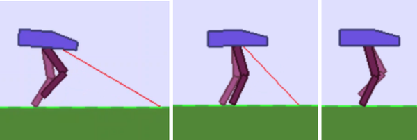
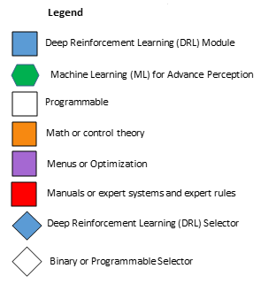
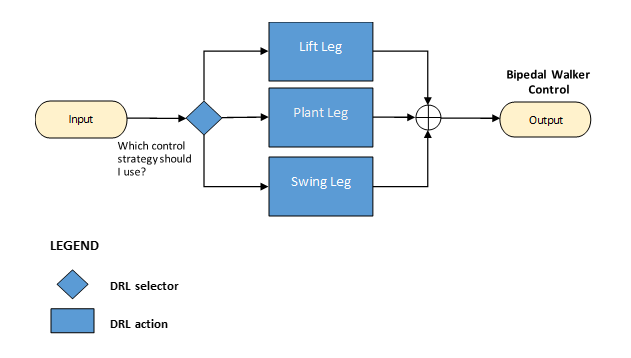

Machine Teaching consists of decomposing a challenge into different skills/modules to be learned individually. That decomposition is guided by subject matter experts, i.e., those expert operators that have dedicated decades to mastering how to best operate a machine or an industrial process. Each skill/module is then implemented using the simplest technology that solves the problem, selecting them from the pool of Automated Intelligence methods and Autonomous Intelligence methods to leverage strengths and compensate for weaknesses. Then you’ll orchestrate these learned skills and integrate them into the industrial processes.

## Steps to create a brain design

These are the three steps you follow to design a brain using the new AI paradigm of Machine Teaching:

1. **Decompose** your task into skills/modules
2. **Orchestrate** how your skills/modules work together
3. **Select** the best technology to implement each skill/module

### 1. How to decompose a task into skills or modules

The building blocks of Autonomous AI are skills. Skills are the individual abilities you'll be asking your AI brain to learn.

The first phase of creating an AI brain is to chunk a task into modular skills that can be practiced separately. Learning goes better and faster if an AI brain learns and practices different skills separately and then combines these skills together.

Let’s explain how you define skills with the example of teaching a hammer-head robot how to walk. If you want to teach a robot how to walk, you follow three phase gait patterns: lift the left, plant the leg, swing the leg.

Next, you set a goal for each of the three skills. Each gait phase has distinct goals that facilitate walking.

| Gait Phase (Skills) | Goals                                                        |
| ------------------- | ------------------------------------------------------------ |
| Lift leg            | Push off with enough velocity to vault over the planted leg. |
| Plant leg           | Plant the leg with enough impulse (force at the moment of impact) to support the weight of the robot. |
| Swing leg           | This is the gait phase that generates most of the forward motion. |

The first gait phase is about pushing off and picking up enough speed to vault over the other leg when you plant it. In the second phase, velocity doesn’t matter nearly as much. Walkers succeed in the second phase when they plant their leg with enough force to support the weight of the body. Otherwise, the walker will collapse to the ground. The final phase has yet another primary objective: forward motion. This phase is the significant mover of the three gaits. During the first and second phase, the body doesn’t move forward very much even when the phases are very successful.

#### Types of skills

There are three types of skills that you'll use in the visual language of brain design:

- **Perception skills** process sensory information to perceive, predict, classify, detect or filter. They include advance perception (computer vision, sound processing, etc.), prediction and classification. It's normally implemented using Machine Learning algorithms.
- **Action skills** that make real-time human-like decisions. They can be implemented with any of the Automated Intelligence set of technologies (control theory, optimization algorithms, expert systems, expert rules) when these technologies are the simplest that solve the task. And it can also be implemented using Deep Reinforcement Learning when the strategy has to be automatically learned.
- **Selector skills** that act as supervisors deciding what action skill is best fit for each particular scenario. If the decision is straightforward, the selector is programmable (implemented with regular if-then lines of code). If the decision is fuzzy and difficult to make, it has to be learned and it will be implemented with Deep Reinforcement Learning.

### 2. How to orchestrate skills/modules

After identifying the skills to teach, we need to put them together in the brain design, by defining how the skills relate to each other.

When you orchestrate the skills, you should ask a few questions to guide your thinking:

- Are there any skills that should be performed in a sequence?
- For skills that should be used in sequence, are the sequence fixed or variable?
- Are there any skills that can or should be performed in parallel?
- Are there strategies that should be arranged in a hierarchy?

For the hammer-head walking robot example, we decomposed the task of walking into three skills: lift leg, plant leg and swing leg. Now, we'll orchestrate these skills together into a brain design. The gait pattern for walking cycles the skills in a sequence: lift leg, plant leg, swing leg, lift (the opposite) leg, plant (the opposite leg), swing (the opposite) leg.

Here's how the brain design for the walking cycles looks like:

The oval yellow shapes represent input and output to the brain. The leftmost oval in a brain design diagram is the input which contains the state environment captured by sensors placed in the environment. The rightmost oval in the brain design diagram is the output that contains the control actions or decisions that the autonomous AI is making to modify the environment.

During the learning/training phase, the actions take place in a simulator and generate feedback that is observed by the sensors as the environment state at the input node. When the brain is deployed into production, the actions take place in the real environment.

Autonomous AI is a feedback controller. Hidden in every brain design is the feedback that comes back from the simulator or the real process (the input) that shows the consequences of the decisions the AI brain just made (the output) according to a goal or objective. 

Here are the possible shapes of the modules that you can find in a brain design:

- Hexagons represent advanced perception concepts. 
- Rectangles represent action concepts. 
- Diamonds represent selectors.
- The lines in the brain diagram represent information that is passed from one module of the brain to the next.

### 3. How to select the technology to implement each skill/module

This is the phase of Machine Teaching where you map the skills in your brain to the best technology (the simplest) to solve that particular skill or task. The technologies that we can select include, first, those reviewed in the module of Automated Intelligence:

- Math – control theory
- Menus – optimization algorithms
- Manuals – expert systems and expert rules
- Other knowledge representation and reasoning technologies, such as Fuzzy Logic or Qualitative Modeling.

And those technologies included in the module of Autonomous Intelligence:

- Machine Learning
- Deep Learning
- Deep Reinforcement Learning

Review the table of strengths and weaknesses of these technologies to determine which is best suited to solve each skill.

#### Visual language of brain design

In the visual language of brain design, you'll color each module of your brain according to the technology used:

- Blue: Learned concept using Reinforcement Learning or Deep Reinforcement Learning
- Green: Machine Learning for Advance Perception
- White: Programmable concept using a regular step by step algorithm
- Orange: Math or control theory
- Purple: Menus or optimization algorithms
- Red: Manuals or expert systems and expert rules

The brain design for the example of the hammer-head walking robot looks like this:

The action modules are Deep Reinforcement Learning modules as each one of the skills is difficult to learn. The selector is also a Deep Reinforcement Learning selector as it's fuzzy or difficult to decide when the robot is in each one of the gate phases.

Remember to always use the shape and colors as depicted above as it's a convention among the Autonomous AI Architects, and it's easy to understand once you learn it.

Remember to always include the legend to better communicate with other stakeholders who aren't trained in the Machine Teaching paradigm.
