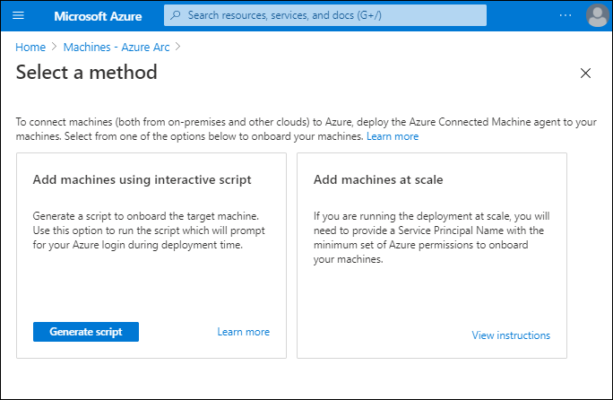
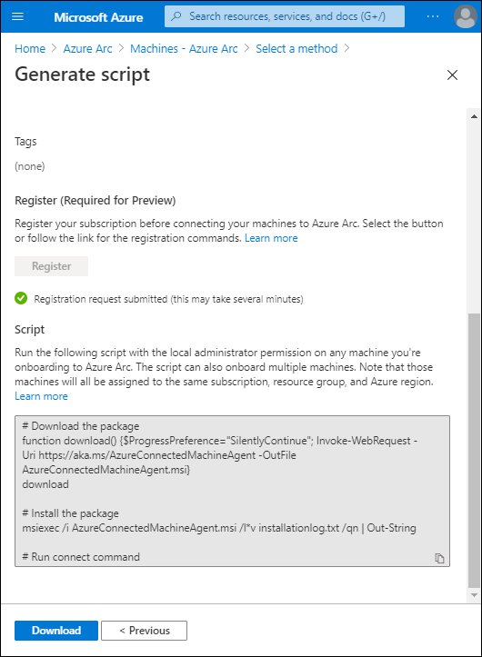

<!--  topic title: Onboard server instances. -->

<!--6 minutes to read-->

Azure Arc expands the support for Resource Manager to resources that run outside of Azure. This means that a physical server or a VM that's running in an on-premises datacenter can be registered with Resource Manager and presented as a compute resource to the fabric controller. This applies to any server that's running the Windows Server OS or Linux server in an on-premises datacenter or that's hosted by Azure or another cloud provider.

## Deploy Azure Arc to on-premises servers

Before a physical server or VM can register, you must install the Azure Connected Machine agent on each of the operating systems that are targeted for Resource Manager-based management. The agent for Windows Server implements as a Windows Installer (.msi file), which is available from the Microsoft Download Center.

> [!TIP]
> Download the Azure Connected Machine agent from the [Microsoft Download Center](https://aka.ms/AzureConnectedMachineAgent?azure-portal=true).

For smaller-scale deployments, you can use the onboarding script that's available on the Azure portal.

### Azure Arc for servers agent

The Azure Arc for servers agent enables you to manage both Windows and Linux computers that you host on-premises or with another cloud provider. The Azure Connected Machine agent currently supports the following versions of the Windows and Linux operating systems:

- Windows Server 2012 R2 and later, including Server Core installations.
- Ubuntu 16.04 and 18.04 (x64)
- CentOS Linux 7 (x64)
- SUSE Linux Enterprise Server 15 (x64)
- Red Hat Enterprise Linux 7 (x64)
- Amazon Linux 2 (x64)

### Permissions

To onboard and manage machines in Azure Arc, you must have certain Azure permissions, described in the following table.

|Ability|Permission requirement|
|-----------------------------------------------|------------------------------------------------------------|
|Onboard machines|Member of the Azure Connected Machine Onboarding role|
|Read, modify, re-onboard, and delete a machine|Member of the Azure Connected Machine Resource Administrator role|

### Installation process

You can install the agent in two ways:

- By manually running the **AzureConnectedMachineAgent.msi** Windows Installer package.
- By using a script from a PowerShell session.

The installation creates folders, services, and variables during installation.

> [!NOTE]
> The Azure Connected Machine agent sends a heartbeat message to the Azure Arc service every five minutes. If the Azure Arc service stops receiving heartbeat messages from the connected machine, it considers it offline. The machine is then marked as **Disconnected** until heartbeats resume, at which time the machine is marked as **Connected**.

### Use a script method to onboard a server

A typical way to onboard a server is to generate and download a script from the Azure portal. To generate the script, use the following procedure:

1. In the Azure portal, browse to **Azure Arc**, and then select **Manage servers**.
2. On the **Machines - Azure Arc** page, select **Create machine - Azure Arc**.
3. On the **Select a method** page, select **Generate script**.
4. On the **Generate script** page, configure the subscription, resource group, region, operating system (OS), and optionally, the proxy server URL. Then select **Review + generate**.

    

    > [!NOTE]
    > Although the script displayed after step 4 is Windows PowerShell, you can also use this procedure to onboard Linux servers.

5. When prompted, select **Download**.
6. On servers that you want to onboard, sign in as a local administrator on Windows Server; for Linux, sign in as Root. Then run the downloaded script.

When you run the script on target computers, the script downloads the Azure Arc agent, installs it, and onboards the server. The script prompts you to authenticate to the target Azure subscription where the corresponding resources will be created. You must also enter a generated security code.

In larger environments, you can use the Desired State Configuration (DSC) management platform in PowerShell and an Active Directory Domain Services principal to perform the installation and registration in an unattended manner.

When you onboard a server, it becomes a connected machine and is represented by a corresponding Azure resource. That resource has a unique **resource ID** property. It belongs to a resource group inside a subscription, and it can benefit from Resource Manager-based mechanisms such as Azure Policy and tags.

