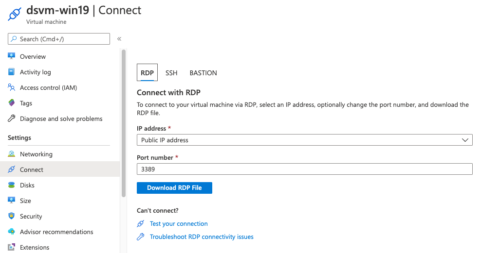

On a Windows Data Science Virtual Machine, the graphical desktop is available via Remote Desktop Protocol.

With SSH, you can connect to the command line of the Data Science Virtual Machine. Both Windows and Ubuntu Data Science Virtual Machine images support SSH connection.

## Connect to a Windows server using RDP 

To connect to a Windows DSVM with Remote Desktop: 

1. If necessary, download [Microsoft Remote Desktop client](https://www.microsoft.com/p/microsoft-remote-desktop/9wzdncrfj3ps?portal=true)
1. Navigate to the DSVM in the portal
1. Select **Connect** and **RDP**
1. Click **Download RDP File** 
1. Open the file in Microsoft Remote Desktop to connect



## Connect to the command line using SSH

To access the command line of your Data Science Virtual Machine, you'll use:

- An SSH client running in a terminal on your local machine
- The username and password you specified during creation
- The public IP address of the running Data Science Virtual Machine

### Install an SSH client on Windows, if necessary

If you're running Linux or macOS, an ssh client is part of the OS standard utilities. If you're running Windows, you may not have an SSH client already installed on your machine. Open a PowerShell console with Administrative rights and see if you have the client installed:

```powershell
Get-WindowsCapability -Online | ? Name -like 'OpenSSH*'

# You should see output similar to:
 
Name  : OpenSSH.Client~~~~0.0.1.0
State : NotPresent
Name  : OpenSSH.Server~~~~0.0.1.0
State : NotPresent
```

If the `State` of the `OpenSSH.Client` isn't `Installed`, run:

```powershell
Add-WindowsCapability -Online -Name OpenSSH.Client~~~~0.0.1.0
```

## Connect using an ssh client from the command line

From a terminal or PowerShell console, run the following, replacing your username and the IP address for `1.1.1.1`:

```bash
ssh UserName@1.1.1.1
```

The first time you connect via SSH, you'll receive a warning. Accept the fingerprint and you'll be presented with a password prompt. Enter the password you specified while creating the Data Science Virtual Machine. You should see a greeting screen and a command prompt.
