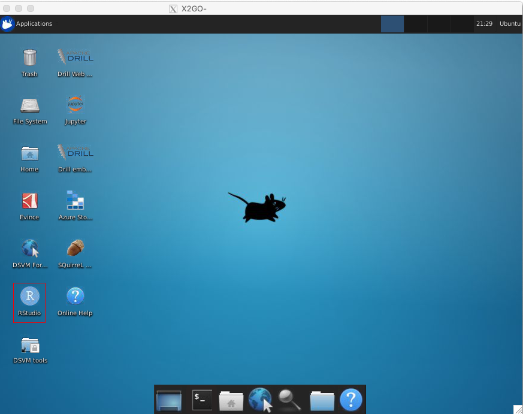

Now that you're connected to your Data Science Virtual Machine, you can begin using it to do data science.

The Data Science Virtual Machine comes with tools preinstalled for:

- Python
- R
- Julia
- Node.js
- Java

You can, of course, add additional programming languages, desktop applications, database tools, and so forth.

## Run RStudio remotely

From the Data Science Virtual Machine desktop running in your XFCE client, double-click the RStudio icon. 



When RStudio completes startup, enter `demo(graphics)` in the Console window to see a demonstration of RStudio's graphing capabilities. 


The free Azure resources used for this learning module don't have permission to access the Internet, unlike those you create with your own account. Since the Data Science Virtual Machine can't access the Internet in this context, it can't download the data files needed for the included Python Jupyter notebook tutorials.

In our scenario, your local data disk might be mounted as a remote disk on the virtual machine and you could begin your analysis immediately.

## List and activate a Python conda environment

The conda package manager is a popular way to manage Python programming environments. It's the default environment manager used by the Data Science Virtual Machine. The Data Science Virtual Machine comes with several environments configured to work with popular data science and machine learning packages. As an example, let's run through initializing, activating, and using PyTorch running with Python 3.6.

To activate the desired conda environment:

1. Click the terminal emulator icon on the toolbar of the Data Science Virtual Machine's desktop

    

1. To initialize conda and activate it, run:

    ```bash
    conda init && source ~/.bashrc
    ```

1. To list the installed conda environments, run: 

    ```bash
    conda info --envs
    ```

You should see output similar to: 


```bash
# conda environments:
#
base                  *  /anaconda
azureml_py36_automl      /anaconda/envs/azureml_py36_automl
azureml_py36_pytorch     /anaconda/envs/azureml_py36_pytorch
azureml_py36_tensorflow     /anaconda/envs/azureml_py36_tensorflow
py37_default             /anaconda/envs/py37_default
py37_pytorch             /anaconda/envs/py37_pytorch
py37_tensorflow          /anaconda/envs/py37_tensorflow
```

The asterisk indicates the `base` environment is currently active. 

1. Run `python --version` and you should see that the base environment is running Python 3.7. You can see what packages are installed with `conda list` or, to get a full list of dependencies, `conda env export -n base`

1. Activate the environment we want to use with: 

    ```bash
    conda activate azureml_py36_pytorch
    ```

Running `python --version` and `conda list` again to confirm that the python environment has changed. 

To start a Jupyter server, run: 

```bash
jupyter notebook
```

After startup, the Firefox browser on your Data Science Virtual Machine should start and open to `localhost:8888/tree`, showing the home directory of your Data Science Virtual Machine user. While the **notebooks** directory contains a number of tutorials on the various installed frameworks, almost all require downloading data from external sources. Since in this module your Data Science Virtual Machine is running in a free, restricted Azure environment, you can't access that data at this time.

Feel free to try other software on the machine, although the Sandbox restrictions will affect those programs that rely on Internet access.
