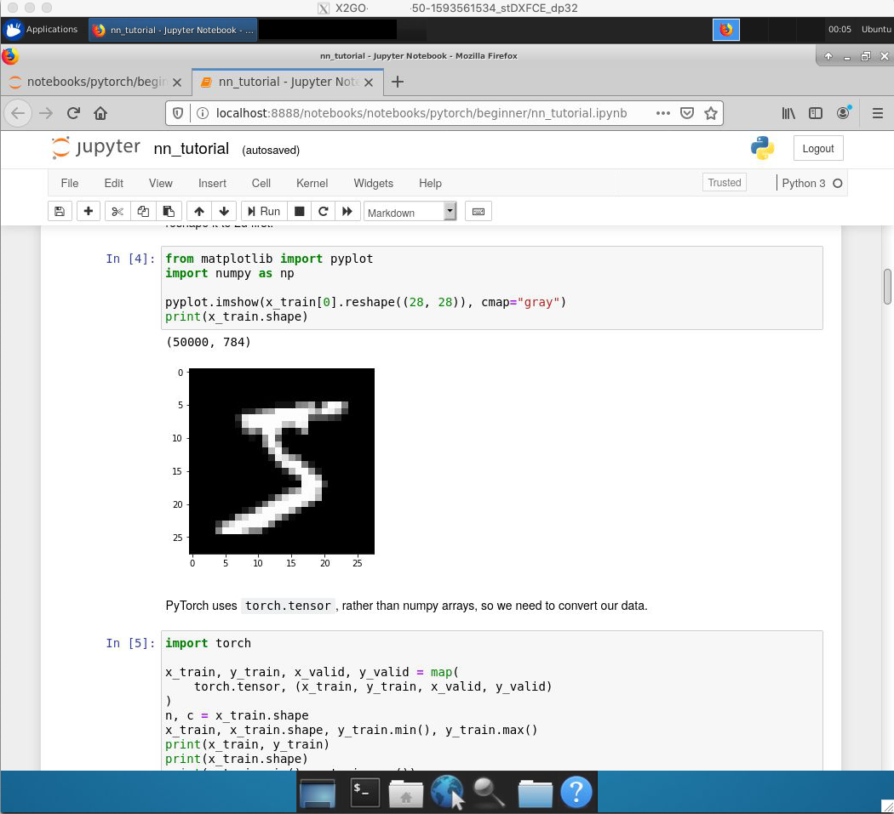

The Data Science Virtual Machine (DSVM) is a customized VM image built specifically for doing data science. The DSVM runs on the Azure cloud platform. The virtual machine image has many popular data science tools preinstalled and preconfigured to jumpstart building intelligent applications for advanced analytics. 

If you work with data, you know: wrangling with data is time-consuming. Transforming data requires different tools for different tasks. Working with data can require large amounts of storage and RAM, challenge the CPU/GPU, and be difficult to replicate. Sharing data and tools can be difficult, and involve fragile data transmissions or "sneakernet" sharing of drives.

You want to:

* Work in the operating system that you prefer.
* Work with the tools that you know.
* Work on a powerful machine.
* Easily share your work with your colleagues.

You can buy or build your own machine, and configure it just as you choose. Buying a machine might be the right choice for you if you're willing to bear the upfront costs, and know that you'll stress the machine frequently. Even so, safe remote access to the machine for yourself or your colleagues might be a challenge. It will, at the least, be an ongoing administrative task.

With a DSVM, you only pay for when the machine is running. If you're worried about forgetting to shut down the machine, you can schedule a daily shutdown at the time of your choosing. You can connect to the machine's command-line interface, or use its graphical desktop.

The DSVM has dozens of applications and programming tools and libraries preinstalled and preconfigured. These tools take advantage of the GPUs if you choose to run the DSVM on hardware with GPU compute resources. For Python, R, Julia, Node, and .NET developers, not only are the base languages installed, but so are popular packages, development environments, and Jupyter kernels.

For discussion's sake, imagine that you're a bank analyst interested in doing some statistical analysis for the purposes of predicting investment trends. You don't yet know what will come of this analysis, but you hope that you can extract a signal and develop a model that potentially has a large impact. 

Because it's early in the process, you don't know exactly what tools and approaches will end up being important. But the data volume is large enough that it's difficult to work with locally while you're sharing work with your colleagues.

## Learning objectives

In this module, you'll:

* Match operating systems and hardware resources available for the DSVM
* Specify and create a DSVM running Ubuntu Server 18.04 LTS
* Connect to the command line of the DSVM with SSH
* Connect to the graphical desktop of the DSVM with X2Go Client
* Demonstrate the use of RStudio running inside the DSVM
* List custom Python environments, activate one, and run a Jupyter notebook server

## Prerequisites

- None
