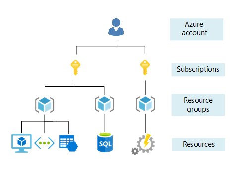

To create and use Azure services, you need an Azure subscription. When you are completing modules on Microsoft Learn, most of the time a temporary subscription is created for you, which runs in an environment called the *Microsoft Learn Sandbox*. However, when you are working with your own applications and business needs, you need to create an Azure account, and a subscription will be created for you. Once you've created an Azure account, you are free to create additional subscriptions; for example: your company might use a single Azure account for your business, and separate subscriptions for development, marketing, and sales departments. Once you have created an Azure subscription, you can start creating Azure resources within each subscription.

If you're new to Azure, you can sign up for a free account on the Azure website to start exploring at no cost to you. Once you're ready, you can choose to upgrade your free account and create a new subscription that enables you to start paying for Azure services you need to use that are beyond the limits of a free account.

## How to create an Azure account

You can purchase Azure access directly from Microsoft by signing up on the [Azure website](https://azure.microsoft.com/), or through a Microsoft representative. You can also purchase Azure access through a Microsoft partner. Cloud Solution Provider partners offer a range of complete managed-cloud solutions for Azure.

For more information on creating an Azure account, see the [Create an Azure account](https://docs.microsoft.com/learn/modules/create-an-azure-account/) learning module.

## What is the Microsoft Learn Sandbox?

Many of the exercises on Microsoft Learn use a technology called the "Sandbox," which creates a temporary subscription that is added to your Azure account. This temporary subscription allows you to create Azure resources for the duration of a learning module, and Microsoft Learn will automatically clean up the temporary resources for you when you've completed the module.

When you are completing a Microsoft Learn module, you are welcome to use your personal subscription to complete the exercises in a module, but the sandbox is the preferred method to use since it allows you to create and test Azure resources at no cost to you.

## What is the Azure free account?

The Azure free account includes free access to popular Azure products for 12 months, a credit to spend for the first 30 days, and access to more than 25 products that are always free. The Azure free account is an excellent way for new users to get started and explore. To sign up, you need a phone number, a credit card, and a Microsoft or GitHub account. The credit card information is used for identity verification only; you won't be charged for any services until you upgrade to a paid subscription.
