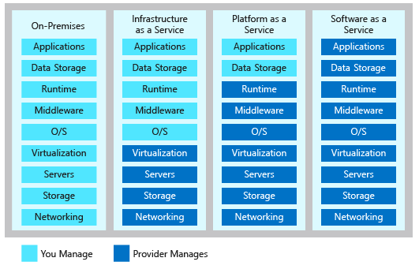
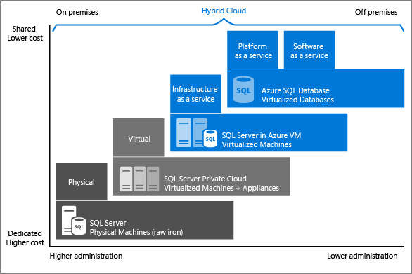

If you've ever wondered, "What is cloud computing?", it is the delivery of computing services - including servers, storage, databases, networking, software, analytics, and intelligence over the Internet ("the cloud"). Cloud computing offers faster innovation, flexible resources, and economies of scale.

> [!VIDEO https://channel9.msdn.com/Shows/Learn-Azure/What-is-Cloud-Computing/player?format=ny]

## Why is cloud computing typically cheaper to use?

Cloud computing is the delivery of computing services over the Internet using a *pay-as-you-go pricing* model. You typically pay only for cloud services you use, which helps you lower your operating costs, run your infrastructure more efficiently, and scale as your business needs change. To put that another way, cloud computing is a way to rent compute power and storage from someone else's data center. You can treat cloud resources like you would your resources in your own data center. When you're done using them, you give them back. You're billed only for what you use.

Instead of maintaining CPUs and storage in your data center, you rent them for the time that you need them. The cloud provider takes care of maintaining the underlying infrastructure for you. While this approach is great, the real value of the cloud is that it enables you to quickly solve your toughest business challenges and bring cutting edge solutions to your users.

## Why should I move to the cloud?

The cloud helps you move faster and innovate in ways that were once nearly impossible.

In our ever-changing digital world, two trends emerge:

- Teams are delivering new features to their users at record speeds.
- End users expect an increasingly rich and immersive experience with their devices and with software.

Software releases were once scheduled in terms of months or even years. Today, teams are releasing features in smaller batches. Releases are now often scheduled in terms of days or weeks. Some teams even deliver software updates continuously - sometimes with multiple releases within the same day.

Think of all the ways you interact with devices that you couldn't do just a few years ago. Many devices can recognize your face and respond to voice commands. Augmented reality changes the way you interact with the physical world. Household appliances are even beginning to act intelligently. These technologies are just a few examples, many of which are powered by the cloud.

To power your services and deliver innovative and novel user experiences more quickly, the cloud provides on-demand access to:

- A nearly limitless pool of raw compute, storage, and networking components.
- Speech recognition and other cognitive services that help make your application stand out from the crowd.
- Analytics services that enable you to make sense of telemetry data coming back from your software and devices.

## What are some cloud computing advantages?

There are several benefits that a cloud environment has over a physical environment. For example, cloud-based applications employ a myriad of related strategies:

- **High Availability** - depending on the service-level agreement (SLA) that you choose, your cloud[based applications can provide a continuous user experience with no apparent downtime even when things go wrong

- **Scalability** - applications in the cloud can be scaled two ways:

   - *Vertically* - computing capacity can be increased by adding additional RAM or CPUs to a virtual machine
   - *Horizontally* - computing capacity can be increased by adding instances of a resource, such as adding additional virtual machines to your configuration

- **Elasticity** - cloud-based applications can be configured to take advantage of autoscaling, so your applications will always have the resources they need

- **Agility** - cloud-based resources can be deployed and configured quickly as your application requirements change

- **Geo-distribution** - applications and data can be deployed to regional data centers around the globe, thereby ensuring that your customers always have the best performance in their region

- **Disaster Recovery** - by taking advantage of cloud-based backup services, data replication, and geo-distribution, you can deploy your applications with the confidence that comes from knowing that your data is safe in the event that disaster should occur

## What are PaaS, IaaS, and SaaS?

If you've been around cloud computing for a while, you've probably seen these acronyms for the different *cloud service models*, which define the different level of shared responsibility that a cloud provider and cloud tenent are responsible for.

| | Definition | Description |
| --- | --- | --- |
| **IaaS** | <nobr>*Infrastructure-as-a-Service*</nobr> | This cloud service model is the closest to managing physical servers; a cloud provider will keep the hardware up-to-date, but operating system maintenance and network configuration is left to the cloud tenent. For example: Azure Virtual Machines are fully operational virtual compute devices running in Microsoft's datacenters. An advantage of this cloud service model is rapid deployment of new compute devices; setting up a new virtual machine is considerably faster than procuring, installing, and configuring a physical server. |
| **PaaS** | <nobr>*Platform-as-a-Service*</nobr> | This cloud service model is a managed hosting environment, where the cloud provider manages the virtual machines and networking resources, and the cloud tenent deploys their applications into the managed hosting environment. For example: Azure App Services provides a managed hosting environment where developers can upload their web applications, without having to worry about dealing with the physical hardware and software requirements. |
| **SaaS** | <nobr>*Software-as-a-Service*</nobr> | In this cloud service model, the cloud provider manages all aspects of the application environment - virtual machines, networking resources, data storage, applications, etc. - and the cloud tenent only needs to provide their data to the application managed by the cloud provider. For example: Microsoft Office 365 provides a fully working version of Microsoft Office that runs in the cloud; all that you need to do is create your content, and Office 365 takes care of everything else. |

The following chart illustrates the various levels of responsibility between a cloud provider and a cloud tenent.

## What is serverless computing?

Overlapping with PaaS, serverless computing enables developers to build applications faster by eliminating the need for them to manage infrastructure. With serverless applications, the cloud service provider automatically provisions, scales, and manages the infrastructure required to run the code. Serverless architectures are highly scalable and event-driven, only using resources when a specific function or trigger occurs.

In understanding the definition of serverless computing, it’s important to note that servers are still running the code. The serverless name comes from the fact that the tasks associated with infrastructure provisioning and management are invisible to the developer. This approach enables developers to increase their focus on the business logic and deliver more value to the core of the business. Serverless computing helps teams increase their productivity and bring products to market faster, and it allows organizations to better optimize resources and stay focused on innovation.

## What are Public, Private, and Hybrid clouds?

There are three deployment models for cloud computing: *public cloud*, *private cloud*, and *hybrid cloud*. Each deployment model has different aspects that you should consider as you migrate to the cloud.

| Deployment Model | Description |
| --- | --- |
| <nobr>**Public cloud**</nobr> | Services are offered over the public internet and available to anyone who wants to purchase them. Cloud resources - such as servers and storage - are owned and operated by a third-party cloud service provider, and delivered over the internet. |
| <nobr>**Private cloud**</nobr> | A private cloud consists of computing resources used exclusively by users from one business or organization. A private cloud can be physically located at your organization's on-site datacenter, or it can be hosted by a third-party service provider. |
| <nobr>**Hybrid cloud**</nobr> | A hybrid cloud is a computing environment that combines a public cloud and a private cloud by allowing data and applications to be shared between them. |

The following image illustrates several of the cloud computing concepts that are presented in this unit. In this example, several factors are demonstrated when you are considering where to deploy a database server in a Hybrid cloud environment: as your resources move from on-premises to off-premises, your costs are reduced, and your administration requirements decrease.

