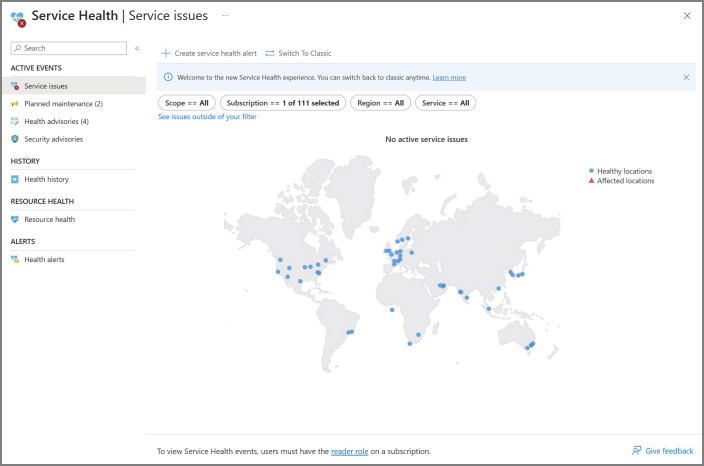
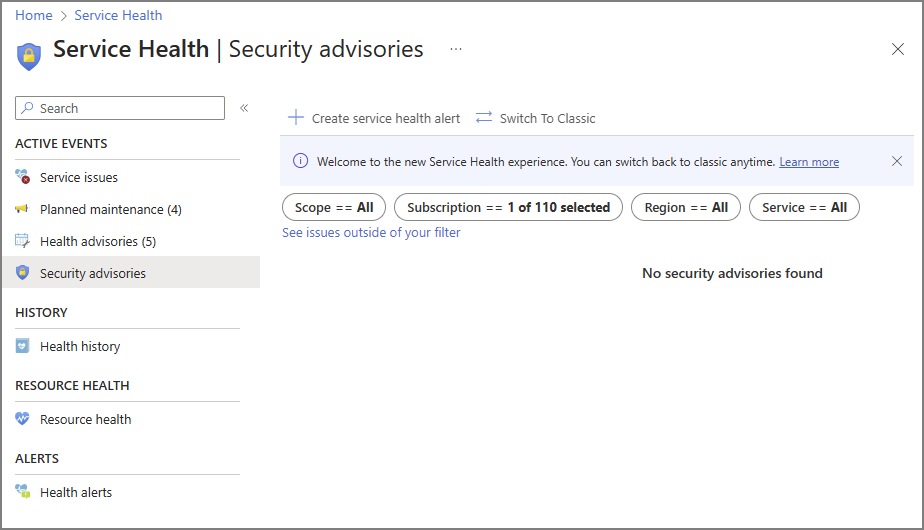
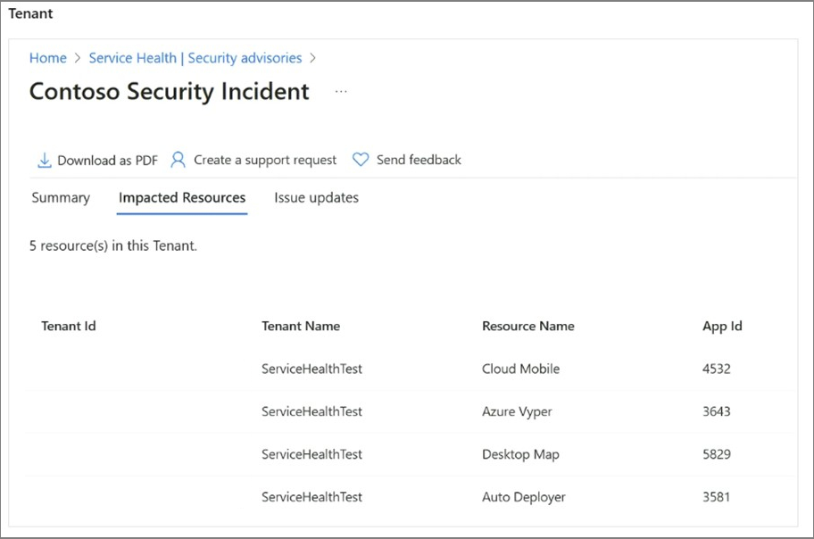
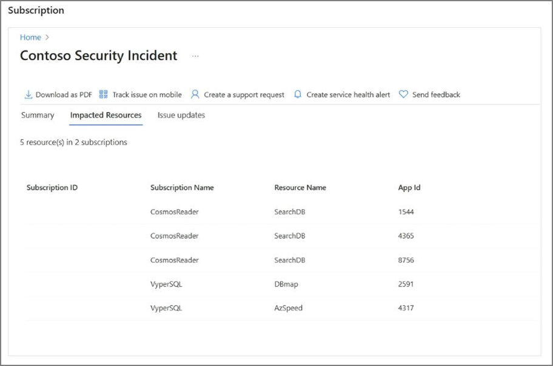
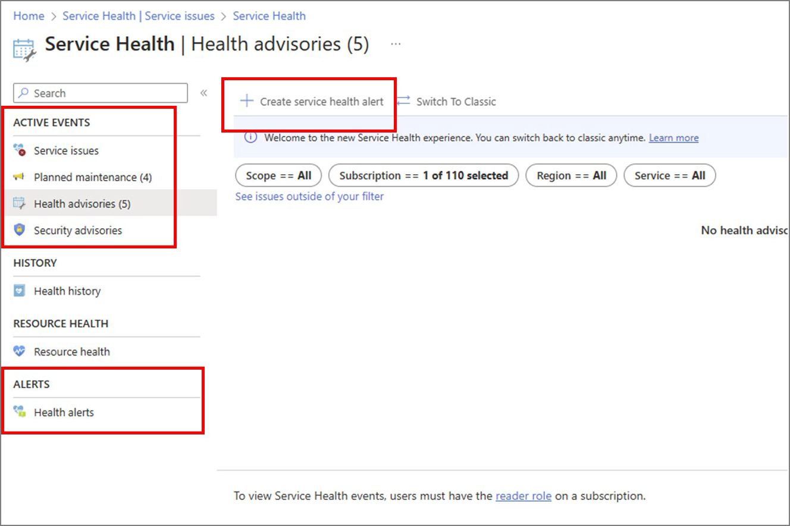
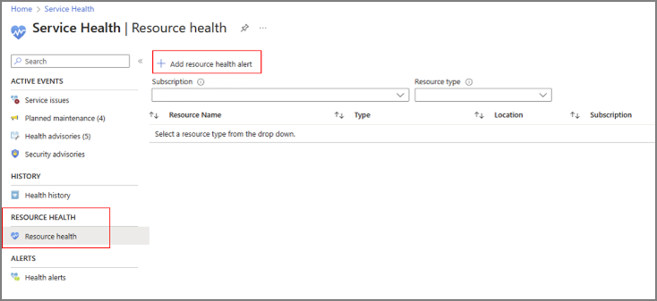

To ensure preparedness and minimize the impact of incidents, it is essential to follow the proactive recommendations outlined in this unit. These actions will help you understand our incident communication process, locate pertinent information, and configure notifications to receive timely updates. Additionally, evaluating the resilience of your applications and implementing recommended measures will contribute to creating more reliable workloads, reducing the potential impact of an incident. Lastly, reviewing and implementing security best practices will fortify your environment and mitigate risks.

## To stay informed, mitigate impact, and protect your investment, we recommend the following five actions:

### Action #1: Familiarize yourself with [Azure Service Health](https://www.aka.ms/ash-acom) in the Azure portal

Unlike our public azure.status.microsoft page, which provides general status information on [only broad outages](/azure/service-health/azure-status-overview#when-does-azure-publish-communications-to-the-status-page), Azure Service Health offers personalized details tailored to your specific resources. It helps you anticipate and prepare for planned maintenance and other changes that may affect resource availability. You can engage with service events and manage actions to maintain the business continuity of your impacted applications. It delivers crucial insights into platform vulnerabilities, security incidents, and privacy breaches at the Azure service level, enabling prompt action to safeguard your Azure workloads.

Now, let's explore some key features available in Azure Service Health to enhance your incident preparedness:

#### Resource Health pane (new experience covered) 

Located within the Service Health blade of the Azure portal, Azure Resource Health assists in diagnosing and resolving service problems that impact your Azure resources. Resources, such as virtual machines, web apps, or SQL databases, are assessed for their health based on signals from different Azure services. If a resource is identified as unhealthy, Resource Health conducts a detailed analysis to determine the root cause of the problem. It also provides information on Microsoft's actions to resolve problems related to incidents and suggests steps you can take to address the issue.

#### Services Issues pane (new experience covered)

The Services Issues pane displays ongoing service incidents that may impact your resources. It enables you to track when an issue began and identify the affected services and regions. By reviewing the most recent updates, you can gain insights into Azure's efforts to resolve the incident. 

Key Features of the Services Issues Pane:

- **Real-Time Insight**: The service issues dashboard offers real-time visibility into Azure service incidents affecting your subscriptions and tenants. If you're a Tenant Admin, you can see active incidents or advisories relevant to your subscription(s) and tenant(s).

- **Resource Impact Assessment**: The Impacted Resource tab in the incident details section shows which resources are confirmed or potentially impacted. Clicking on the resources provides direct access to the Resource Health pane. 

- **Links and Downloadable Explanations**: Generate a link for the issue to use in your problem management system. You can also download PDF and sometimes CSV files to share comprehensive explanations with stakeholders who don't have access to the Azure portal. Additionally, you can request a Post Incident Review (PIR) for any issues that have affected your resources, previously known as Root Cause Analyses (RCAs).

#### Security Advisories pane

The Security Advisories pane focuses on urgent security-related information affecting the health of your subscriptions and tenants. It provides insights into platform vulnerabilities, security incidents, and privacy breaches. 

Key Features of the Security Advisories Pane:

- **Real-Time Security Insights**: Gain immediate visibility into Azure security incidents relevant to your subscriptions and tenants.

- **Resource Impact Assessment**: The Impacted Resource tab in the incident details section highlights the resources that are confirmed to be impacted.

    Users authorized with the following roles can view security impacted resource information:

    | View Subscription Level Resources | View Tenant Level Resources |
    |---|---|
    | Subscription Owner | Security Admin/Security Reader |
    | Subscription Admin | Global Admin/Tenant Admin |
    | Service Health Security Reader | Azure Service Health Privacy reader |

- Additionally, you can download explanatory PDF documents to share with stakeholders who don't have direct access to the Azure portal.

    The following examples show a security incident with impacted resources from both the subscription and tenant scope.
   
    

    

In addition to familiarizing yourself with Azure Service Health, another crucial step is to set up Service Health alerts, which will ensure timely notifications and keep you informed about incidents and important information that may impact your workloads. The next section will cover this topic in detail.

### Action #2: Set up Service Health alerts to stay informed

Configuring [service health alert](/azure/service-health/alerts-activity-log-service-notifications-portal) notifications is essential, and the most important call to action, for proactive incident management. Service Health alerts enable you to receive timely notifications through various channels such as email, SMS, webhooks, and more. These alerts provide updates on service incidents, planned maintenance activities, security incidents, and other critical information that may impact your workloads.

You can configure service health alerts from any of the 'active event' panes in the Service Health blade of the Azure portal, clicking Health alerts from the Service Health pane, or by leveraging Azure Resource Graph. 

Here, you can find [Azure Resource Graph sample queries for Azure Service Health](/azure/service-health/resource-graph-samples?tabs=azure-cli).

Service Health tracks different types of health events that may affect your resources, including service issues, planned maintenance, health advisories, and security advisories. When configuring service health alerts, you have the flexibility to choose how and to whom these alerts are sent. You can customize the alerts based on the class of service health notification, affected subscriptions, services, and regions.

#### Class of Service Health notifications

| Service Health Event Type | Description |
|---|---|
| **Service issue** | Problems in the Azure services that affect you right now, also known as service incidents. |

| **Planned maintenance** | Upcoming maintenance that can affect the availability of your services in the future.|
| **Health advisories** | Changes in Azure services that require your attention. Examples include when you need to take an action, when Azure features are deprecated, upgrade requirements or if you exceed a usage quota. |
| **Security advisories** | Security related notifications dealing with platform vulnerabilities and security and privacy breaches at the subscription and tenant level, also known as security &/or privacy incident. |

We know you need to be notified when there are issues impacting your services, and service health alerts give you the power to choose **HOW** and **TO WHOM** these alerts are sent. The alerts can be configured based on the class of service health notification, subscriptions affected, services affected, and / or regions affected. You can set up alerts to trigger emails, SMS messages, logic apps, functions and more.

When an alert is triggered, you can define the actions to be taken using action groups. Action groups are collections of notification preferences that determine how and to whom the alerts are sent. 

#### Full list of available notification types

| Notification Type | Description | Fields |
|---|---|---|
| Email Azure Resource Manager role | Send an email to the subscription members, based on their role. A notification email is sent only to the primary email address configured for the Microsoft Entra user. The email is only sent to Microsoft Entra user members of the selected role, not to Microsoft Entra groups or service principals. | Enter the primary email address configured for the Microsoft Entra user. See [Email](/azure/azure-monitor/alerts/action-groups?WT.mc_id=Portal-Microsoft_Azure_Monitoring#email). |
| Email | Ensure that your email filtering and any malware/spam prevention services are configured appropriately. Emails are sent from the following email addresses: - azure-noreply@microsoft.com - azureemail-noreply@microsoft.com - alerts-noreply@mail.windowsazure.com | Enter the email where the notification should be sent.
| SMS | SMS notifications support bi-directional communication. The SMS contains the following information: - Shortname of the action group this alert was sent to - The title of the alert. A user can respond to an SMS to: - Unsubscribe from all SMS alerts for all action groups or a single action group. - Resubscribe to alerts - Request help. For more information about supported SMS replies, see [SMS replies](/azure/azure-monitor/alerts/action-groups?WT.mc_id=Portal-Microsoft_Azure_Monitoring#sms-replies). | Enter the **Country code** and the **Phone number** for the SMS recipient. If you can't select your country/region code in the Azure portal, SMS isn't supported for your country/region. If your country/region code isn't available, you can vote to have your country/region added at [Share your ideas](https://feedback.azure.com/d365community/idea/e527eaa6-2025-ec11-b6e6-000d3a4f09d0). As a workaround until your country is supported, configure the action group to call a webhook to a third-party SMS provider that supports your country/region.
| Azure app Push notifications | Send notifications to the Azure mobile app. To enable push notifications to the Azure mobile app, provide the For more information about the Azure mobile app, see [Azure mobile app](https://azure.microsoft.com/features/azure-portal/mobile-app/). | In the **Azure account email** field, enter the email address that you use as your account ID when you configure the Azure mobile app. |
| Voice | Voice notification. | Enter the **Country code** and the **Phone number** for the recipient of the notification. If you can't select your country/region code in the Azure portal, voice notifications aren't supported for your country/region. If your country/region code isn't available, you can vote to have your country/region added at [Share your ideas](https://feedback.azure.com/d365community/idea/e527eaa6-2025-ec11-b6e6-000d3a4f09d0). As a workaround until your country is supported, configure the action group to call a webhook to a third-party voice call provider that supports your country/region.

#### Full list of actions you can trigger

| Action Type | Details |
|---|---|
| Automation Runbook | For information about limits on Automation runbook payloads, see [Automation limits](/azure/azure-resource-manager/management/azure-subscription-service-limits#automation-limits). |
| Event hubs | An Event Hubs action publishes notifications to Event Hubs. For more information about Event Hubs, see [Azure Event Hubs - A big data streaming platform and event ingestion service](/azure/event-hubs/event-hubs-about). You can subscribe to the alert notification stream from your event receiver. |
| Functions | Calls an existing HTTP trigger endpoint in functions. For more information, see [Azure Functions](/azure/azure-functions/functions-get-started). When you define the function action, the function's HTTP trigger endpoint and access key are saved in the action definition, for example, `https://azfunctionurl.azurewebsites.net/api/httptrigger?code=<access_key>`. If you change the access key for the function, you must remove and re-create the function action in the action group. Your endpoint must support the HTTP POST method. The function must have access to the storage account. If it doesn't have access, keys aren't available and the function URI isn't accessible. [Learn about restoring access to the storage account](/azure/azure-functions/functions-recover-storage-account).
| ITSM | An ITSM action requires an ITSM connection. To learn how to create an ITSM connection, see [ITSM integration](/azure/azure-monitor/alerts/itsmc-overview). |
| Logic apps | You can use [Azure Logic Apps](/azure/logic-apps/logic-apps-overview) to build and customize workflows for integration and to customize your alert notifications. |
| Secure webhook | When you use a secure webhook action, you must use Microsoft Entra ID to secure the connection between your action group and your endpoint, which is a protected web API. See [Configure authentication for Secure webhook](/azure/azure-monitor/alerts/action-groups#configure-authentication-for-secure-webhook). Secure webhook doesn't support basic authentication. If you're using basic authentication, use the Webhook action. |
| Webhook | If you use the webhook action, your target webhook endpoint must be able to process the various JSON payloads that different alert sources emit. You can't pass security certificates through a webhook action. To use basic authentication, you must pass your credentials through the URI. If the webhook endpoint expects a specific schema, for example, the Microsoft Teams schema, use the **Logic Apps** action type to manipulate the alert schema to meet the target webhook's expectations. For information about the rules used for retrying webhook actions, see [Webhook](/azure/azure-monitor/alerts/action-groups#webhook). |

Remember that most service incidents impact a few subscriptions, so these won't show up on places like status.azure.com. Service health alerts can be configured from the portal - if you're looking to automate creation, they can also be configured via PowerShell or ARM templates.

By configuring Service Health alerts and action groups effectively, you can ensure that you receive timely notifications and take appropriate actions to mitigate the impact of incidents on your Azure resources.

> [!NOTE]
>
> Looking for assistance in what to monitor and which alerts you should configure for what? Look no further than the "[Azure Monitor Baseline Alerts](https://aka.ms/alz/monitor/repo)" solution. It provides comprehensive guidance and code for implementing a baseline of platform alerts as well as service health alert via policies and initiatives in Azure environments, with options for automated or manual deployment. The solution includes predefined policies to automatically create alerts for all service health event types (service issue, planned maintenance, health advisories, & security advisories), action groups, and alert processing rules for various Azure resource types. While the focus is on monitoring Azure Landing Zones (ALZ) architected environments, it also offers guidance for brownfield customers who aren't currently aligned to the ALZ architecture brownfield.

### Action #3: Consider Resource Health alerts or Scheduled Events to inform you of resource-specific issues

Once you have setup service health alerts, consider also adopting resource health alerts. Azure Resource Health alerts can notify you in near real-time when these resources have a change in their health status, regardless of why. 

The key distinction between 'service health' alerts and 'resource health' alerts is that the former is triggered during a known platform issue, such as an ongoing outage (service incident) that is under investigation by Microsoft. In contrast, the latter is triggered when a specific resource is deemed unhealthy, irrespective of the underlying cause.

You can configure resource health alerts from the Resource Health pane in the Service Health blade of the Azure portal.

You can also create [resource health alerts programmatically](/azure/service-health/resource-health-alert-arm-template-guide) using Azure Resource Manager templates and Azure PowerShell. Creating resource health alerts programmatically allows for you to create and customize alerts in bulk.

#### Scheduled events for virtual machines, avoiding impact

[Scheduled events](/azure/virtual-machines/linux/scheduled-events) is another great tool where both 'alerts' types above notify people or systems, scheduled events notify the resources themselves. This can give your application time to prepare for virtual machine maintenance or one of our automated service healing events. It provides a signal about an imminent maintenance event (for example, an upcoming reboot) so that your application can know that and then act to limit disruption - for example, by running automation to drop itself out of the pool or otherwise degrade gracefully. Scheduled events are available for all Azure Virtual Machine types including PaaS and IaaS on both Windows and Linux.

> [!NOTE]
>
> Although both resource health alerts and scheduled events are helpful tools, the most important call to action is to configure service health alerts. This is critical to ensure you understand what's happening with your resources, what we're doing about it, and when it's mitigated. 

### Action #4: Increase the security of your investment to protect your environment

Ensure the protection of your data, applications, and other assets in Azure by reviewing and implementing the [Operational Security Best Practices](/azure/security/fundamentals/operational-best-practices). These best practices are derived from the collective knowledge and experience of those who work with the current capabilities and features of the Azure platform. The article is regularly updated to reflect evolving opinions and technologies.

As a starting point, consider these top recommendations for implementation:

- Require two-step verification for all your users. This includes administrators and others in your organization who can have a significant impact if their account is compromised (for example, financial officers). Enforce [multifactor authentication](/azure/security/fundamentals/operational-best-practices#enforce-multi-factor-verification-for-users) to alleviate concerns of this exposure. 

- Configure and enable [risk policies](/azure/active-directory/identity-protection/howto-identity-protection-configure-risk-policies) on your tenant so you're [alerted](/azure/active-directory/identity-protection/howto-identity-protection-configure-notifications) if 'anyone' is in your environment. This will create an alert for risky events such as anonymous IP address use, atypical travel, unfamiliar sign-in properties and will further trigger remediation efforts such as multifactor authentication, resetting passwords, etc. ensuring customers remain secure.

- Control the movement of [subscriptions from and into directories](/azure/cost-management-billing/manage/manage-azure-subscription-policy) as a proactive measure to be prepared and aware for 'anyone' in your environment. This ensures your organization has full visibility into the subscriptions that are used and prevents the movement of subscriptions that could go to an unknown directory.

- Rotate credentials for all global & subscription admins on a regular basis to help protect against potential security breaches, compromised accounts, or unauthorized use of privileged permissions. Regularly rotating credentials adds an additional layer of security to your environment and helps maintain the integrity and confidentiality of your data and resources.

- Review and regularly update all global admin user(s) email and phone numbers within your tenant

### Action #5: Increase the resiliency of your key Azure workloads to potentially avoid or minimize impact

To ensure the reliability of your workloads, it is crucial to assess them using the tenets of the Microsoft Azure Well-Architected Framework (WAF) through the [Microsoft Azure Well-Architected Review](/azure/well-architected/resiliency/testing). The WAF also provides recommendations for resiliency testing, including adopting a chaos engineering methodology.

Applications should undergo testing to ensure both availability and resiliency. Availability refers to the duration in which an application operates without significant downtime, while resiliency measures how quickly an application can recover from failures.

To complement your work with the WAF, consider implementing the following top recommendations and leveraging the provided tools to help you check and build resiliency into your applications: 

- Utilize the integrated [Reliability workbook](https://ms.portal.azure.com/#view/Microsoft_Azure_Expert/AdvisorMenuBlade/%7E/workbooks) in the Azure portal under the Azure Advisor blade to assess the reliability posture of your applications, identify potential risks, and plan and implement improvements.

- Enhance business continuity and disaster recovery (BCDR) by deploying your workloads and resources across multiple regions. Refer to the comprehensive list of [Azure region pairs](/azure/reliability/cross-region-replication-azure#azure-cross-region-replication-pairings-for-all-geographies) for optimal cross-region deployment options.

- Maximize availability within a region by distributing workload/resource deployments across [Availability Zones](/azure/reliability/availability-zones-overview). 

- Consider utilizing isolated virtual machine sizes in Azure for your business-critical workloads that require a high level of isolation. These sizes guarantee that your virtual machine is dedicated to a specific hardware type and operates independently. Please refer here for more information: Isolation for VMs in Azure - Azure Virtual Machines | Microsoft Learn.

- Consider utilizing [Maintenance Configurations](/azure/virtual-machines/maintenance-configurations#scopes) to have better control and management over updates for your Azure virtual machines. This feature allows you to schedule and manage updates, ensuring minimal disruption to sensitive workloads that can't tolerate downtime during maintenance activities. 

- Enhance redundancy by implementing inter or intra-region redundancy. Refer to the example of a [Highly available zone-redundant web application](/azure/architecture/reference-architectures/app-service-web-app/zone-redundant) for guidance.

- Enhance the resilience of your applications by utilizing [Azure Chaos Studio](https://azure.microsoft.com/products/chaos-studio/). With this tool, you can deliberately introduce controlled faults to your Azure applications, allowing you to assess their resilience and observe how they respond to various disruptions such as network latency, storage outages, expiring secrets, and datacenter failures.

- Utilize the [Service Retirement workbook](/azure/advisor/advisor-how-to-plan-migration-workloads-service-retirement) available in the Azure portal under the Azure Advisor blade. This integrated tool helps you stay informed about any service retirements that may impact your critical workloads, enabling you to effectively plan and execute necessary migrations.

> [!Note]
> Customers who have a Premier/Unified Support agreement can utilize the Customer Success team to strategize and implement a Well-Architected Framework assessment (WAF).
