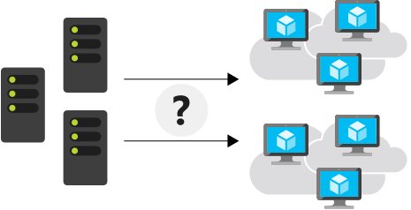
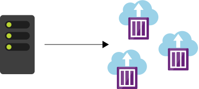
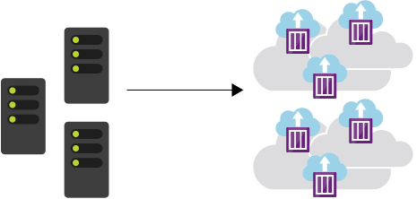
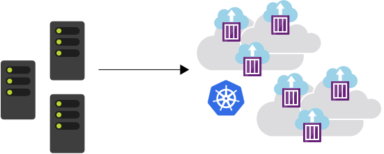
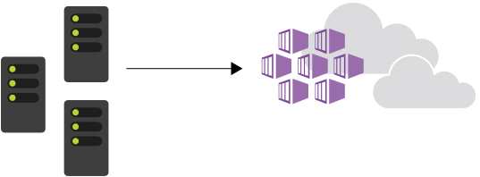

Let's start with a few definitions and see what Azure Kubernetes Service (AKS) is. This overview should help you decide whether AKS might be a good fit for your containerization management strategy.

## What is a container?

Suppose your fleet management solution includes three major applications:

- A fleet tracking website that includes maps and information about the assets being track. This application uses other services such as authentication and caching.

- A data processing service that collects and processes the information sent from the tracked vehicles.

- An MSSQL database for storing tracking information and user information capture from the website.

You realize that you have to scale out your solution to meet customer demands. One option is to deploy a new virtual machine (VM) for each application and then deploy the applications to the VMs. However, doing so will make you responsible for the management of each additional VM. For example, you’ll have to make sure the correct operating system (OS) versions and dependencies for each application is installed and configured. You also have to make sure you're installing and upgrading the correct versions of the applications. If there are errors, you have to make sure you can roll back the installation with the least amount of disruption to your solution.

The above deployment is cumbersome, sometimes error prone and doesn't easily scale single services. For example, you might find you can't easily scale only the caching service used in the web application. Containers help solve these types of problems.

A container is an atomic unit of software that packages up code, dependencies, and configuration for a specific application. Containers allows us to split up a monolithic application into the individual services that makes up the solution. You then deploy these separate services via containers.

The container concept gives us three mayor benefits.

1. A container is immutable. The unchanging nature of a container allows it to be deployed and run reliably with the same behavior from one compute environment to another. A container image tested in a QA environment is the same container image deployed to production.

1. A container is lightweight. You can think of a container as a VM image, but smaller. A VM image is normally installed on a physical host. The image contains both the OS and the application you want to run. In contrast, the container doesn't need an OS, only the application. The container always relies on the host installed OS for Kernel-specific services. Containers are less resource intensive and multiple containers can be installed on the same compute environment.

1. Container startup is fast. Containers can start up in few seconds instead of minutes, like a VM.

The above benefits make containers a popular choice for developers and IT operations alike.

## What is container management?

Even though you can think of containers as VMs, you have to keep in mind that they aren't. A container has a distinct life cycle. It's deployed, started, stopped, and destroyed as requested. This life cycle makes containers disposable and impacts how developers and IT operations should think about the management of large container deployments.

The process of deploying, updating, monitoring, and removing containers introduces many challenges.

Suppose you want to scale your fleet tracking website. You find that at specific times during the day you need more instances of the site's caching service to manage performance. You can solve this problem by adding additional caching service containers.

Now let's suppose, you need to roll out a new version of your caching service. How do you make sure you update all of the containers? How do you remove all of the older versioned containers?

These types of questions justify some sort of system to help you manage your container deployment.

## What is Kubernetes?

Kubernetes is a portable, extensible open-source platform for automating deployment, scaling, and the management of containerized workloads. Kubernetes abstracts away complex container management and provides us with declarative configuration to orchestrate containers in different compute environments. This orchestration gives us the same ease of use and flexibility as with Platform as a Service (PaaS) and Infrastructure as a Service (IaaS) offerings.

Kubernetes allows you to view your data center as one large computer. We don't worry about how and where we deploy our containers, only about deploying and scaling our applications as needed.

However, this view might be slightly misleading as there are a few aspects to keep in mind:

- Kubernetes isn't a full PaaS offering. It operates at the container level and offers only a common set of PaaS features.

- Kubernetes isn't monolithic. It's not a single application that is installed. Aspects such as deployment, scaling, load balancing, logging, and monitoring are all optional. You're responsible to find the best solution that fits your needs to address these aspects.

- Kubernetes doesn't limit the types of applications that can be run. If your application can run in a container, it can run on Kubernetes. Your developers need to understand concepts such as microservices architecture, to make optimal use of container solutions.

- Kubernetes doesn't provide middleware, data-processing frameworks, databases, caches nor cluster storage systems. All of these items are run as containers or as part of another service offering.

- A Kubernetes deployment is configured as a cluster. A cluster consists of at least one master machine and three or more workers machines for production deployments. These machines can be physical hardware or VMs.

With all the benefits you receive with Kubernetes, keep in mind that you're responsible for maintaining your Kubernetes cluster. For example, you need to management OS upgrades and the Kubernetes installation and upgrades. You also manage the hardware configuration of the host machines, such as networking, memory, and storage.

> [!NOTE]
> Kubernetes is sometimes abbreviated to **K8s**. The 8 represents the 8 characters between the K and the s of the word K[*ubernetes*]s.

## What is a Kubernetes pod?

A Kubernetes pod, in its simplest form, is the same as a container. However, a pod is bigger than a container since you can deploy multiple containers into a pod. Just like a container, a pod has the same life cycle as a container. A pod is also immutable and not meant to be durable.

## What is Azure Kubernetes Service?

Azure Kubernetes Service (AKS) manages your hosted Kubernetes environment and makes it simple to deploy and managed containerized applications in Azure. Your AKS environment is enabled with features such as automated updates, self-healing, and easy scaling. The Kubernetes cluster master is managed by Azure and is free. You manage the agent nodes in the cluster, and only pay for the VMs your nodes are running on.

You can either create your cluster in the Azure portal or use the Azure CLI. When you create the cluster, you can use Resource Manager templates to automate cluster creation. With these templates, you specify features such as advanced networking, Azure Active Directory (AD) integration, and monitoring. This information is then used to automate the cluster deployment on your behalf.

With AKS, we get the benefits of open-source Kubernetes without the complexity or operational overhead compared to running our own custom Kubernetes cluster.

## Azure Kubernetes Service features

AKS integrates into the various Azure platform features that enhance the standard Kubernetes offering.

### Identity and security management

Resources and namespaces, and permissions to these resources, are managed with Kubernetes role-based access control (RBAC) in a Kubernetes cluster. AKS supports RBAC and allows you to also integrate AD. For example, you can extend access control, to allow existing identity and group membership and enable an integrated sign-on experience with AD.

### Integrated logging and monitoring

A large part of orchestrating a Kubernetes cluster is knowing the state of containers, nodes, and masters in the cluster. AKS includes *Azure Monitor for containers* to monitor the overall performance of your Kubernetes cluster. *Azure Monitor for containers* collects memory and processor metrics from controllers, nodes, and containers that are available in Kubernetes through the Metrics API. Container logs are also collected to complete the overall performance picture.

### Cluster node and pod scaling

AKS nodes run on Azure virtual machines. You can scale the number of nodes and running pods in your cluster as the demand for resources change. AKS supports auto cluster scaling and allows you to use the horizontal pod autoscaler or the cluster autoscaler. These two options allow the AKS cluster to automatically adjust node and pod resources.

### Cluster node upgrades

AKS offers a number of multiple Kubernetes versions. A default version of Kubernetes is suggested when you configure your cluster. You can however, chooses to install either newer or older listed versions. Once a newer version of Kubernetes becomes available, you can choose to upgrade the master and all nodes. AKS uses best practice procedures to remove pods from each node before the node is upgraded. Removed nodes are rescheduled on remaining nodes. This procedure makes sure that disruption to running applications is kept to a minimum.

### GPU enabled nodes

Azure provides single or multiple GPU enabled VMs for compute-intensive, graphics-intensive, and visualization workloads. AKS supports the use of these VMs as nodes when you create node pools. A node pool is a collection of similar configured nodes.

### Storage volume support

AKS supports both static and dynamic mountable storage volumes for persistent data. You have two options to choose from. You use Azure Disks for single pod access, and Azure Files for multiple pods that needs concurrent access.

### Virtual network support

AKS clusters can be deployed into an existing virtual network (VNET). With this configuration, pods can connect securely with services or other pods in the peered VNET. Good examples of a service connected this way, is Azure Storage or SQL DB. These services are located outside the cluster and typically configure on different networks.

### Ingress with HTTP application routing support

The pods in a Kubernetes cluster aren't automatically reachable from outside the cluster by clients. Ingress is a Kubernetes object that allows you to configure client access to pods inside the cluster. 

Ingress support is enabled by the *HTTP application routing solution*. It allows auto configuration of a *Kubernetes Ingress controller* and an *External-DNS controller*. As applications are deployed, publicly accessible DNS names are auto configured so that applications are reachable.

### Kubernetes certification and Regulatory compliance

AKS has been Cloud Native Computing Foundation (CNCF) certified as Kubernetes conformant and is complaint with the following certifications:

- Service Organization Controls (SOC)
- International Organization for Standardization (ISO)
- Payment Card Industry Data Security Standard (PCI DSS)
- Health Insurance Portability and Accountability Act (HIPAA)

> [!NOTE]
> Windows Server containers support is currently in preview in AKS.
