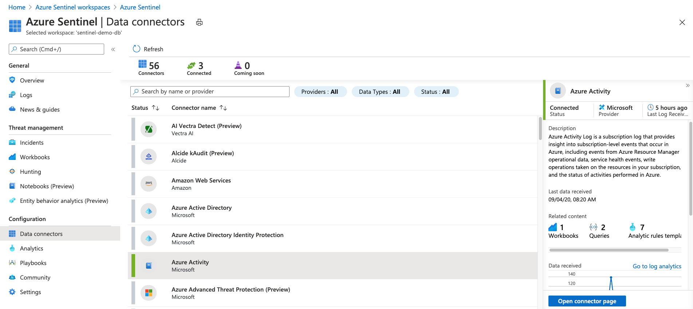

# How Azure Sentinel works

As we've already learned, Azure Sentinel is designed to help you enable end to end security operations starting from log ingestion, through to automated response to security alerts.

Here are the key features and components of Azure Sentinel.

### Data Connectors
The first thing you need to do is get your data ingested into Azure Sentinel. Data Connectors enable you to do just that. Some services are able to be added with a simple click of a button, such as Azure Activity logs. Others require a little configuration, such as syslog. There are Data Connectors that cover all scenarios and sources, including, but not limited to syslog, CEF, TAXII (Threat Intelligence), Azure and AWS services.

### Log Retention
Once our data is within Azure Sentinel, it's stored using Azure Log Analytics. This gives us a number of benefits, including the ability to use the Kusto Query Language (KQL) to query our data. KQL is a rich query language that gives us lots of power to dive into and gain insights from our data.

### Workbooks
Workbooks enable us to visualize our data within Azure Sentinel. You can think of these as dashboards, each component in the dashboard is built using an underlying Kusto Query Language (KQL) query over our data. You can use a number of built in Workbooks within Azure Sentinel, edit them to meet your own needs, or create your own Workbooks from scratch. If you've used Azure Monitor Workbooks, this will be very familiar, it's Sentinel's implementation of Monitor Workbooks.

### Analytics Alerts
Now we have our logs, and we have some visualization, it would be great to have some proactive analytics across our data to be notified when something suspicious occurs. There are a number of built in analytics alerts that you can enable within your Sentinel workspace. There are various types of alerts, some of which you can edit to your own needs, others which are built on proprietary Microsoft Machine Learning models.  You can also create custom scheduled alerts from scratch too. 

### Threat Hunting
We won't dive too deep into Threat Hunting in this module, but if SOC Analysts need to hunt for suscpicious activity, there are some built in hunting queries that they can leverage, they can also create their own too. Sentinel also integrates with Azure Notebooks, and provides a number of example notebooks too, for the more advanced hunter who wants to leverage the full power of a programming language to hunt through their data.

### Incidents and Investigations
An Incident is created when an alert that you've enabled is triggered. You can perform standard incident management in Azure Sentinel such as changing status, assigning etc. Azure Sentinel also has a investigation functionality which enables you to visually investigate incidents by mapping entities across log data along a timeline.

### Automation Playbooks
Being able to respond to incidents automatically, enables us to automate some of our security operations and make our SOC more productive. Azure Sentinel integrates with Azure Logic Apps, enabling us to create automated workflows in response to events. This could be used to perform Incident Management, enrichment, investigation or remediation. This is often referred to as Security Orchestration, Automation and  Response (SOAR).

As the SOC Analyst within Contoso, we can now start to see how Azure Sentinel might help us achieve our goals. For example, we could ingest data from our multiple cloud and on premises environments, perform analytics on that data, manage and investigate any incidents that occur, or even automatically respond using Playbooks. Giving us an end to end solution for our security operations.