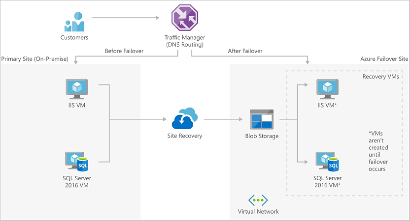

Azure Site Recovery orchestrates and automates the replication of Azure VMs between regions, on-premises VMs and physical servers to Azure, Azure VMs to on-premises VMs, and on-premises machines to a secondary datacenter. On-premises VMs can be hosted in and replicated from Hyper-V or VMware virtualization solutions. You can use Azure Site Recovery to migrate VMs from other environments, such as on-premises infrastructure, to Azure.  

Because Azure Site Recovery is built natively into Azure, you can use it to run disaster recovery drills to test your BCDR solutions without affecting your production workloads. Disaster recovery drills help you test if you've correctly configured your disaster recovery settings and validates the replication strategy for your environment without losing data, experiencing downtime, compromising your production environment.

Use Azure Site Recovery to seamlessly protect your VM instances in Azure by mirroring the source VM configuration and creating required or associated resource groups, storage accounts, virtual networks, and availability sets to a secondary Azure region.

## Failover and failback

There are two terms that you should understand when working with Azure Site Recovery:

- **Failover** – a failover occurs when operations are transferred from your primary location to your secondary location, which often happens after a service outage at the primary location; for example: scheduled downtime or a catastrophic failure.
- **Failback** – a failback occurs when operations are restored from your secondary location to your primary location, which often happens when the cause of the service outage has been alleviated.

Azure Site Recovery allows you to perform a failback after performing a failover. For example, if the primary location has a scheduled outage, you can failover to the secondary location during the outage, and then fail back the workload to the primary location once the scheduled outage is completed. 

