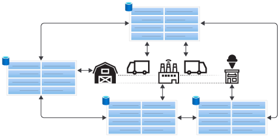
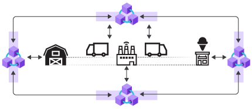

Blockchain is a record-keeping and contract-enforcement technology that uses cryptography to make it extremely difficult to change previous history. It allows participants to share workstreams by tracking changes on a shared ledger.

In the ice cream scenario, how do we discover there is a food quality or safety issue caused by improper temperature storage during shipment? We need to track the responsible party and the temperature and keep a log of changes.

## Why not use a centralized database?

We could use a centralized database that all participants use to track shipments. In many scenarios, a centralized database is the right solution. Suppose we have a centralized database that stores details about the shipment and who's currently responsible. In our scenario, we could have the farmer, shipper, factory, and retailer use the same centralized database.

The advantage of the centralized database is that it's easy to control access and consistency. Everyone is using the same database and there's a trusted authority controlling access. Because there is only one database, all participants are using the same set of data. All participants need to trust the database is correct, and by extension they need to trust the owner of the database not to modify historical data for any reason.

What if our scenario doesn't allow for a trusted central authority? What if no one company wants to be responsible for hosting a centralized database? Perhaps the requirements for system integration with each participant system can't be met.

## Distributed database

What if each participant could have their own copy of the database? A distributed database uses multiple copies of a database and changes are synchronized. In our scenario, we could have the farmer, shipper, factory, and retailer use their own distributed database.

The advantage of the distributed database is that each participant has a copy of the database. In most cases, it's easier to control access and integrate your systems and process in your own copy of a database. However, synchronization of changes to each database is required. Handling failures and conflicts can add complexity and data integrity issues.

## Distributed ledger

Blockchain technology is referred to as a distributed ledger. Just like an accounting ledger, the distributed ledger is a history of transactions. Each transaction in the ledger affects the final state.

Blockchain networks that are distributed among participants are called a consortium network. The consortium network gives each partner visibility into every transaction that occurs on the network.

Blockchain uses consensus rules to ensure data is consistent across nodes. It also uses cryptography to enable participants to trust the data. Specifically, it prevents any individual participant or minority of participants from modifying history. Since blockchain is decentralized, solutions that can use a decentralized database work best. For example, you have a requirement to support multiple companies with no central authority due to cost, control, or being a single point of failure.
