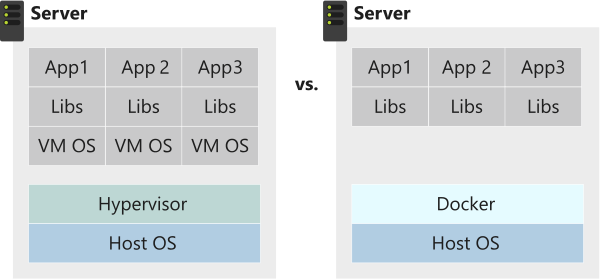

As we've seen, Docker has several features for us to use. Here, we'll look at the benefits that Docker provides to our development and operations teams. We'll also look at a few scenarios where Docker may not be the best choice.

These aspects will help you decide if Docker is a good fit for your containerization strategy.

Recall from earlier, there were a number of challenges our team faced as they develop and publish our order tracking portal. They were looking for a solution to:

- Manage our hosting environments with ease
- Guarantee continuity in how we deliver our software
- Ensure we make efficient use of server hardware
- Allow for the portability of our applications

Docker is a solution to these challenges. Let's have a look at all the benefits we've covered so far.

## Docker benefits

When we use Docker, we immediately get access to the benefits containerization offer.

### Efficient use of hardware

Containers run without using a virtual machine (VM).  As we saw, the container relies on the host kernel for functions such as file system, network management, process scheduling, and memory management.

Compared to a VM, we see that a VM requires an OS installed to provide kernel functions to the running applications inside the VM. Keep in mind that the VM OS also requires disk space, memory, and CPU time. By removing the VM and the additional OS requirement, we can free resources on the host and use it for running other containers.

### Container isolation

Docker containers provide security features to run multiple containers simultaneously on the same host without affecting each other. As we saw, we can configure both data storage and network configuration to isolate our containers or share data and connectivity between specific containers.

Let's compare this feature to using VMs.

 Assume we have a physical host running two VMs. We have three applications that we want to run isolated from each other. We decide to deploy the first app onto VM 1 and the second onto VM2 to separate the two apps from each other. If we now choose to install the third application, we'll need to install another VM to continue this pattern.

### Application portability

Containers run almost everywhere, desktops, physical servers, VMs, and in the cloud. This runtime compatibility makes it easy to move containerized applications between different environments.

Since containers are lightweight, they don't suffer from slow startup or shutdown times like VMs. This aspect makes redeployment and other deploy scenarios such as scaling up or down smooth and fast.

### Application delivery

With Docker, the container becomes the unit we use to distribute applications. This concept ensures that we have a standardized container format used by both our developer and operation teams. Our developers can focus on developing software and the operations team on the deployment and management of software.

We can use the container in every step of our deployment system once our development team releases a build of our application. Containers are ideal candidates for continuous integration and speed up the time from build to production.

### Management of hosting environments

We configure our application's environment internally to the container. This containment provides flexibility for our operations team to manage the application's environment much closer. Our team can monitor OS updates and apply security patches once and roll out the updated container as needed.

Our team can also manage which applications to install, update, and remove without affecting other containers. Each container is isolated and has its resource limits assigned separately from other containers.

### Cloud deployments

Docker containers are the default container architecture used in the Azure containerization services and are supported on many other cloud platforms.

For example, you can deploy Docker containers to Azure Container Instances, Azure App Service, and Azure Kubernetes Services. Each of these options provides you with different features and capabilities.

For example, Azure container instances allow you to focus on designing and building your applications without the overhead of managing infrastructure. And when you have many containers to orchestrate, Azure Kubernetes service makes it easy to deploy and manage large-scale container deployments.

## When not to use Docker containers

Docker containers provide us with many benefits, as we've seen. Keep in mind that containers may not fit all of your requirements. There are a few aspects to keep in mind.

### Security and virtualization

Containers provide a level of isolation. However, containers share a single host OS kernel, which can be a single point of attack.  

We also need to take into account configure aspects such as storage and networks to make sure that we consider all security aspects. For example, all containers will use the bridge network by default and can access each other via IP address.

Not all applications will benefit from containerization. In such instances, it may make more sense to use a VM.

### Service monitoring

Managing the applications and containers are more complicated than traditional VM deployments. Logging features exist that tell us about the state of the running containers. However, more detailed information about services inside the container is harder to monitor.

For example, Docker provides us with the `docker stats` command. This command returns information for the container such as percentage CPU usage, percentage memory usage, I/O written to disk, network data send and received and process IDs assigned. This information is useful as an immediate data stream, however no aggregation is done as the data isn't stored. We'll have to install third-party software for meaningful data capture over a period of time.
