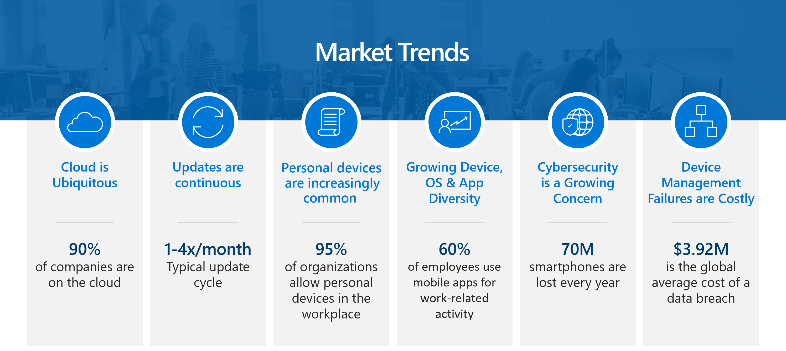

Today, most companies are on the cloud. Software updates are needed continuously. Organizations often allow personal devices in the workplace. The majority of end users use mobile devices and apps for work-related activity. And, cybersecurity continues to be a growing concern when protecting corporate data. 

Technology needs are evolving in the modern workplace. IT is adapting to this evolving modern workplace. These changes including the following:
- End users that were using a single device are now using multiple devices.
- Devices that were business owned are now both user and business owned.
- End users that were soley using the corporate network with legacy apps are now using cloud managed and SaaS apps as well.
- IT admins that were using manual processes are moving toward automated processes.
- IT admins that spent their time being reactive are now moving toward being automated.
- IT admins that were providing a high-touch environment for their organization are now providing self-service solutions.

Members of your organization must be able to access your organization's data seemlessly and securely. Whether they are using a corporate device, such as an iOS/iPadOS, Android, Windows, or macOS device, or they're using their own device. Additionally, people at your organization will need to share information with trusted and verified coworkers in a variety of forms, such as from an app or displayed in a web browser. And, each member of your organization will often be using multiple devices, both personal and corporate, to get their work done.  

As an IT admin or business decision maker, you must find modern methods and technologies to successfully manage and protect your organization against advanced digital threats, while still being productive.

You can start by implementing services and tools to protect the digital resources at your organization. Those resources often include devices, apps, and data that the people of your organization use to be productive. These same users may also be employees, coworkers, and students. They may open and share personal files, visit unsecure websites, and install potentially unsafe apps. They want to use their devices to access all of their information and resources, whether it is at work, school, or home.

You can protect those resources and devices by using Mobile Device Management (MDM) and Mobile Application Management (MAM) services and tools. MDM enables organizations to protect and secure their resources and data, based on enrolled devices. Organization can make sure that only authorized people and devices get access to proprietary information. Similarly, device users can feel at ease accessing work data from their device, such as a phone, because they know their device meets their organization's security requirements. MAM enables organizations to manage and protects their data within an application. 

An MDM or MAM solution must accomplish the following tasks:

- Support a diverse mobile environment to securely manage iOS/iPadOS, Android, Windows, and macOS devices.
- Make sure devices and apps are compliant with your organization's security requirements.
- Create and distribute digital policies that help keep your organization's data safe on organization-owned and personal devices.
- Use a single, unified mobile solution to enforce these policies, and help manage devices, apps, users, and groups.
- Protect your company information by helping to control the way your workforce accesses and shares its data.

Microsoft Endpoint Manager combines these services and tools in one location. You may know and already be using these services and tools, including Microsoft Intune, Microsoft Endpoint Configuration Manager, Desktop Analytics, co-management, and Windows Autopilot. These services are part of the Microsoft 365 stack of services to help protect your organization's endpoints, by securing access, protecting data, and responding to and managing risk.

## Learning objectives

In this module, you will:

- Learn what endpoints are and what Microsoft Endpoint Manager can do for you and your organization.
- Learn about the different products and services that encompass Microsoft Endpoint Manager.
- Consider the device types used by your organization and how they fit into your endpoint environment.
- Understand the benefits of Microsoft Endpoint Manager.