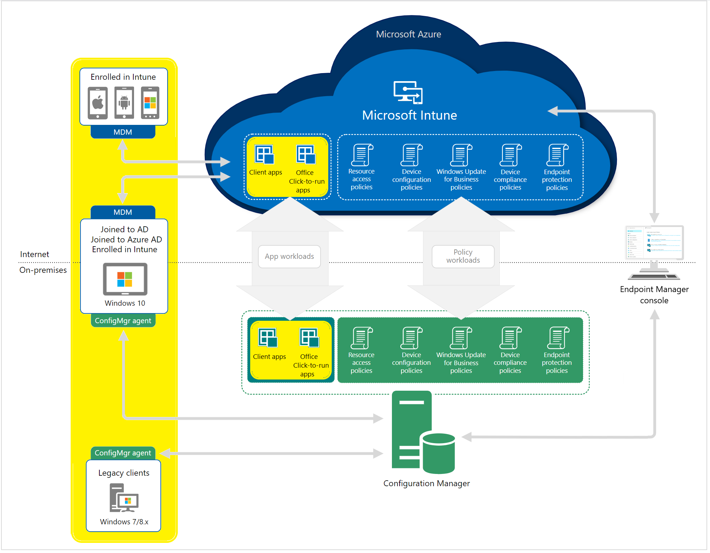

Microsoft Endpoint Manager is used to manage your organization's endpoints. As we've mentioned, Endpoints include the mobile devices, desktop computers, virtual machines, embedded devices, and servers that your organization uses. Additionally, endpoints also include the apps used by your organization. These endpoints are managed in different environments based on where these endpoints are located. Microsoft Endpoint Manager manages multiple endpoint environments, including cloud endpoints, on-premises endpoints, and co-managed endpoints.

## Cloud endpoint management

You can manage devices, apps, and data by using a cloud-based mobile device management (MDM) and mobile application management (MAM) service, such as Microsoft Intune. Intune integrates with other services, including Microsoft 365 and Azure Active Directory (Azure AD) to control who has access and what they have access to. Intune also integrates with Azure Information Protection to protect your organization's data. When you use Intune with Microsoft 365, you can enable your workforce to be productive on all their devices, while keeping your organi
zation's information protected.

## On-premises endpoint management

By using an on-premises endpoint management solution, you can manage your on-premise Windows 10 devices, apps, and data. By restricting access and location, your environment is more secure. Your end users will not be able to access company apps and data using remote devices. If you only use an on-premises solution, those remote devices will not be protected as corporately recognized endpoints.

## Cloud + on-premises endpoint management

For Configuration Manager managed devices, data can also flow to Microsoft Endpoint Management through the ConfigMgr connector. This is call cloud attached, where the ConfigMgr connector is attached to the cloud. It  requires a connection to an Intune tenant, and doesn't require turning on co-management.
 
## Co-managed endpoint management

Co-management is where you concurrently manage Windows 10 devices with both Configuration Manager and Microsoft Intune. Co-management combines your existing on-premises Configuration Manager investment with the cloud, by using Intune and other Microsoft 365 cloud services. You choose whether Configuration Manager or Intune is the management authority. By using co-management, you keep some tasks on-premises, while running other tasks in the cloud with Intune.

