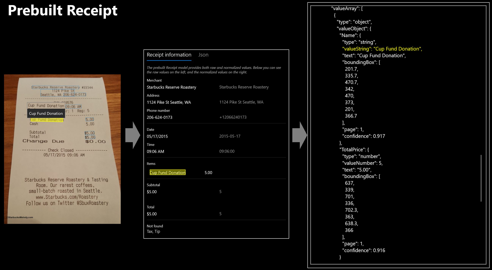
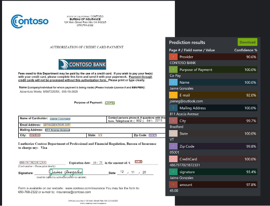

Form Recognizer is a cognitive service that extracts data from images and documents using machine learning. Form Recognizer can analyze and extract data from various types of documents including forms, tables, PDFs, pictures, written and typed documents, receipts, invoices, and business cards.

Extracting data manually from large numbers of forms is difficult. Using a service like Form Recognizer you can automate this process to help lower errors for data entry and save time, while also ensuring data from paper and digital forms is easily accessible.

## Layout API

Form Recognizer Layout API can extract text, selection marks, and table structures - the row and column numbers associated with the text - as well as their bounding box coordinates.

## Prebuilt Models

Form Recognizer Pre-built models are available for four applications: invoices, sales receipts, identifications, and business cards.

### Prebuilt Invoice Model

The Pre-built Invoice model extracts data from invoices in various formats and returns structured data. This model extracts key information such as invoice ID, customer and vendor details, shipping and billing information, the price totals, and tax amounts.

The Invoice model is able to extract the full line item and its parts – description, amount, quantity, product ID, date, and more. Further, this model is designed to analyze and return all of the text and tables in structured data in order to automate the invoice process.

### Prebuilt Receipt Model

This model is used to read English sales receipts from restaurants, retail, gas stations and more, from Australia, Canada, Great Britain, India, and the United States. The Prebuilt receipt model extracts the information you need, such as the time and date of the transaction, merchant information, and the tax and total amounts. The data can be extracted from different formats of receipts, in both scanned copies or phone images.

### Prebuilt ID model

This model extracts the information from worldwide passports and American drivers licenses, such as the document number, name, country of residence, and expiration date, and returns it in a structured list.

### Prebuilt Business Cards model

This model extracts key information, such as the contact information, and compiles them in an organized JSON response.

## Custom models

Form Recognizer offers custom data extraction ‘models’ that are tailored to your specific forms, which can extract text, key/value pairs, selection marks, and table data. The models are trained from the data you provide, improving the data extraction and outputting structured data in a customizable format. Custom models are perfect for forms that you use repeatedly, such as documents specific to your organization or industry.

You can create a custom model by uploading examples of your documents in the Azure portal, and even create a highly accurate model by ‘labeling’ the correct data to extract from your examples.

