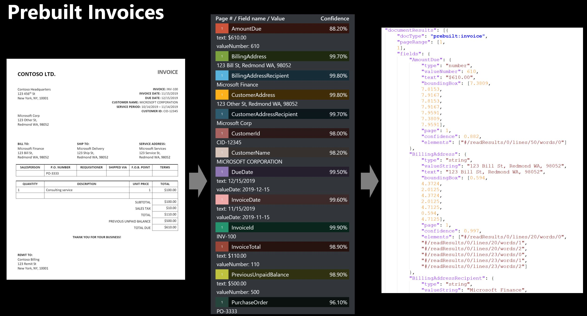

To use Form Recognizer, you need an Azure subscription, and a Form Recognizer resource, which you can create in the Azure portal. The resource provides you with an endpoint and key, with which you can access the Form Recognizer service through REST or by using the appropriate software development kit (SDK). SDKs are available in these languages:

* .NET
* Python
* Java
* JavaScript

You can test the service using a free pricing tier, to determine if Form Recognizer is right for your organization. 

## Layout API

Form Recognizer Layout API can extract text, selection marks, and table structures - the row and column numbers associated with the text - as well as their bounding box coordinates.

## Prebuilt Models

Form Recognizer Pre-built models are available in four models: invoices, sales receipts, identifications, and business cards.

### Prebuilt Invoice Model

The Pre-built Invoice model extracts data from invoices in various formats and returns structured data. This model extracts key information such as invoice ID, customer and vendor details, shipping and billing information, the price totals, and tax amounts.

The Invoice model is able to extract the full line item and its parts – description, amount, quantity, product ID, date, and more. Further, this model is designed to analyze and return all of the text and tables in structured data in order to automate the invoice process.

### Prebuilt Receipt Model

This model is used to read English sales receipts from restaurants, retail, gas stations and more, from Australia, Canada, Great Britain, India, and the United States. The Prebuilt receipt model extracts the information you need, such as the time and date of the transaction, merchant information, and the tax and total amounts. The data can be extracted from different formats of receipts, in both scanned copies or phone images.

### Prebuilt ID model

This model extracts the information from worldwide passports and American drivers licenses, such as the document number, name, country of residence, and expiration date. It then returns a list of the structured data.

### Prebuilt Business Cards model

This model extracts key information, such as the contact information, and compiles them in an organized JSON response.

