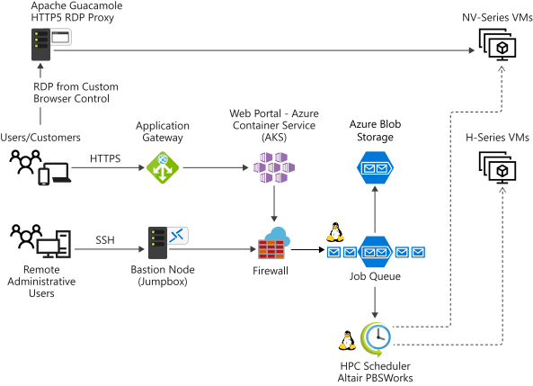

Each High-Performance Computing (HPC) challenge has its own requirements and often requires a unique solution.

As the solution architect for the engineering organization, you need to use HPC solutions on Azure to solve the complex tasks that the organization faces. These tasks include rendering 3D models of the facilities the company designs and storing large amounts of statistical data. The essence of HPC is to use many computers or computers that have highly specified CPU, GPU, and memory configurations to deal with complex, time consuming tasks. 

Here, you'll learn about some more typical HPC use cases. This knowledge should help you to identify future problems that might be addressed using HPC solutions.

## Common HPC use cases

Organizations use HPC to solve varied business problems. Your requirements may be unique but often, a use case falls into one or more of the following scenarios:

### Finite element analysis

Finite element analysis deals with problems that involve complex questions of engineering physics. Such problems might include heat transfer, structural analysis, mass transport, and electromagnetic potential. To solve these problems, large systems are subdivided into smaller chunks called finite elements, and reassembled into a larger system of equations.

Examples include car crash simulation and weather prediction. You can emphasize the most interesting aspects of the system. For example, car crash simulation might focus on the front of the vehicle while weather simulations can optimize for identifying extreme weather events. Using finite element analysis to model car crashes merely requires the specification of the vehicle's structural geometry and material composition. The mathematical variations for what might happen in a car crash over a couple of seconds are so vast that you might need HPC to model it properly.

### 3D model rendering

You'll see that 3D rendering is a classic use case for HPC in the cloud. A single machine might take hours or days to fully render a 3D video file or image from static assets. You could purchase an expensive and well-specified machine to deal with this problem. However, given the speed with which technology ages, it may be more economic and efficient to rent the required power in the cloud. Use Azure Batch to rent as much power as you need for the rendering in the time you have, then shut it down when the job is finished. You can adopt this process when you have frequent similar jobs to complete. 

The underlying infrastructure will be improved as technology upgrades become available. Azure Batch also lets you use some of the most important 3D rendering packages like Maya, 3D Studio Max, and Chaos V-Ray. You pay any licensing fees by the hour. Because rendering is particularly taxing on the CPU, deploying H-Series VMs into Azure Batch pools provides an efficient solution.

This diagram shows a typical Azure Batch architecture that you can use to support 3D rendering:

### DNA analysis

Genomics, the study of an individual organism's complete set of DNA, is also well-suited to cloud-based HPC techniques. Genome research typically involves vast amounts of data. The configuration of DNA is tracked across a sufficiently large number of individuals to identify significant variation. On average, there are around 25,000 genes in the human body, each consisting of instructions of between 500 and 2.3 million letters. HPC in the cloud allows enormous amounts of data to be stored and worked with efficiently, without major capital expenditure on technology that will soon be improved.

### Computer-aided design

Computer-aided design (CAD), which has some similarities to both finite element analysis and 3D Batch rendering, is another good use case for HPC in the cloud. CAD accelerates product design and testing, and allows complex visualizations and simulations to be done on the resulting artifacts.

This diagram shows a possible architecture that you could use to publish a CAD Software-as-a-Service product, based on N- and H-series VMs in Azure. 

### Computational fluid dynamics

Computational fluid dynamics (CFD) use mathematics to model fluid flows, both free-flowing and in interaction with solid surfaces. These simulations are taxing from a compute point of view and provide a good use case for some of the more intricate aspects of the H-Series VMs you saw earlier – such as Infiniband networking capabilities and an ability to interact via MPI.
