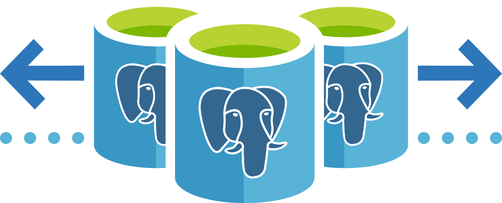

Hyperscale transforms PostgreSQL into a distributed database, letting you scale compute, memory, and storage. Your tables are broken into smaller parts and intelligently distributed over several servers.

## Citus - Open-source scale

:::row:::
:::column span="2":::

As modern workloads increased, relational databases struggled to scale to the same extent. Many solutions gave up standard features for scale. Citus, an open-source extension of PostgreSQL, was created in 2011 to solve this problem. Citus became so popular it was open-sourced in 2016.

Hyperscale combines the benefits of PostgreSQL, Citus, and Azure, created by the same team from Citus Data. No more giving up transactions, joins, or foreign keys. Developers retain all of the benefits that two decades of open-source community development have given PostgreSQL.

 :::column-end:::
:::column span="2":::

:::column-end:::
:::row-end:::

## What is Hyperscale?

Hyperscale is a deployment option, built into Azure Database for PostgreSQL - A fully managed database-as-a-service. You keep the open-source Postgres relational database engine, while scaling as much as you want to.
:::row:::
:::column span="3":::

Hyperscale is used when applications require high performance or massive scale.  Examples include Clearent, with over half a billion credit card transactions per year. Hyperscale takes care of the massive speed and analytical workloads for employees and customers alike.

Another example is Helsinki Region Transport Authority (HSL), responsible for more than half of all public transportation in Finland. With over 1 million journeys every day made on HSL bus, train, Metro, tram, and ferry services, it’s critical to log and monitor this traffic efficiently.
 :::column-end:::
:::column span="2":::

“Hyperscale (Citus) transforms PostgreSQL into a distributed database—giving developers game-changing performance improvements and delivering queries that are magnitudes faster than proprietary implementations of Postgres”
\- Umur Cubukcu, co-founder and CEO of Citus.
:::column-end:::
:::row-end:::

### The benefits of Hyperscale

Hyperscale allows you to easily "scale out" - Letting a single PostgreSQL instance run on multiple servers, instead of a single server. Collectively, server groups can hold more data and use more CPU cores than a single server, while having shorter distances to users. This gives faster responses on large datasets, even over multiple regions.

As an example, let’s say you work for Woodgrove Bank, and you’ve developed and trialed a contactless payment app that works from six feet away. Your app is currently using a single on-premises PostgreSQL server.

The trial went well, and now you’re planning to start releasing your app to customers in Europe and the United States. The current single on-premises server will struggle under the heavy analytical loads that your bank requires. It will also slow transaction times across the Atlantic. To avoid this problem, you need to scale the database solution for both capacity and geographic performance.

Hyperscale lets you scale out, seamlessly distributing and managing your data under the covers. Transactions will be spread across multiple servers, giving better transaction times and more room for analytical workloads.

In this module, we’ll create a Hyperscale instance on Azure, design how to effectively distribute the postgres database, and scale it. More importantly, we’ll explain what we’re doing, and why.
