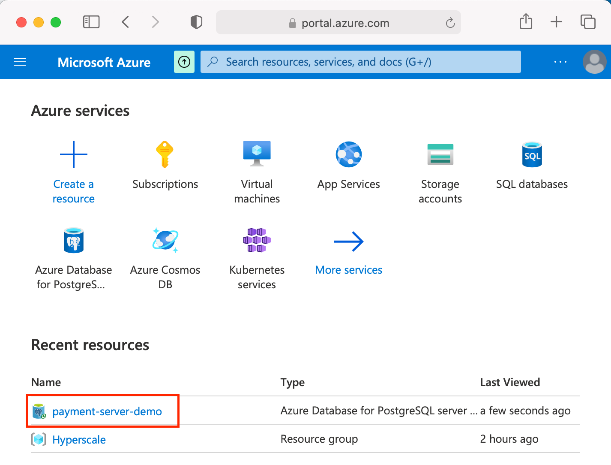
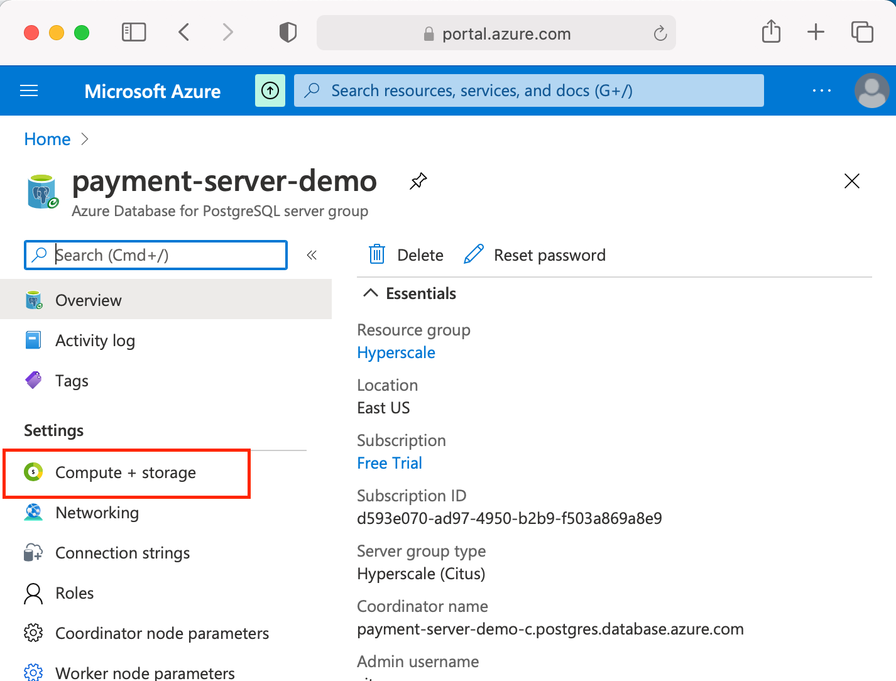

In this exercise, we're going to double the number of worker nodes. Then we'll rebalance the shards, to take advantage of the new worker nodes.

1. Sign in to the Azure portal using your Azure account.

    > [!div class="nextstepaction"]
    > [Azure portal](https://portal.azure.com/)

2. Next, select the **payment-server-demo** resource.



3. Then select the **Compute + storage** tab.



4. Now, select 4 worker nodes. Adjust the vCores for the coordinator node if you want, but the deployment process may take a few minutes longer.


    > [!NOTE]
    > Once increased and saved, the number of worker nodes cannot be decreased using the slider.

5. At the bottom of the page, select the blue **Save** button, then select **Continue**.

To take advantage of newly added nodes, we must rebalance distributed table shards. You need to **wait** until the deployment of the new nodes is complete, though.

6. Go to Azure Cloud Shell
    > [!div class="nextstepaction"]
    > [Azure Cloud Shell](https://shell.azure.com)

7. Connect to your Hyperscale instance with the following command, using your password:

   ```psql
   psql "host=payment-server-demo-c.postgres.database.azure.com port=5432 dbname=citus user=citus password={YOUR-PASSWORD-HERE} sslmode=require"
   ```
    > [!NOTE]
    > You can reset your password in the [Azure Portal](https://portal.azure.com). Select the `payment-server-demo` resource, then select `Reset password` 

8. In the Cloud Shell window, run the following query to rebalance the shards for our payment_events and payment_users tables:

```sql
SELECT rebalance_table_shards('payment_events');
SELECT rebalance_table_shards('payment_users');
```

And that's it! You've now created and scaled a distributed database. Run the next step in the Azure Cloud Shell, to delete the resource group and avoid any unnecessary charges to your account.

9. In the Cloud Shell window, run to disconnect from the Hyperscale instance:

```sql
\q
```

Then:

```azurecli
az group delete --name Hyperscale
```
Press `y`, then hit enter. The process will take a while, you can move onto the next unit.
