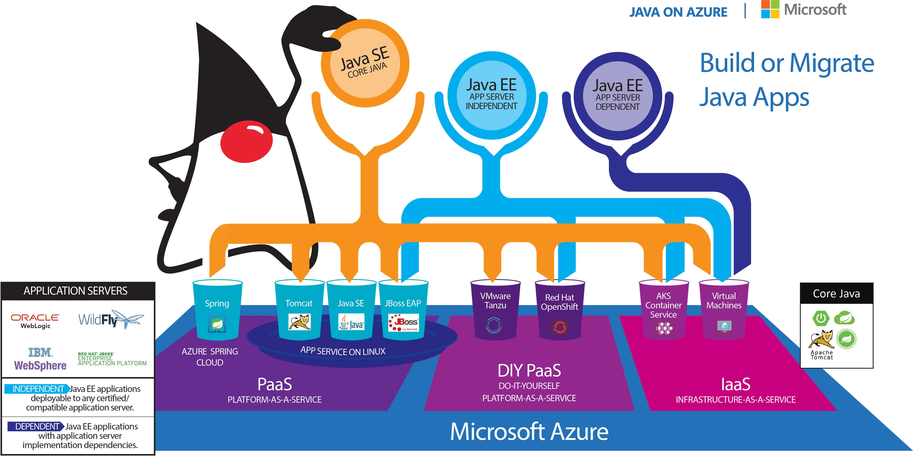

Azure offers various deployment solutions for Java applications. We'll look at just a few of them here.

## Virtual machines  

Just like in your own datacenter, virtual machines (VMs) are available on Azure. You can choose between kinds of VMs on Windows and on Linux, such as Ubuntu, Red Hat, or SUSE.

VMs are usually the starting point for the *lift and shift* approach.
Just like in your datacenter, you have all the freedom. 

> [!NOTE]
> With great power comes great responsibility. If you choose this infrastructure as a service (IaaS) solution, you'll have to take care of OS updates, Java runtime, network settings, port forwarding, and security.

## Container

When you realize that the OS didn't bring any business impact to your application, you can abstract from it and use containers instead.

- **Azure Kubernetes Service** (AKS) is a managed Kubernetes service. Kubernetes is the de facto standard to orchestrate your containerized applications. It's perfect for microservices and for midsize applications. AKS comes with service discovery, scalability, and monitoring. Microsoft is a proud initializer and collaborator in open-source technologies around the Kubernetes ecosystem, such as Virtual Kubelet, Dapr, or Open Application Model (OAM).

- **Azure Red Hat OpenShift** is the managed by the Red Hat variety of Kubernetes.

- **Azure Container Instances** is a solution for quick tests, proofs of concept, and sidecars.

## Azure App Service

One of the easiest and most straightforward deployment opportunities for Java applications on Azure is Azure App Service. It comes with scalability and integrated monitoring through Azure Monitor.

## Azure Spring Cloud

Azure Spring Cloud is Spring Cloud with all its advantages, plus all the global scalability and high availability of Azure. Azure Spring Cloud is a fully managed service for Spring Boot apps. It lets you focus on building and running the apps that run your business without the hassle of managing infrastructure.

Customers can deploy their JARs or code, and Azure Spring Cloud will automatically wire their apps with the Spring service runtime.
After the customers deploy the apps, they can easily monitor performance, fix errors, and make improvements.

Azure Spring Cloud is integrated into the Azure ecosystem and is ready to tackle enterprise workloads and needs. Microsoft and VMware provide the service's general availability.

## Functions

You can deploy your Java code as functions. So you'll benefit from great tooling and integration with other Azure services.

Sample scenarios for functions are:

- Web, mobile, and Internet of Things (IoT)-connected back ends
- Bot or real-time file and stream processing
- Automation of scheduled tasks
