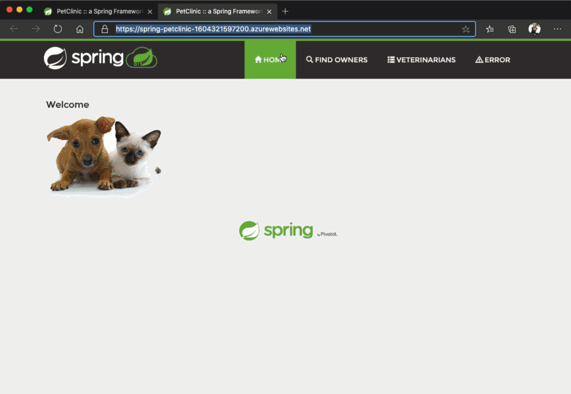

Probably you're more than curious how a deployment of a Java application in Azure can look like! No worries! We got you.

## Sample application

You can go with an example, you've created by yourself. Or you succeed with a common Spring Boot example that can be found at the spring starters.

Clone in your favorite command-line tool.

``` bash
git clone https://github.com/spring-projects/spring-petclinic.git
```

And then run it locally.

``` bash
cd spring-petclinic

./mvnw package

java -jar target/*.jar
```

Opening in the browser, it should like this.


## Choose the right Service

Before you decide which Service is the best for you to use, have a look at the following flowchart. It should be simple to follow. This chart helps you decide if using, for example, an Azure App Service is the best solution for your application code.


For the single deployment of the pet clinic, we'll take App Service.

## Prepare the sample application to be cloud ready

As you as a Java developer are used to, you'll find all the relevant code in the src folder. It's following the Spring Boots architecture with Object, Controller, and Repository classes and they're separated by functionality.

As Java is platform independent, the OS is free to be chosen. But what's important for the deployment is the Java version. You find the version in the `pom.xml`.

```xml
<properties>
    <java.version>1.8</java.version>
</properties>
```

That example is using Java 8. So our App Service, Linux or Windows should use Java 8 as well. As the platform doesn't matter, we'll use Linux for our example.

Regardless of the Java version. We have to add some Azure dependencies to the `pom.xml` file. This adding can be done automatically for us by running

```bash
mvn com.microsoft.azure:azure-webapp-maven-plugin:1.11.0:config
```

Running that command will ask for some options to be specified. Those options will be stored automatically in our `pom.xml`.

```bash
Please choose which part to config:
* 1: Application
  2: Runtime
  3: DeploymentSlot
Enter your choice: 1
Define value for appName [spring-petclinic-1604321597200]:
Define value for resourceGroup [spring-petclinic-1604321597200-rg]:
Define value for region [westeurope]:
Define value for pricingTier(P1v2):
   1: b1
   2: b2
   3: b3
   4: d1
   5: f1
*  6: p1v2
   7: p2v2
   8: p3v2
   9: s1
  10: s2
  11: s3
Enter your choice: 1
Please confirm webapp properties
AppName : spring-petclinic-XXXX200
ResourceGroup : spring-petclinic-XXXX200-rg
Region : westeurope
PricingTier : Basic_B1
OS : Linux
RuntimeStack : JAVA 8-jre8
Deploy to slot : false
Confirm (Y/N) [Y]: y

[INFO] Saving configuration to pom.
[INFO] ------------------------------------------------------------------------
[INFO] BUILD SUCCESS
```

As you can see, you can go with the defaults for a simple deployment.

The `pom.xml` file has now added the required plugin for the automatically maven-based deployment to Azure.

```xml
 <plugin>
    <groupId>com.microsoft.azure</groupId>  
        <artifactId>azure-webapp-maven-plugin</artifactId>  
        <version>1.11.0</version>  
        <configuration>
          <schemaVersion>V2</schemaVersion>  
          <subscriptionId>XXX-XXX-XXX</subscriptionId>  
          <resourceGroup>spring-petclinic-XXX200-rg</resourceGroup>  
          <appName>spring-petclinic-XXX200</appName>  
          <pricingTier>B1</pricingTier>  
          <region>westeurope</region>  
          <runtime>
            <os>linux</os>  
            <javaVersion>jre8</javaVersion>  
            <webContainer>jre8</webContainer>
          </runtime>  
          <deployment>
            <resources>
              <resource>
                <directory>${project.basedir}/target</directory>  
                <includes>
                  <include>*.jar</include>
                </includes>
              </resource>
            </resources>
          </deployment>
        </configuration>
  </plugin>
```

## Deploy the application with maven

Great! We're already prepared for the deployment to Azure App Service.

```bash
mvn package azure-webapp:deploy
```

This command will run the tests, and then automatically spin up an Azure App Service on Azure and deploy the packaged application.



Congratulations! The app got successfully deployed to Azure App Service.
You just used the commands, which are in more real world scenarios run by the CI/CD tool of your choice.
