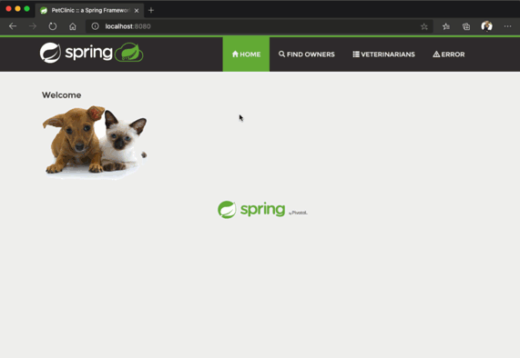

In this unit, you'll configure a Spring Boot application to be deployed via Maven. You'll then deploy the application to an Azure App Service instance. This unit shows the example of a pet clinic.

## Example application

Clone in your favorite command-line tool.

``` bash
git clone https://github.com/spring-projects/spring-petclinic.git
```

Then run it locally.

``` bash
cd spring-petclinic

./mvnw package

java -jar target/*.jar
```

When you open the example in the browser, it should like this:



## Prepare the example application to be cloud ready

In the src folder, you'll find object, controller, and repository classes.

Because Java is platform independent, you're free to choose the OS. But the Java version is important for the deployment. You find the version in the pom.xml file.

```xml
<properties>
    <java.version>1.8</java.version>
</properties>
```

The example uses Java 8. So our Azure App Service instance, whether Linux or Windows, should also use Java 8. Because the platform doesn't matter, we'll use Linux for our example.

We have to add some Azure dependencies to the pom.xml file. Adding the dependencies can happen automatically if you run the following command.

```bash
mvn com.microsoft.azure:azure-webapp-maven-plugin:1.12.0:config
```

The output of that command asks for some options to be specified. Those options will be stored automatically in pom.xml.

```bash
Please choose which part to config:
* 1: Application
  2: Runtime
  3: DeploymentSlot
Enter your choice: 1
Define value for appName [spring-petclinic-XXXX200]:
Define value for resourceGroup [spring-petclinic-XXXX200-rg]:
Define value for region [westeurope]:
Define value for pricingTier(P1v2):
   1: b1
   2: b2
   3: b3
   4: d1
   5: f1
*  6: p1v2
   7: p2v2
   8: p3v2
   9: s1
  10: s2
  11: s3
Enter your choice: 1
Please confirm webapp properties
AppName : spring-petclinic-XXXX200
ResourceGroup : spring-petclinic-XXXX200-rg
Region : westeurope
PricingTier : Basic_B2
OS : Linux
RuntimeStack : JAVA 8-jre8
Deploy to slot : false
Confirm (Y/N) [Y]: y

[INFO] Saving configuration to pom.
[INFO] ------------------------------------------------------------------------
[INFO] BUILD SUCCESS
```

As you can see, you can go with the defaults for a simple deployment.

The pom.xml file has now added the required plug-in for the automatic Maven-based deployment to Azure.

```xml
 <plugin>
    <groupId>com.microsoft.azure</groupId>  
        <artifactId>azure-webapp-maven-plugin</artifactId>  
        <version>1.12.0</version>  
        <configuration>
          <schemaVersion>V2</schemaVersion>  
          <subscriptionId>XXX-XXX-XXX</subscriptionId>  
          <resourceGroup>spring-petclinic-XXX200-rg</resourceGroup>  
          <appName>spring-petclinic-XXX200</appName>  
          <pricingTier>B2</pricingTier>  
          <region>westeurope</region>  
          <runtime>
            <os>linux</os>  
            <javaVersion>jre8</javaVersion>  
            <webContainer>jre8</webContainer>
          </runtime>  
          <deployment>
            <resources>
              <resource>
                <directory>${project.basedir}/target</directory>  
                <includes>
                  <include>*.jar</include>
                </includes>
              </resource>
            </resources>
          </deployment>
        </configuration>
  </plugin>
```

## Deploy the application with Maven

We're already prepared for the deployment to Azure App Service.

```bash
mvn package com.microsoft.azure:azure-webapp-maven-plugin:1.12.0:deploy
```

This command runs the tests. It then automatically spins up an Azure App Service instance and deploys the packaged application.


Congratulations! The app is successfully deployed to Azure App Service.
