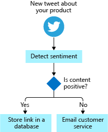
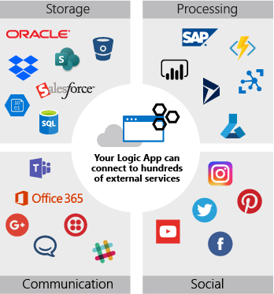

Let's start with a few definitions and a quick tour of the core features of Logic Apps. This overview should help you see whether Logic Apps might be a good fit for your work.

## What is a business process?

A *business process* or *workflow* is a sequence of tasks that produce a specific outcome. The result might be a decision, some data, or a notification.

One of the shoe-company scenarios is monitoring social media for reaction to a new product. The sequence of tasks would be: detect tweets about the product, analyze the sentiment, store a link to positive tweets, and email customer service for negative tweets.

Since the steps occur in a specific order, you'll often describe them with a flowchart. The following illustration shows a sample flowchart for the social-media monitor process. Notice how there are three types of operations: an event that starts the flow, processing steps that do most of the work, and a conditional operator that makes a decision.

## What is Azure Logic Apps?

Azure Logic Apps is a cloud service that automates the execution of your business processes. You use a graphical design tool called the *Logic Apps Designer* to arrange pre-made components into the sequence you need. The designer sends a definition of your workflow to the Logic Apps execution engine. The execution engine launches your app when conditions are right and manages the compute resources needed to run it. The following illustration shows a high-level view of the steps.

The power of Logic Apps comes from the diversity of the pre-built components and their ability to work together. The components let you connect to hundreds of external services. The following illustration shows a few of the services you can use in your logic app.

You build your app from the services you use in your business processes. The components can be connected in any pattern you need. You can add conditional statements and loops to add decision making to your app. The following illustration shows how you would combine external services to implement the social-media monitor workflow.

:::image type="complex" source="../media/service-use.png" alt-text="Diagram showing the mapping of the tweet-analysis business process to a logic app.":::
Diagram showing a flowchart for a business process and a logic app that implements that process. For each step in the business process, there's a corresponding component used in the logic app to implement it. For example, the process would use the Twitter component to watch for tweets about a new product.
:::image-end:::

The Logic Apps model is extensible. If there isn't a pre-built component for the service you need, you can create your own. You can also run custom code in an Azure function that you invoke from your app.

If we had to describe the goal of Logic Apps in one word, we'd choose *integration*. Logic Apps helps you join disparate services to implement a workflow. Your job is to use the Logic Apps Designer to arrange the components into the sequence you need. For most apps, you won't need to write any code and you can be up and running in minutes.
