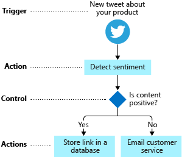
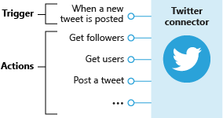
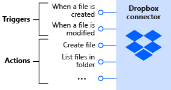
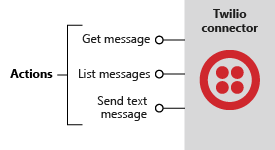
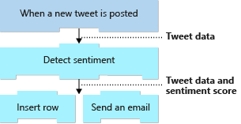
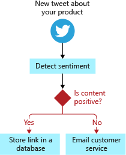
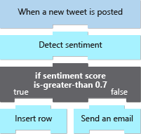
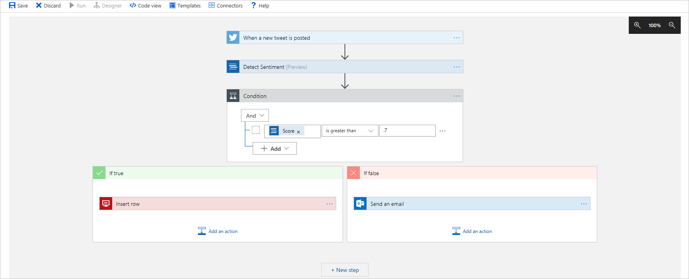

Now that we know the basics of Logic Apps, let's see how it works behind the scenes. This information should help you decide whether Logic Apps will work for you without any customization. In cases where you do need create custom components, you'll be able to determine how difficult it will be.

## What is a connector?

A *connector* is a component that provides an interface to an external service. For example, the Twitter connector allows you to send and retrieve tweets, while the Office 365 Outlook connector lets you manage your email, calendar, and contacts. Logic Apps provides hundreds of pre-built connectors that you can use to create your apps.

A connector uses the external service's REST or SOAP API to do its work. When you use a connector in your logic app, the connector calls the service's underlying API for you. The following illustration shows the Twitter connector and its use of the Twitter REST API.

## Custom connectors

You can write custom connectors to access services that don't have pre-built connectors. The services must have a REST or SOAP API. The requirement that the services provide an API shouldn't be too surprising since connectors are essentially wrappers around that underlying API.

To create a custom connector, you first generate an OpenAPI or Postman description of the API. You then use that API description to create a custom connector resource in the Azure portal. You can give your connector a name, an icon, and a description for each operation. The following illustration shows an example of the process. Notice that there's no coding involved.

You can use your new connector in your own apps and share it with other people in your organization. You can also submit your connector to Microsoft for certification. Once your connector is certified, it will be included in the set of connectors available to all users.

## What are triggers and actions?

Workflows are built from different types of tasks. For example, in our social-media monitor scenario we start the workflow when a new tweet is posted, perform work like detect the sentiment, and make a decision based on the sentiment score. Logic Apps uses the terms *trigger*, *action*, and *control action* for these concepts. These operations are the building blocks of Logic Apps. The following illustration shows how we use each type of step in the social-media monitor app.

Let's be more specific about the definitions for trigger and action:

- A *trigger* is an event that occurs when a specific set of conditions is satisfied. Triggers activate automatically when conditions are met. For example, when a timer expires or data becomes available.

- An *action* is an operation that executes a task in your business process. Actions run when a trigger activates or another action completes.

A connector is a container for related triggers and actions. Let's look at a few examples.

The Twitter connector lets your logic app interact with Twitter. The social-media monitor app would use a trigger from the Twitter connector to determine when new relevant tweets are available. The following illustration shows the Twitter connector with its trigger and actions.

Next, we have the Dropbox connector. Suppose you were working with a small team on a project that stored its shared data in Dropbox. You could build a workflow that detects when someone modifies any of your files and sends a notification to the other team members. The following illustration shows the Dropbox connector with its triggers and actions.

Finally, let's look at the Twilio connector. Most connectors offer both triggers and actions, but this one only has actions. The Twilio connector is great whenever you want to send text messages for notifications. For example, you could use it in the Dropbox scenario to let team members know that a shared file had changed. The following illustration shows the Twilio connector and its actions.

## How to build Logic Apps from triggers and actions

You build a logic app from triggers and actions. An app must begin with a trigger. After the trigger, you include as many actions as you need to implement your workflow. The following illustration shows the trigger and actions used in the social-media monitor app.

## How do triggers and actions work together?

Triggers and actions are essentially function calls to an underlying API operation. Each operation has inputs and outputs. For example, the **When a new tweet is posted** Twitter trigger takes in a search string and returns the tweets that contain that string. The "detect sentiment" action takes a string as input and returns the sentiment score as a floating-point number. The following illustration shows these two operations.

Logic Apps automatically makes the return values available throughout the rest of the operations. This feature lets you pass the results from one operation as input to the next operation. The following illustration shows the data flow for the first two operations in the social-media monitor app. Notice that the results from an operation are available in all of the following steps.

## What are control actions?

Most workflows need to do different actions based on the data being processed. For example, an expense report might be routed to a different manager based on the amount. In the social-media monitor app, we need to branch based on the sentiment score of the tweet. The following illustration shows the flowchart for the social-media monitor app with the control logic highlighted.

*Control actions* are special actions built-in to Logic Apps that provides these control constructs:

- *Condition* statements controlled by a Boolean expression.
- *Switch* statements.
- *For each* and *until* loops.
- Unconditional *branch* instructions.

The following illustration shows the use of a *condition* statement in the social-media monitoring application.

## What is the Logic Apps Designer?

The Logic Apps Designer is a graphical tool for creating your workflows. It gives you a design canvas that you use to add a trigger and actions to your app. For example, the social-media monitor app uses the **When a new tweet is posted** trigger, a _condition_ to branch, and the **Detect sentiment**, **Insert row**, and **Send an email** actions. The following screenshot shows the social-media monitor logic app displayed in the designer.

