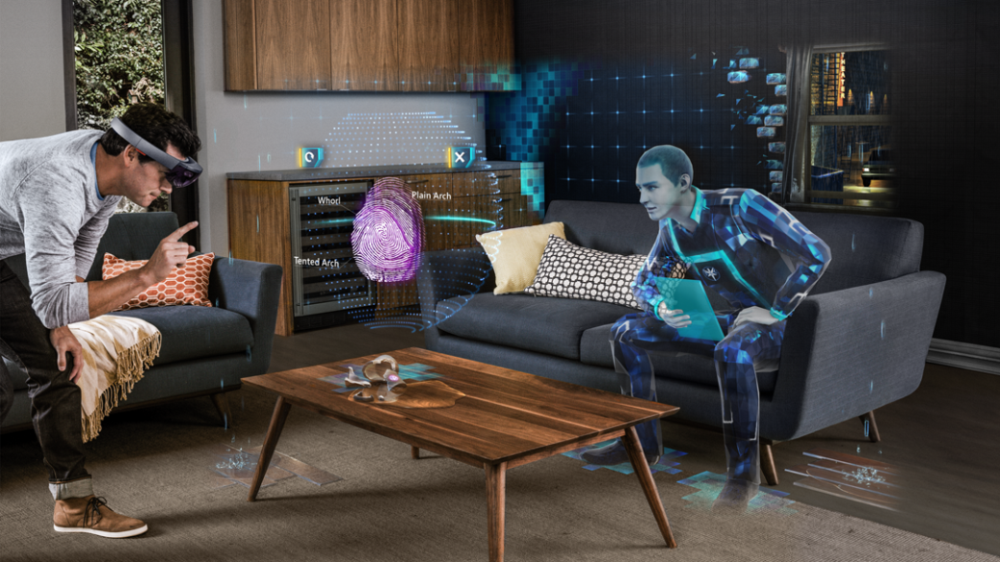
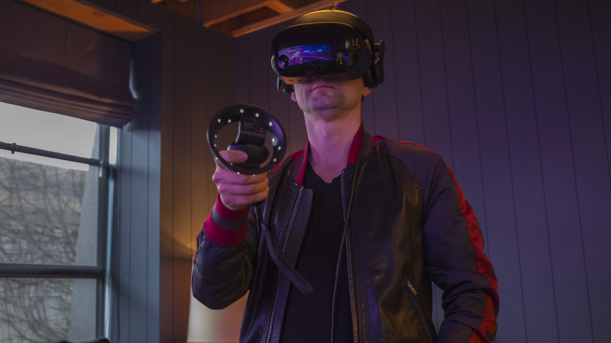

One of the central questions that new Mixed Reality learners ask is always some variation of “Well, what’s the difference between AR, VR, and MR then”. Before we dive into the Webster’s dictionary definitions, watch the following video and see if your mental model starts to line up with this new paradigm:

Now that you’ve got the basics down, let’s define AR on a more granular level:

*Augmented Reality is any technology that creates a composite viewing experience by superimposing a computer-generated image over a user’s view of the real world.*

Augmented Reality experiences are not limited to visual addition to our world. You can create augmented experiences that are only audio addition to your physical world or both audio and visual.

Augmented Reality experiences are also not limited to headsets like HoloLens. Today, millions of mobile devices have depth-sensing capabilities to augment your real world with digital information.

On the other side of the spectrum, VR is defined as:

*Any technology or experience that absolutely immerses a user into a virtual world through the use of a headset, effectively severing their connection to the sights and sounds of the real world.*

Virtual Reality applications are great for training and for simulations where users would benefit from total immersion to replicate the real life situation. Some examples include training for firefighters, emergency room healthcare providers and flight simulations.

The next logical question you’re probably asking yourself is – “With all these choices, how do I decide between AR and VR when I start developing an MR application?”. The easy answer is that we have a video for just that scenario to round out our discussion:

