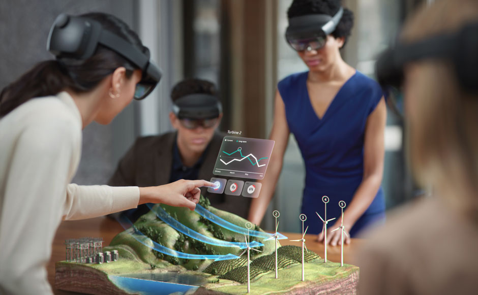

Holograms and holographic experiences aren’t the fruit of pure science-fiction anymore, in fact, they make up the foundation of all augmented reality applications. Holograms are digital objects that appear in the world around you when wearing a HoloLens; they’re made of light and sound. You can program holograms to interact with a user’s gaze, gestures, or voice input, like rotating a digital building plan with the touch of a finger or wave of the hand. 

It’s important to note that holograms are only part of the augmented reality part of the Mixed Reality spectrum and shouldn’t be confused with virtual objects in immersive experiences. 

## Placing holographic content

You can place them in a specific location within an augmented reality space, giving your users the ability to walk around or even away and have the hologram remain in place. If you’re creating a more interactive interaction, holograms can be set to follow a user, tagging along at a relative distance no matter where they are. You can even add something called a spatial anchor to have your application remember where you placed a hologram, effectively pinning it in place for you to come back to later. 

One of the most wonderful aspects of holograms and augmented reality is that they can appear to interact with the physical world. For example, you could place a holographic ball above a table in the real world and have it bounce when a user makes a gesture or says the word “bounce”. Adding sound effects or occlusion behind real-world objects can give your holograms an added bit of physicality and realness. 