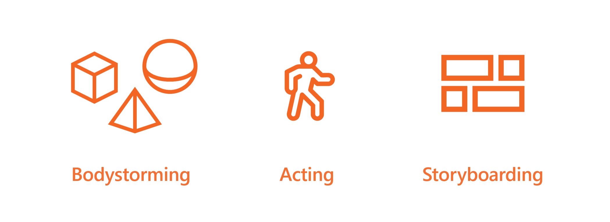
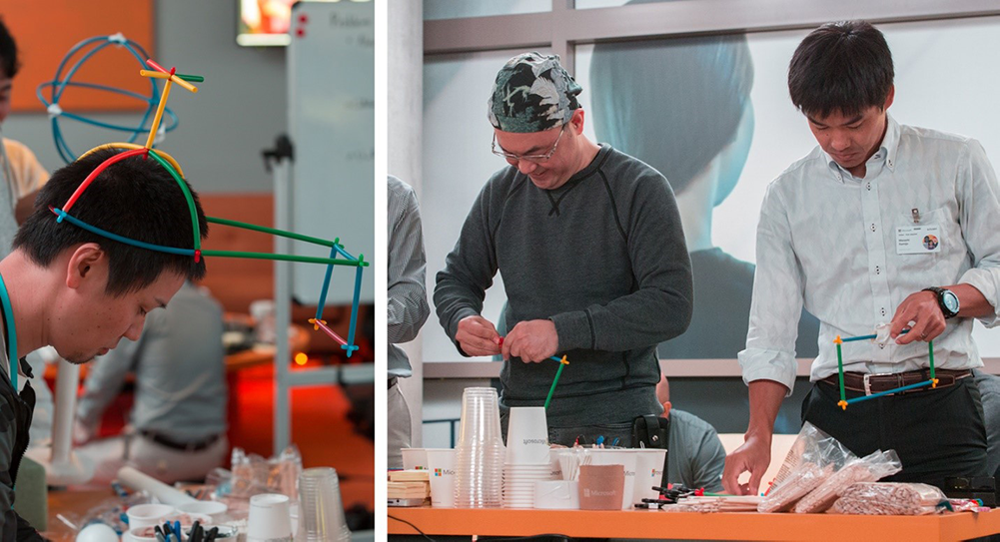

When it comes to Mixed Reality projects, it’s important to understand that some of the familiar design processes you or your team might be used to need to be adapted for 3D content. For instance, when you’re in the midst of brainstorming a login screen for a mobile app or website, a simple rectangle and a few lines to symbolize text fields is all you need to get the point across. 

Designing for three dimensions instead of two can be more time consuming, as drawing or sketching in 3D is much harder than in 2D. There are 3D tools that exist for gaming and engineering, but these usually have a high barrier to entry. This lack of fast, lightweight tools can impact your design pipeline and overload the person developing the actual application. 

Luckily, there are a few techniques that can help in effectively iterating through ideas and getting your content fleshed out and allow different team members and disciplines to have a voice.

## Bodystorming

Bodystorming is the process of prototyping interactions, digital objects, and UI, and animations using crafting materials. This allows anyone involved in the design process to try out the proposed interactions, features, and mechanics without having to fully prototype them. The goal of all bodystorming sessions is to get actionable input, testing feedback, and most importantly to think spatially about the app content.

## Acting and feedback

After you’ve been through a bodystorming session or two, the next step is to stage how a user would move through your Mixed Reality experience. This phase, which is called acting, is all about testing ideas in three-dimensional space, but also about allowing others to watch the interactions and events from the outside and provide feedback. This is especially important when you have non-technical team members or stakeholders. For example, if you are exploring a mixed reality experience designed for hospitals, acting out your thinking to a medical professional can provide invaluable feedback.

## Storyboarding

Choosing the best method for getting your ideas and proposed experience always depends on the target audience. If you need to present some new ideas to a development team, bodystorming and acting out the experience or new content can be more than enough to get the job done. However, when you need to convince stakeholders or non-technical team members, you may need to opt-in for more high-fidelity assets like storyboarding. 

Whether the storyboards themselves are extremely detailed or just sketches meant to evoke the broad strokes of an experience is up to you. 