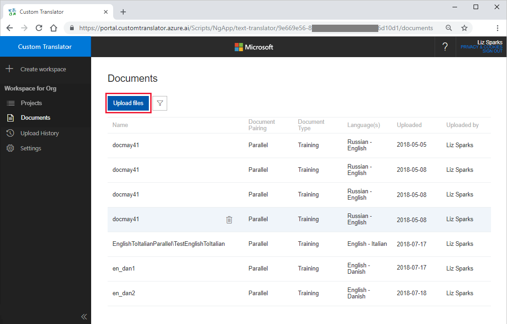
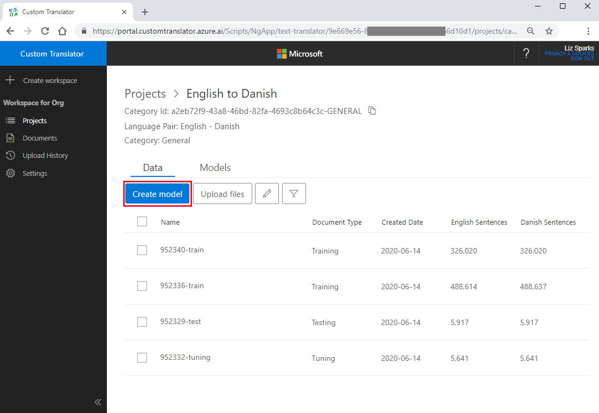

Translator is accessed via **REST API**, and requires an **Azure Cognitive Services subscription** and a **Translation service subscription**. The subscription has free and standard pricing tiers and provides an endpoint and subscription key for you to access the service.

## Translating text

Translator’s text translation service uses a JSON-based Web API with text sent as strings. Developers can specify translations to be returned in multiple languages. The body of a translation request is an array, where each element is a JSON object holding the text to be translated. For example:

```JSON
[
    {"Text":"I would really like to go to the theatre."},
    {"Text":"Let's go out for lunch!"}
]
```

The target language that the text is to be translated into should be provided in the URL. For example, the following URL for the POST request would translate text into German:

```HTTP
https://api.cognitive.microsofttranslator.com/translate?api-version=3.0&to=de
```

## Translating documents

**Document Translation API** translates batches of documents while preserving all document structure and data formatting. Document Translation is a non-real-time request, where you make a request that specifies the location of the source and target documents and the list of target output languages.

This batch translation is done within Azure blob storage containers, with the source, target, and glossary files stored in their own separate blob containers. Below we see a request to translate all documents within the 'source-en-location' container to French:

```JSON
{
    "inputs": [
        {
            "source": {
                "sourceUrl": https://my.blob.core.windows.net/source-en-location
            },
            "targets": [
                {
                    "targetUrl": https://my.blob.core.windows.net/target-fr-location,
                    "language": "fr"
                }
            ]
        }
    ]
}
```

## Custom Translator

Using the custom translator portal, you can use previously translated documents to build a customized translation system. Translated documents can be in many formats, including PDF, TXT, DOCX, XLSX, and HTML. Using the portal, you can upload two sets of documents - one set of documents being the source language, and the other set being the target.



Once uploaded, you can then create a custom translation model.



Once a model is trained, you can view the test results. If you require a more accurate model, you can upload more documents and retrain the model. Custom translation models can be accessed by applications using the Translator Text API V3.

## Additional functionalities

**Dictionary look-up** provides alternative translations for words or figures of speech. Each dictionary look-up request will show a list of alternate translations that interpret a word or phrase in its original language, allowing you to understand the translation in context. The original or alternate translations can then be used with the Dictionary example operation to show example sentences of the translation pairing in both languages, imparting clarity on the appropriate translation to use.

A **Dynamic Dictionary** is used if you already know the translation you want to apply to a word or phrase. The dynamic dictionary is best used to translate compound nouns like proper names and product names.

**Profanity filters** are available when requesting a  translation. By default Translator includes the profanity present in the source language as what is considered profane differs across cultures. If you would like to change the settings to have profanity deleted or marked with appropriate tags in your translation, you can use the profanity filtering option.
