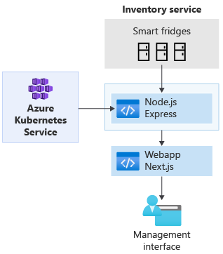
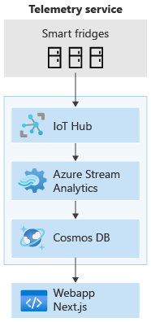
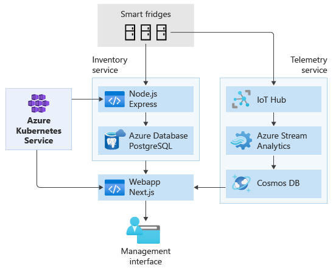

Because cloud-native apps are made up of the components of your choice, you can easily architect a solution that uses technologies you're comfortable with. For example, if Python better suits your data analytics service, but your email service is more suited to using a pre-built solution, the architectural modularity of cloud-native apps significantly simplifies implementation. This modularity even extends across different cloud providers.

For example, many cloud services, such as Azure Database for MySQL, allow you to develop using the open-source versions of technologies that you’re used to, but have Azure take care of administration and deployment responsibilities for you.

### Architecting a cloud-native solution for Adatum

In our scenario, we can architect a solution that’s easy for a small team to develop but also scales safely to thousands of devices. Cloud functionality eliminates many development issues arising from a need to connect to large numbers of devices and process data on demand. By using cloud infrastructure, pre-built services can be easily configured to communicate with each other and autoscale as needed.

Later, if necessary, the solution can grow to accommodate new or updated products. In our scenario, if a hotel chain ordering thousands of fridges needs extra functionality, you can create an extra service with no downtime for existing customers.

### Starting small

:::row:::
:::column span="2":::

To begin, we could use a basic webapp for a management interface. A simple backend in the cloud can relay messages from smart fridges to the webapp, which can then be containerized and deployed to a Kubernetes cluster—so the number of containers can scale as needed. The following diagram shows this relationship. The Node.js Express box relays messages to our Webapp Next.js box, both of which are deployed from our Kubernetes service.

This solution is easily connected to your database of choice, allowing a scalable, end-to-end service to be up and running quickly.

:::column-end:::
:::column span="1":::

:::column-end:::
:::row-end:::

### Growing our application

:::row:::
:::column span="3":::

Smart devices offer a wealth of connectivity and data options. Advancements in the IoT field offer cost-effective options for gathering data and streaming it to the cloud. IoT cloud services for smart devices are easy to connect, allowing you to stream telemetry data such as fridge temperatures, power consumption, and water quality.

Developers can use cloud-services, such as IoT Hub and Stream Analytics, to develop cloud-native apps with IoT integration. Since much of the groundwork has been done for you, development time can be decreased significantly.

Because of the loosely coupled nature of cloud-native apps, you can choose a different database solution for telemetry data that's more suitable for streaming data, such as Cosmos DB, rather than a traditional, relational database that might be more suitable for an inventory service.

:::column-end:::
:::column span="1":::

:::column-end:::
:::row-end:::

As the services are separated, your team can also develop and deploy an IoT service with no effect on your existing inventory service, as shown in the following image.

