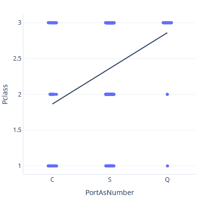
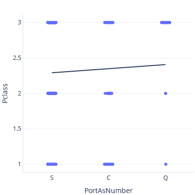

So far, we’ve covered encoding continuous data (floating point numbers), ordinal data (usually integers), and binary categorical data such as survived/died, male/female.

Here we'll look at how to encode, and categorical data that have more than two classes. We also explore how decisions we make to improve our models can actually damage their performance.

## Categorical Data aren't numerical

Categorical data aren't numbers in the same way that other kinds of data are. With _ordinal_ or _continuous_ (numerical) data, higher values imply an increase in amount. For example, on the Titanic, a ticket price of £30 is more money than a ticket price of £12.

Trying to encode categorical features with more than two classes as numbers causes problems because categorical data has no logical order.

For example, Port of Embarkment has three values, C (Cherbourg), Q (Queenstown), and S (Southampton). There's no correct way to replace these symbols with numbers, because doing so implies that one of these ports is ‘less than’ the others, while another is ‘greater than’ the others. This doesn’t make sense.

As an example of this problem, let’s throw caution to the wind and model the relationship between Port of Embarkment and Ticket Class, treating Port of Embarkment as a number. First, we set C < S < Q:

In the above plot, the line predicts a Pclass of ~3 for Port Q.

Now, setting S < C< Q we get a completely different trendline and prediction:

Neither of these trendlines are correct; it doesn't make sense to treat categories as continuous features. So, how do we work with categories?

## One-Hot Encoding

One-hot encoding is a way to encode categorical data that avoids the above problem. Each available category gets its own single column, and a given row only contains a single 1 in the category it belongs to.

For example, our port would be encoded as three columns, one for Cherbourg, one for Queenstown, one for Southampton (the order isn't important). A person who boarded at Cherbourg would have a 1 in the Port_Cherbourg column, like so:

|Port_Cherbourg|Port_Queenstown|Port_Southampton|
|---|---|---|
|1|0|0|

A person who boarded at Queenstown would have a 1 in the second column:

|Port_Cherbourg|Port_Queenstown|Port_Southampton|
|---|---|---|
|0|1|0|

A person who boarded at Southampton would have a 1 in the third column

|Port_Cherbourg|Port_Queenstown|Port_Southampton|
|---|---|---|
|0|0|1|

## One-Hot Encoding, Data Cleaning, and Statistical Power

Before using one-hot encoding, it's important to understand that its use can have positive or negative impacts on a model’s real-world performance.

### What is Statistical Power?

Statistical power refers to a model’s ability to reliably identify real relationships between features and labels. For example, a powerful model might report a relationship between ticket price and survival rate with a high degree of certainty. By contrast, a model with low statistical power might not find this relationship or report it with a low degree of certainty.

We’ll stay out of the maths, but it’s important to keep in mind that certain choices we make can affect how powerful our models are.

### Removing Data Lowers Statistical Power

We’ve talked several times about cleaning data by removing samples that are incomplete. An unfortunate side effect is that this also reduces statistical power. For example, let’s pretend that we want to be able to predict survival given the following data:

|Ticket Price|Survival|
|---|---|
|£4|0|
|£8|0|
|£10|1|
|£25|1|

From here we could guess that someone with a ticket worth £15 would survive, because people with tickets ≥£10 all survived. If we had less data though, this would be harder to guess:

|Ticket Price|Survival|
|---|---|
|£4|0|
|£8|0|
|£25|1|

### Worthless Columns Lower Statistical Power

Statistical power can also hurt by providing models with features that have little value, particularly when the number of features (columns) begins to approach the number of samples (rows).

For example, let’s pretend that we want to be able to predict survival given the following data:

|Ticket Price|Survival|
|---|---|
|£4|0|
|£4|0|
|£25|1|
|£25|1|

We could use this to confidently predict that a person with a ticket costing £25 for Cabin A would survive, because all people with £25 tickets survived.

Imagine, however, that we have another feature (Cabin):

|Ticket Price|Cabin|Survival|
|---|---|---|
|£4|A|0|
|£4|A|0|
|£25|B|1|
|£25|B|1|

Cabin doesn't provide useful information, because it simply corresponds to the ticket price. Now it'sn't clear if someone with a ticket costing £25 for Cabin A would survive – do they perish, like others from Cabin A, or survive like those with £25 tickets?

### One-Hot Encoding Can Reduce Statistical Power

One-hot encoding reduces statistical power much more than continuous or ordinal data because it requires multiple columns–one for each possible categorical value. For example, one-hot encoding port of embarkation adds three model inputs (C, S, and Q).

As a rule of thumb, a categorical variable is worth including if the number of categories is substantially lower than the number of samples (dataset rows) and this category provides information that isn't already available to the model through other inputs.

For example, we saw that the likelihood of survival was different for people embarking at different ports. This probably just reflects that most people at the Queenstown port had third class tickets. So, embarkment is likely to slightly reduce statistical power without adding relevant information to our model.

By contrast, Cabin is likely to have a strong influence on survival, because the ship’s lower cabins would have filled with water before the cabins closer to the deck of the ship. That said, the Titanic dataset contains 147 different cabins, which will reduce our model’s statistical power if included. To find out if Cabin is useful on balance, we might have to experiment with including or excluding it from our model.

In our next exercise, we finally build our model predicting survival on the Titanic, and practice one-hot encoding as we do so.
