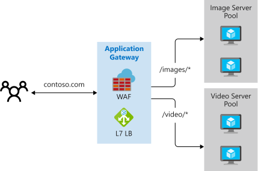

Application Gateway manages the requests that client applications can send to a web app. Application Gateway routes traffic to a pool of web servers based on the URL of a request. This is known as *application layer routing*. The pool of web servers can be Azure virtual machines, Azure virtual machine scale sets, Azure App Service, and even on-premises servers.

## How Application Gateway routes requests

<!-- Application Gateway provides access to a back-end pool of servers hosting your web apps. -->

Clients send requests to your web apps to the IP address or DNS name of the gateway. The gateway routes requests to a selected web server in the back-end pool, using a set of rules configured for the gateway to determine where the request should go.

There are two primary methods of routing traffic, path-based routing and multiple site hosting. Let's take a look at the capabilities for each.

### Path-based routing

Path-based routing enables you to send requests with different paths in the URL to a different pool of back-end servers. For example, you could direct requests with the path `/video/*` to a back-end pool containing servers that are optimized to handle video streaming, and direct `/images/*` requests to a pool of servers that handle image retrieval.

### Multiple site hosting

Multiple site hosting enables you to configure more than one web application on the same application gateway instance. In a multi-site configuration, you register multiple DNS names (CNAMEs) for the IP address of the Application Gateway, specifying the name of each site. Application Gateway uses separate listeners to wait for requests for each site.  Each listener passes the request to a different rule, which can route the requests to servers in a different back-end pool. For example, you could configure Application Gateway to direct all requests for `http://contoso.com` to servers in one back-end pool, and requests for `http://fabrikam.com` to another back-end pool. The following diagram shows this configuration.

Multi-site configurations are useful for supporting multi-tenant applications, where each tenant has its own set of virtual machines or other resources hosting a web application.

### Other routing capabilities

Along with path-based routing and multiple site hosting, there are a few additional capabilities when routing with Application Gateway.

- **Redirection** - Redirection can be used to another site, or from HTTP to HTTPS.
- **Rewrite HTTP headers** - HTTP headers allow the client and server to pass additional information with the request or the response.
- **Custom error pages** - Application Gateway allows you to create custom error pages instead of displaying default error pages. You can use your own branding and layout using a custom error page.

## Load balancing in Application Gateway

Application Gateway will automatically load balance requests sent to the servers in each back-end pool using a round-robin mechanism. However, you can configure session stickiness, if you need to ensure that all requests for a client in the same session are routed to the same server in a back-end pool.

Load-balancing works with the OSI Layer 7 routing implemented by Application Gateway routing, which means that it load balances requests based on the routing parameters (host names and paths) used by the Application Gateway rules. In comparison, other load balancers, such as Azure Load Balancer, function at the OSI Layer 4 level, and distribute traffic based on the IP address of the target of a request.

Operating at OSI Layer 7 enables load balancing to take advantage of the other features that Application Gateway provides. These features include:

- Support for the HTTP, HTTPS, HTTP/2 and WebSocket protocols.
- A web application firewall to protect against web application vulnerabilities.
- End-to-end request encryption.
- Autoscaling, to dynamically adjust capacity as your web traffic load changes.

## Routing for the motor vehicle department

Revisiting our scenario at the motor vehicle department, Application Gateway can be used to address both issues. We can use the load balancing and health probe capabilities to ensure that failures are handled without user impact. We can also use path-based routing to provide a single endpoint for users to access sites hosted across disparate web services.

Let's take a closer look at how we can do this.
