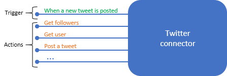
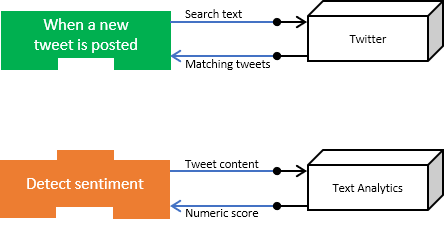
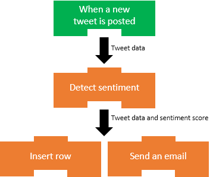
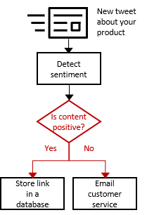
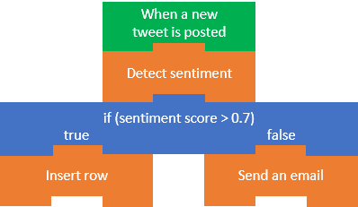

Implementing business processes is difficult because you need to make diverse products work together. Think about everything your company uses to store and process data: Salesforce, Office 365, Oracle, Twitter, YouTube, Dropbox, Google services, Azure Cognitive Services, etc. How do you integrate all these products?

Azure Logic Apps give you pre-built components to connect to hundreds of services like these. You put the pieces together in any combination you need. For example, in the shoe-company scenario we want to monitor social media reaction to our new product so we will use a Logic App to integrate Twitter, Azure Cognitive Services, SQL Server, and Outlook email.

In this unit, we'll analyze a business process to get some intuition about how Azure Logic Apps work and the types of problems they help you solve. We will plan the sequence of steps needed to implement the process and map those steps to the pre-built components in Azure Logic Apps.

## What is a business process?

A *business process* or *workflow* is a sequence of tasks that produce a specific outcome such as a product, a service, a piece of data, a decision, etc. For example, here are a few classic processes and their associated tasks:

* **Expense approval**: submit an expense report, route to the appropriate manager for approval based on amount, notify employee of the result.
* **Order processing**: accept a customer order, charge their credit card, send a confirmation, ship the product, send the tracking number.
* **Bug tracking**: accept a bug report, analyze the severity and affected feature, add a new entry to your bug-tracking tool, send a notification to the correct developer.

Notice that the definition of business process includes the word *sequence* which implies the tasks happen in a specific order. In the social-media monitoring scenario, the order is:

1. Detect when someone mentions our product on Twitter
1. Analyze the sentiment of the tweet
1. Save a link to positive tweets
1. Send an email to customer service for negative tweets.

The fact that processes are ordered means that they are often described using a flowchart. For example, the following illustration shows the flowchart for the social-media monitor process.

Once you have the process specification complete, it's time to think about your implementation options.

## What is Azure Logic Apps?

Azure Logic Apps is a cloud service that automates the execution of your business processes. You use a graphical design tool called the *Logic Apps Designer* to arrange a sequence of pre-made components. The Designer sends a definition of your workflow to the Logic App execution engine. The execution engine launches your app when conditions are right and manages the compute resources needed to run it. The following illustration shows a high-level view of the steps.

The power of Logic Apps comes from the diversity of pre-built components and their ability to work together. Let's think again about the variety of tasks in your business processes. You store information in databases, post messages, send email, work with files, sign documents, and much more. Within each of these categories, you have a lot of options for the service that works best for your situation:

* **Database**: CosmosDB, MySQL, Oracle, SQL Server, etc.
* **Social media**: Twitter, Facebook, Instagram, Pinterest, YouTube, Vimeo, etc.
* **Email**: Gmail, Office 365 Outlook, etc.
* **Files**: Dropbox, Box, OneDrive, SharePoint, Azure Storage, etc.
* **Messaging**: Slack, HipChat, Teams, etc.
* **Repository**: Bitbucket, GitHub, etc.

Logic Apps provides pre-built components to let you interact with hundreds of services like these.

## What is a connector?

A *connector* is a Logic Apps component that provides an interface to an external service. For example, the Twitter connector gives your Logic App access to Twitter while the Office 365 Outlook connector lets you manage your email, calendar, and contacts.

Connectors use an underlying REST or SOAP API to do their work. When you use a connector in your Logic App, the connector calls the functions in the underlying API for you. The following illustration shows a few of the operations supported by the Twitter connector and its use of the Twitter REST API.

> [!TIP]
> You can write custom connectors to access services that do not have a pre-built connectors. You can share your custom connectors with other people in your organization immediately. You can also submit your connector to Microsoft for certification and request that it be included in the standard set of connectors available to all users.

## What are triggers and actions?

Think about the different pieces of a business process. We know that a business process is the combination of steps in a specific pattern to accomplish a goal; however, not all the steps are of the same type. For example, in our social-media monitor scenario we have three distinct types: we *trigger* the process when a new tweet is posted, we perform several *actions* (detect the sentiment, store in a database, and send an email), and we make a *control* decision based on the sentiment score.

Let's be more formal about the definitions for trigger and action:

* A *trigger* is an event that occurs when a specific set of conditions is satisfied. Triggers activate automatically when the conditions are right; for example, when a timer expires or data becomes available.

* An *action* is an operation that performs one of the tasks in your business process. Actions run when a trigger activates or another action completes.

Triggers and actions are packaged inside connectors. Let's look at a few examples.

The Twitter connector lets your Logic App interact with Twitter. The social-media monitor app would use a trigger from the Twitter connector to determine when new relevant tweets are available. The following illustration shows the Twitter connector with its operations divided into the two categories.

Next, we have the Dropbox connector. Suppose you were working with a small team on a project that stored its shared data in Dropbox. You could build a workflow that detected when any of the files in your Dropbox account were modified and send a notification to the other team members. The following illustration shows the Dropbox connector with its triggers and actions.

Finally, let's look at the Twilio connector. Most connectors offer both triggers and actions; however, this connector shows us that's not always true since it only has actions. This connector would fit in any workflow that used text messages for notifications. For example, you could use it as the notification piece in the previous Dropbox example so team members would receive a text message whenever a shared file was modified. The following illustration shows the Twilio connector and its actions.

## How to build Logic Apps from triggers and actions

Triggers and actions are the building blocks of Logic Apps. An app can only have one trigger and it has to appear right at the beginning of the workflow. After the trigger, you include as many actions as you need to implement the tasks in your business process. The following illustration shows the trigger and actions used in the social-media monitor app.

## How do triggers and actions work together?

Triggers and actions are essentially function calls to an underlying API operation. This means they have inputs and outputs. For example, to use the "When a new tweet is posted" Twitter trigger, you input a search string and get back the tweets that contain that string. The "Detect sentiment" action takes a string as input and returns a floating-point number. The following illustration shows these two operations.

Logic Apps automatically places the return values into special variables that are available throughout the rest of the operations. This lets you pass the result from one operation as input to the next one. The following illustration shows the data flow for the first two operations in the social-media monitor app. Notice that the results from an operation are available in all remaining steps.

## What are control actions?

Most business processes need to perform different actions based on the data being processed. For example, an expense report might be routed to a different manager based on the amount. In the social-media monitor app, we need to branch based on the sentiment score of the tweet. The following illustration shows the flowchart for the social-media monitor app with the control logic highlighted.

*Control actions* are special actions built-in to Logic Apps that provides conditional logic and control constructs. They include simple Boolean conditional statements, complex Boolean expressions using *AND* and *OR*, *switch* statements, *foreach* loops, *until* loops, and unconditional *branch* instructions.

The following illustration shows the use of a control action in the social-media monitoring application.

## How to create a Logic App for your business process

The first step is to analyze your business process. Ideally, you will identify the tasks and create a flowchart to capture the required order of the tasks. The following illustration shows the flowchart for the social-media monitor process that we saw earlier.

Next, you will map each task in your flowchart to Logic Apps trigger and actions. The following illustration shows the connectors we'd use in the social-media app with the relevant triggers and actions highlighted.

Finally, you will use the graphical Logic Apps Designer to arrange the trigger, actions, and control actions. The following screenshot shows the Designer with the completed application.

When you select the "Save" button in the Designer your app will be deployed and will run automatically whenever the trigger activates.