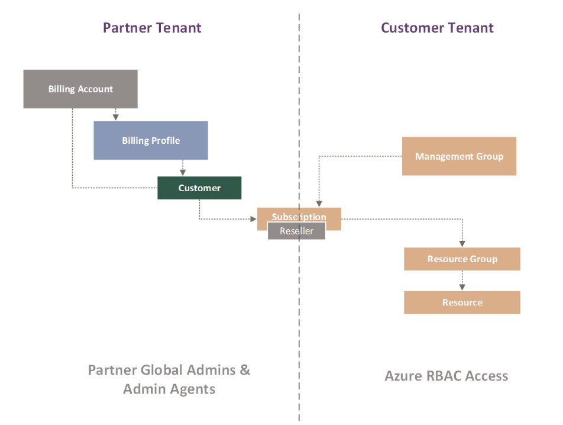

Costs are organized by different Azure entity hierarchies. It's important to understand the hierarchies before evaluating your bill and the tools available in Azure to manage Fabrikam's costs. There are two hierarchies that are applicable to Azure Cost Management. Each node in either hierarchy is known as a *scope*. The scope that you select determines the group of costs that apply to the Cost Management tools you use.

The Azure Billing hierarchy is in your partner tenant. The billing hierarchy is used specifically to manage your organization's billing data and invoices. Billing hierarchy permission roles are used to manage payments, cost management, and account management. The permission roles are *global admin* and *admin agent* of a direct partner or an indirect partner, as set in the Partner Center.

Contoso's subscriptions and resources themselves are in the Azure Resource Entity hierarchy. The hierarchy is located in the customer's (Contoso) tenant. Resource management and the associated permissions are governed by Azure role-based access control (Azure RBAC). We'll only focus on Fabrikam's Billing hierarchy in this module. To learn more about the scopes available to Contoso in their tenant, see [Azure RBAC scopes](https://docs.microsoft.com/azure/cost-management-billing/costs/understand-work-scopes?WT.mc_id=costmanagementcontent_docsacmhorizontal_-inproduct-learn#azure-rbac-scopes).

The following diagram shows the full hierarchical structure of Cost Management scopes that are available to Microsoft CSP partners. The Azure Billing hierarchy scopes are shown on the left in the partner tenant, your Fabrikam tenant. The Azure resource entity scopes are on the right in the customer's tenant, Contoso. They're colored orange.

### Billing account

The Billing account represents the root node of Fabrikam's presence within Azure. All costs across your customers roll up into this scope. Note the following nuances about costs viewed at this scope:

- **Consumption-based costs:** Invoice costs are only available in Azure Cost Management for customers on the Azure Plan under the Microsoft Customer Agreement. An example of a consumption-based product is a VM that has been created for Contoso that is billed hourly.
- **Purchase-based costs:** Invoice costs are available in Azure Cost Management for customers on both the Azure plan on the Microsoft Customer Agreement and the classic CSP agreement.
- **Currency:** Regardless of different customer-billed currencies, budgets set at the Billing Account scope are evaluated in USD across your customers, subscriptions, resources, and resource groups.

### Billing profile

The Billing profile scope defines subscriptions shown on invoices that Fabrikam receives. The invoices are billed against the scope. After you onboard Fabrikam's customers to a Microsoft Customer Agreement, you receive an invoice. It includes all charges for all products (consumption, purchases, and entitlements) for the customers on the Azure Plan under the Microsoft Customer Agreement.

Use the Billing profile scope to view pre-tax costs in the invoiced currency across all your customers for all products and subscriptions included in an invoice. We'll discuss how to analyze your invoice in more detail in the next unit.

Note the cost differences viewed at this scope:

- **Currency** - Currently, the invoiced currency is the default currency when viewing costs in the billing profile scope. Budgets set at the billing profile scope are in the invoiced currency.
- **CSP offer charges** - When billed in the same currency, these invoices also include the charges for entitlement and purchased products such as SaaS, Azure Marketplace, and reservations for Fabrikam's customers who are still in the classic CSP agreement.

## Customer

The customer scope allows you to view pre-tax invoiced costs in invoiced currency for a specific customer, such as Contoso. You can also filter these costs for a specific subscription, resource group, or resource.

The customer scope doesn't include customers who are on the classic CSP. The scope only supports customers who have an Azure plan under Microsoft Customer Agreement.

## Roles and permissions for Cost Management in the billing hierarchy

Only the users with **Global admin** and **Admin agent** roles can manage and view costs for billing accounts, billing profiles, and customers directly in the partner's Azure tenant. For more information about partner center roles, see [Assign users roles and permissions](https://docs.microsoft.com/partner-center/permissions-overview).

## Export cost data

Partners with access to billing scopes in a partner tenant can export their cost and usage data to an Azure Storage blob. The blob must be on a subscription in the partner tenant that's not a shared service subscription or a customer's subscription. To enable cost data export, we recommended that you set up an independent pay-as-you-go subscription in the partner tenant to host the exported cost data. Users with RBAC access to the subscription can also export the cost data to an Azure storage blob hosted in any subscription in the customer tenant. For more information, see [Create an export in a partner tenant or customer tenant](https://docs.microsoft.com/azure/cost-management-billing/costs/get-started-partners#create-an-export-in-a-partner-tenant-or-customer-tenant).