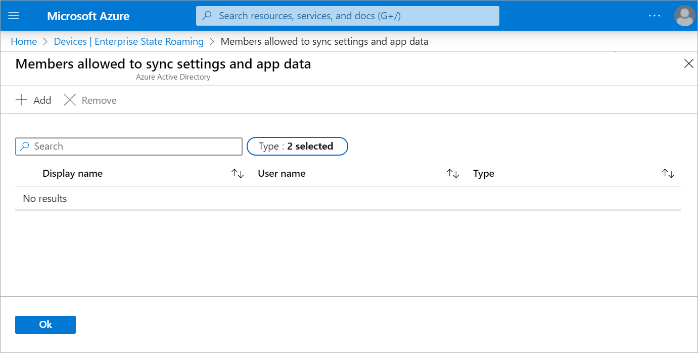

Your organization wants to improve the security of its devices. So far, you've seen how security is enhanced by using device identity and Azure AD join. But you need to maintain the security seamlessly when a user switches between devices. You want to see the options Azure offers to allow users to transition their accounts between devices. Users need to maintain data and settings without increasing technical overhead or maintenance.

In this unit, you'll learn about Enterprise State Roaming, how to enable it, where the user's application and settings data is stored, and how long the data is kept for.

## What is Enterprise State Roaming?

Enterprise State Roaming offers Windows 10 device users the capability to sync settings and application data with their organization's cloud service. When it's enabled, synchronization takes place automatically. You can enable all applicable device users, or select specific users or groups based on your organization's needs. Enterprise State Roaming allows users to switch devices, and for their settings and application data to follow them seamlessly.

Some of the key benefits of using Enterprise State Roaming are:

- Separation of corporate and consumer data.
- Enhanced security as all applicable device data is encrypted using Azure Rights Management before synchronizing with the cloud. All stored data remains encrypted.
- Better management and monitoring so you decide who can sync their data and from which devices.

Enterprise State Roaming requires a Premium Azure Active Directory subscription.

## What data syncs and roams?

**Windows settings**:
The PC settings that are built into the Windows operating system. Generally, these are settings that personalize your PC, and they include the following categories:

* *Theme*, which includes features such as desktop theme and taskbar settings.
* *Internet Explorer settings*, including recently opened tabs and favorites.
* *Microsoft Edge browser settings*, such as favorites.
* *Passwords*, including Internet passwords, Wi-Fi profiles, and others.
* *Language preferences*, which include settings for keyboard layouts, system language, date and time, and more.
* *Ease of access features*, such as high-contrast theme, Narrator, and Magnifier.
* *Other Windows settings*, such as mouse settings.

**Application data**: Universal Windows apps can write settings data to a roaming folder, and any data written to this folder will automatically be synced. It's up to the individual app developer to design an app to take advantage of this capability.

## Enabling Enterprise State Roaming

Enterprise State Roaming requires a device to authenticate with a known Azure AD identity. For Azure AD joined devices, this identity is the account the user first signed in with.

To enable Enterprise State Roaming, go to **Azure Active Directory** > **Devices** > **Enterprise State Roaming**.

For **Users may sync settings and app data across devices**, select **All** or **Selected**. 

With **Selected**. you add the users or groups that will have Enterprise State Roaming available.

## Data storage

Enterprise State Roaming stores the user data in a geographical region that's nearest to your Azure AD instance. There are three geographic regions: North America (USA), Europe, the Middle East, and Africa (EMEA), and Asia-Pacific (APAC). While tenant data will be hosted within the nearest region, user data can be hosted on one or more of these regions. The country or region for your tenant is defined when the Azure AD is set up and can't be changed.

## Data retention

All Enterprise State Roaming data persists in the cloud until it's explicitly deleted, or becomes stale. Any deleted data is automatically kept for a minimum of 90 days. After 90 days, you can't restore the deleted data from the cloud.

### Explicit data deletion

Explicit data deletion occurs when an Azure Administrator acts on a user, an organization within Azure AD, or needs to request that specific roaming data is removed for a user.

- **User deletion**: When the administrator removes a user from Azure AD, any associated enterprise roaming data is automatically deleted.

- **Azure AD organization deletion**: When the administrator removes a directory, all user settings or data stored in that directory are automatically discarded.

- **On Request deletion**: Use this option to remove a specific user's roaming data. The administrator needs to raise an Azure support ticket for this option.

### Stale data deletion

Any Enterprise State Roaming data that hasn't been accessed during the past year is automatically treated as stale data. Stale data is deleted from the host cloud storage. The retention period of deleted data is 90 days.

### Deleted data recovery

After the retention period elapses, data is permanently deleted from the cloud and can't be recovered. But you can restore the data from the device when it next connects to the cloud.

The data retention periods can't be changed.
