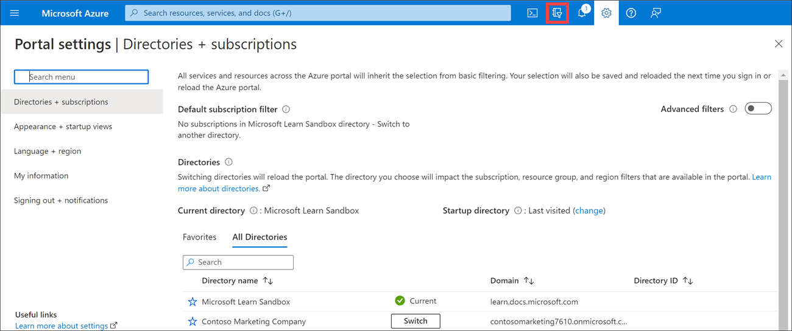
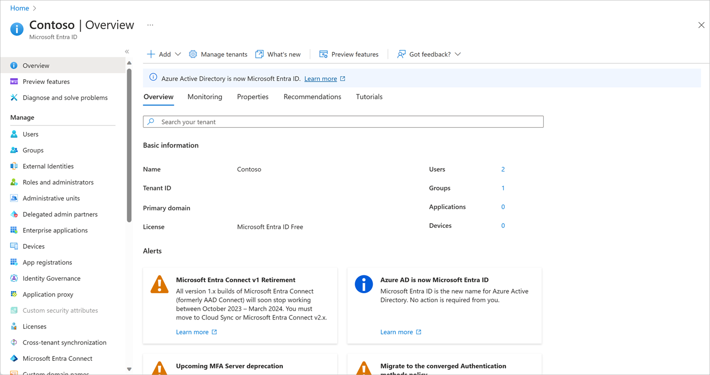

While they share a similar name, Azure AD is _not_ a cloud version of Windows Server Active Directory. It's also not intended as a complete replacement for an on-premises Active Directory. Instead, if you are already using a Windows AD server, you can connect it to Azure AD to extend your directory into Azure. This approach allows users to use the same credentials to access local and cloud-based resources.

Azure AD can also be used independently of Windows AD. Smaller companies can use Azure AD as their only directory service, using it to control access to their applications and SaaS products such as Microsoft 365, Salesforce, and Dropbox.

> [!NOTE]
> Keep in mind that this approach doesn't provide a completely centralized administrative model - for example, local Windows machines would authenticate using local credentials. But applications can be written to use Azure AD to provide authentication and authorization that can then be administered in a single place.

## Directories, subscriptions, and users

Microsoft offers several cloud-based offerings today - all of which can use Azure AD to identify users and control access.

- Microsoft Azure
- Microsoft 365
- Microsoft Intune
- Microsoft Dynamics 365

When a company or organization signs up to use one of these offerings, they are assigned a default _directory_, which is an instance of Azure AD. This directory holds the users and groups that will have access to each of the services the company has signed up for. This default directory is sometimes referred to as a _tenant_. A tenant represents the organization and the default directory assigned to it.

_Subscriptions_ in Azure are both a billing entity and a security boundary. Resources such as virtual machines, web sites, and databases are always associated to a single subscription. Each subscription also has a single account _owner_ who is responsible for any charges incurred by resources in that subscription. If your organization wants the subscription to be billed to another account, you can transfer ownership of the subscription. A given subscription is also associated to a **single Azure AD directory**. Multiple subscriptions can trust the same directory, but a subscription can only trust one directory.

Users and groups can be added to multiple subscriptions - this allows the user to create, control, and access resources in the subscription. When you add a user to a subscription, the user must be known to the associated directory as shown in the following image.

If you belong to multiple directories, you can switch the current directory you are working in through the **Directory + subscription** button in the Azure portal header.

Here you can also decide how the default directory is selected: last visited, or a specific directory. You can also set the default filter for displayed subscriptions. This is useful if you have access to several subscriptions but typically only work in a few of them.

## Creating a new directory

An organization (tenant) always has one default Azure AD directory it's associated with, however owners can create additional directories to support development or testing purposes, or because they want to have separate directories to synchronize with their local Windows Server AD forests. 

> [!IMPORTANT]
> The steps to create a new directory are shown below, however unless you are an owner of your Azure account, this option won't be available to you. The Azure Sandbox doesn't allow you to create new Azure AD directories.

1. Sign into the [Azure portal](https://portal.azure.com?azure-portal=true).

1. Select **Create a resource** from the left sidebar, **Identity** from the Azure Marketplace, and then **Azure Active Directory** from the list.

1. Choose a name for the directory that will help distinguish it from your other directories. If the directory you're creating is to be used in production, choose a name for the directory that your users will recognize as the name of your organization. You can change the name later if you want.

1. Enter the domain name associated with it. The domain must not be known to Azure or you will get a validation error. The default domain name will always have the suffix `.onmicrosoft.com`. While this default domain cannot be changed, later you can add a custom domain owned by your organization so defined users can use a traditional company email such as `john@contoso.com`.

1. Select the country the directory should reside in. This will identify the region and data center where the Azure AD instance will live and it cannot be changed later.

    

1. Select **Create** to create the new directory. This will create a free tier directory where you can add users, create roles, register apps and devices, and control licenses.

Once the directory is created, you can navigate to the dashboard that lets you control all aspects of the directory.

Let's explore one of the primary elements you'll work with in Azure AD: **users**.
