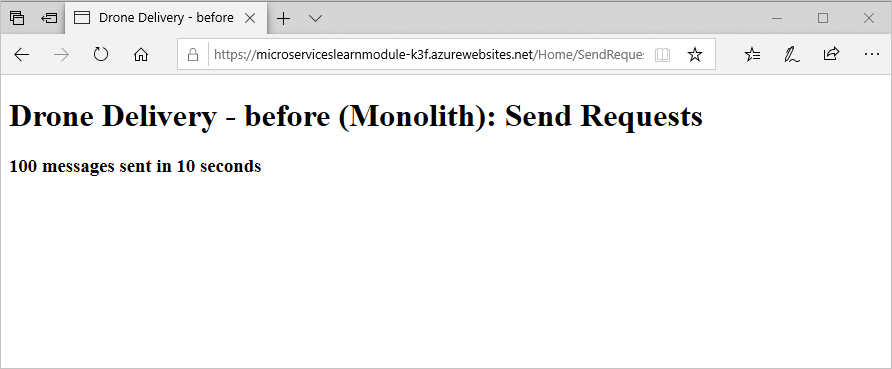

We'll run some performance tests against the application as it is currently configured.

## Download and configure the load test file

1. Open the [web test file](https://raw.githubusercontent.com/MicrosoftDocs/mslearn-microservices-architecture/master/src/post-deliveryrequests.webtest?azure-portal=true) in a new browser tab.

1. Save this file locally as `post-deliveryrequests.webtest`.

1. Open the `post-deliveryrequests.webtest` file in a text editor.

1. On line 4 in the file you should see an attribute with the text `Url="http://YourMicroservicesLearnModuleWebsite.azurewebsites.net/api/DeliveryRequests/"`. Replace `YourMicroservicesLearnModuleWebsite` with the name of your App Service. Save the file.

## Perform load test against application

1. Sign into the [Azure portal](https://portal.azure.com/learn.docs.microsoft.com?azure-portal=true) using the same account you activated the sandbox with.

1. Select **App Services** on the left, then select your App Service.

1. In the **Development Tools** section, select **Performance test**.

1. Select **+ New** to create a new performance test.

1. Select **CONFIGURE TEST USING**.

1. For **TEST TYPE** select **Visual Studio Web test**

1. Select the blue folder icon and browse to the `post-deliveryrequests.webtest` file you saved earlier.

1. Ensure the URL shown matches the URL of your web site and select **Done**

1. Change the **DURATION (MINUTES)** to **3**, leave the other values at their default and select **Run test**

    

## Review test results

1. Allow several minutes for your test to execute and complete. Once it completes, select the completed test in the **Recent runs**.

1. Notice in the test results the average response time is pretty high. In the example below it's 43.31 seconds, pretty poor performance for an API call.

    

Let's see if we can improve the performance of the application.
