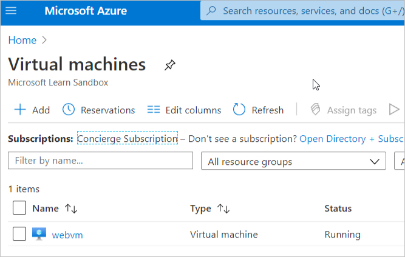
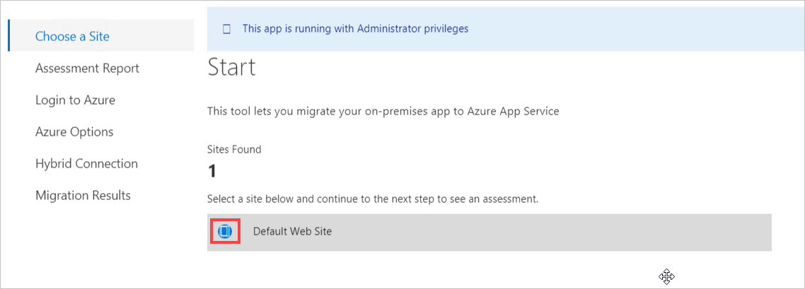

Now that you've deployed the Virtual Machines containing your web application to the sandbox environment, you'll use the Azure App Service Migration Assistant to perform an assessment and migration to Azure App Service.

> [!Important]
> This module assumes you've successfully completed the steps in a previous unit and have activated the sandbox and run the first setup script.  If you haven't, go back to the previous unit and complete the unit titled "Exercise - Setup the environment" before continuing on.

## Exercise steps

In this exercise, you'll complete the setup steps, log into your Azure account and work in a sandbox environment provisioned for you.  You'll remotely connect to the Virtual Machine (VM) that was set up for this exercise, and perform an assessment using the Azure App Service Migration Assistant already installed on the VM.

1. Copy and paste the following script into the Azure Cloud Shell on the right, then execute the script by selecting <key>enter</key>.

```bash
./finish.sh
```
This script will wait for the previous script to complete (from the second unit) so you may see the following message:

"Waiting for provisioning to complete ..."

Once it is complete, you should see the credentials for the VM that was provisioned in the sandbox.

2. In a separate tab in your web browser, navigate and log into to The Azure Portal using the same account you're logged into while taking this module.  Navigate to: [https://portal.azure.com](https://portal.azure.com?azure-portal=true).

In the upper-right hand corner, under your account user name, you should see that you're logged in to the directory "Microsoft Learn Sandbox".

3. Select the Virtual machines icon under Azure services.  You should see a single vm listed named "webvm".



4. Select the "webvm" item in the list.  This will display the details for the VM.

5. In the details toolbar, select the Connect icon, then choose RDP.  


On the Connect page, select Download RDP File.


The file webvm.rdp is downloaded to your local computer.

6. Open the webvm.rdp file.  You'll be prompted for the VM's security credentials on the Windows Security dialog.  Select "Use a different account", then copy and paste the username and password from step 1 into the dialog and select OK.  When the Remote Desktop Connection dialog appears warning you about the remote computer's security certificate, select Yes.  The remote desktop will open for the VM.

7. On the remote desktop, open Internet Explorer and navigate to: `http://localhost`.  Confirm that the "Parts Unlimited" web site is successfully running.


8. On the remote VM's desktop, double-click the icon to launch the Azure App Service Migration Assistant.  Once launched, the user interface lists the Migration Assistant's steps with the first step highlighted, "Choose a Site".  In the main area, the Migration Assistant lets you know that it found one site to assess.  

9. Select the radio button next to "Default Web Site".  



Then, select the Next button at the bottom of the dialog.  This will begin the assessment of the site.

10. After a moment, the Assessment Report step should complete and you should see that all 13 assessments were successful with no warnings or errors.  You may take a moment to expand the chevron icon next to the label "Success (13)" to see the types of assessments it performed.  We covered some of these previously in an earlier unit.

You have successfully completed the exercise setup and the assessment of the website.  Next, you'll learn about migration.