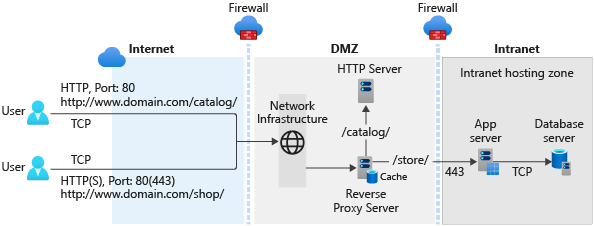
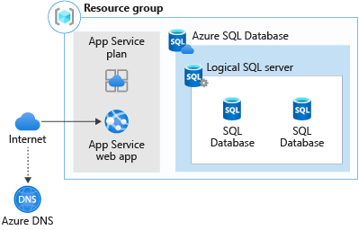

Now that the assessment has determined that you can migrate your web app to Azure App Service, you'll complete the migration.  But what does the Migration Assistant do?  How does it work?  And when it asks for you to choose various settings, what should you choose and why?

## How the Migration Assistant migrates your web app

The Migration Assistant begins the migration process by collecting key details from you about your Azure account and then performs the migration.  First, you'll log in to your Azure account and associate your Migration Assistant session with your account using a unique code. Next, you'll choose the subscription, resource group, and the website's domain name. You can choose to create a new App Service Plan to host the app, or select an existing plan, which affects the geographical region from which your app is hosted. You'll also have a chance to associate this migration effort with an existing Azure Migration Project (we'll talk about this in a moment).  Finally, you can choose to either skip database setup or choose to set up a hybrid connection to enable database connection.

Once the Migration Assistant collects and verifies your selections, it goes to work.  It creates the needed App Service resources in the selected region and resource group. It zips up the web app's source files and uses the App Service deployment API to deploy them. Finally, it performs optional migration steps, like helping you set up a Hybrid connection.

After a successful migration, you'll need to perform any post-migration tasks.  This might include:

- manually moving application settings and connection strings in your web.config file to the Azure App Service.
- migrating data from an on-premises SQL server to an Azure SQL database.
- setting up an SSL certificate.
- setting up custom domain names.
- setting up permissions in Azure Active Directory.

You may also decide to change the App Service hosting plan and other settings like autoscaling and deployment slots.  

### Migration scenario

The following diagram describes a typical web application hosting architecture where the web server is deployed in a DMZ and an application server (a web api accessible via HTTP) and database server are hosted behind a firewall in an intranet zone.

After migration, the web site and the web api would be hosted on a single App Service web app.  The database would be moved to an Azure SQL Database instance.  Both would be deployed to a single Resource group.

As a result of the migration to Azure Database, the customer would experience increased resiliency and redundancy.

## App Service plans

During migration, the Migration Assistant will:

- create an App Service hosting plan.
- deploy your web app to a single Premium P1v2 VM instance.

If you're new to Azure App Service, it's important to understand key distinctions between your web app, the hosting plan, and VM instances that will host your web app.

The App Service hosting plans are divided into tiers based on the intended workloads they were designed to support.  Hosting plans affect:

- The maximum number of virtual machine instances available to run your app, and the performance characteristics of those virtual machines.
- Whether features like VPN hybrid connectivity, network isolation and autoscale are available.
- The Service Level Agreement (SLA).

For example, the Free and Shared tiers are intended for small proof of concepts and testing, so there's no SLA and multiple apps share virtual machines.  On the other end of the spectrum, the Isolated Service Plan is intended for mission critical workloads that run in a private, dedicated virtual networked environment with state-of-the-art hardware, more RAM, and faster processors and SSD storage.

Within each hosting plan, you can select the instance size.  Instance size affects:

- Instance size, including number of cores, RAM, and disk storage.
- Pricing.

You can deploy multiple web apps to a single hosting plan (similar to running multiple web apps on a single instance of IIS).  All will share the same VM instances.

For more information, see "App Service overview".  (A link provided in the Additional Reading section at the end of this module).

## Database migration

The Azure App Service Migration Assistant does not migrate your database to Azure SQL.  In fact, you're not required to migrate your database to Azure at all. In that case, the Migration Assistant can help you set up a Hybrid connection to your on premises database as an optional step.  

While you can use a hybrid connection in a production environment, you may want to consider the impact on performance. Given that, you may think about a hybrid connection as a temporary, interim solution before you move your data to Azure SQL. Hybrid connections to your data may also be useful in a development or testing scenario.

If you select the "setup a hybrid connection" option, the Migration Assistant will prompt you to download and run the Hybrid Connection Manager (HCM) on your server.  The HCM connects your web app running in Azure App Service to the Service Bus Relay to facilitate a connection with your on premises database end point.  The following diagram provides a high level overview of the relationship between your migrated web app, your on-premises database, the Hybrid Connection Manager, and the relay hybrid connection.

For more information, see "Azure App Service Hybrid Connections". (A link provided in the Additional Reading section at the end of this module).

To perform a migration, you can use the Data Migration Assistant.  For more information, see "Overview of Data Migration Assistant". (A link provided in the Additional Reading section at the end of this module).

You may be interested in another Learn module "Assess and convert SQL Server Databases using the Data Migration Assistant (DMA)".  (A link provided in the Additional Reading section at the end of this module).

## What is an Azure Migrate Project?

Earlier we said that you could associate your migration with an Azure Migration Project.  Azure Migrate is a hub for matters related to migration.  Organizations use Azure Migrate to capture information about all the servers and services they hope to migrate to Azure.  They can use this information as a form of discovery and assessment to ascertain the scope of their migration efforts, then adequately plan, inform stakeholders, determine costs, track migration status and so on.  

Azure Migrate supports key migration scenarios like:

- Migrating Windows and Linux servers (whether those servers are VMs hosted in VMWare or Hyper-V, physical servers, even of other clouds).
- Migrating SQL Server and other databases, including the data.
- Migrating Virtual Desktops.
- Migrating web apps (using the Azure App Service Migration Assistant).

So, if you already have an Azure Migrate project set up, you can specify the name of the project during Migration and it will save the migration details and status in your Azure Migrate hub.

## Recap

In this unit, we covered several important concepts:

- If the Azure App Service Migration Assistant assessment determines it can migrate your web app, it will collect information about your Azure account, create new App Service resources in Azure, and deploy your app to them.
- After the migration, there may still be steps you need to take to get your web app into working order.
- An Azure Web App hosting plan determines the features, type of hardware and SLA available to your web app.  The Instance size determines the number of cores, amount of RAM and storage available.
- A single instance can host multiple web apps.  All apps are scaled on all instances.
- During migration, the Migration Assistant can help setup a hybrid connection to your on premises database servers.
- During migration, the Migration Assistant can log its progress into an existing Azure Migrate project.
