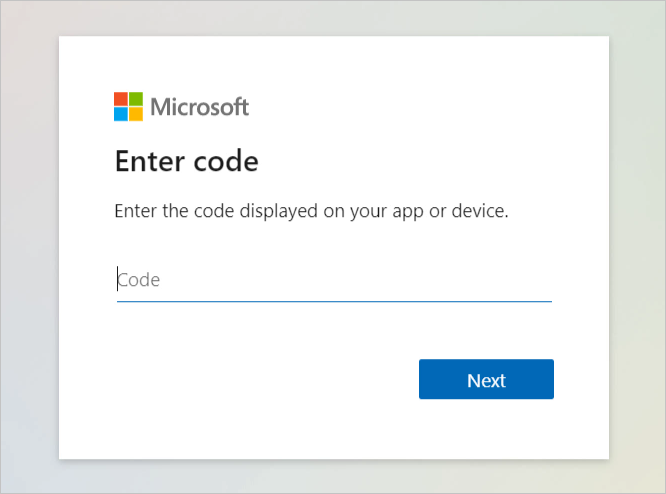

The last step is to perform the migration.  Here you'll log into your Azure account and associate your Migration Assistant session.  You'll fill out the details for migration, then watch as the Migration Assistant goes to work.  Finally, you'll observe the web app running in Azure App Service and view the settings of your new Azure App Service account.

> [!Important]
> This module assumes you've successfully completed the steps in previous units.  If you haven't, go back and complete the previous units before continuing on.

## Exercise Steps

Here you'll continue the exercise from the point where you left off in a previous unit on the "Assessment Report for 'Default Web Site'" screen.

1. Click Next. This displays the "Login to Azure" step. Here you'll use a special code to associate this assessment on your server to your Azure account.  

    In the next few steps, you'll need to use the device code then sign in to your Azure account using your Azure credentials.  You will need to do this on your local computer.  You'll copy the URL and the device code from your VM session and paste the URL and device code into a web browser on your local computer.

    > [!Important]
    > For this exercise, you will need to complete the "Login to Azure" step on your local computer.  You'll copy the URL and the device code from the VM and paste into a web browser on your local computer.

2. In the Migration Assistant, you'll see the Login to Azure page with a device code and a button.  Copy the device code to the clipboard.

    

3. Click [here](https://microsoft.com/devicelogin?azure-portal=true) to navigate to the device login service.

    You should see the "Enter code" web page on your local computer.

    

4. On your local computer, select "Next". Sign in using the same account you used to sign in to Learn and activate the sandbox.  This might require you authenticate using Two-Factor Authentication.

    Once you sign in successfully, you should see a confirmation message that you have successfully signed in to the Azure App Service Migration Assistant application on your device.

5. Back in the Migration Assistant running in the remote VM, the step "Azure Options" is displayed.  Here you'll enter details about the target App Service to which you'll move your app.  

    First, click the link at the end of the first sentence "Switch user directory".  Ensure that you have the "Microsoft Learn Sandbox" directory selected.

    

6. Use the following table to make your selections:

    | Field | Your entry |
    | --- | ----------- |
    | Subscription | Select "Concierge Subscription" |
    | Resource Group | Select the "Use Existing" option.  This should automatically select an existing Resource Group prefixed with the word "learn" |
    | Destination Site Name | Enter a valid destination site name. |
    | App Service Plan | Select the "Use exiting" option. This will automatically select "Learn-Exercise-Plan", which was created for you at the beginning of the exercise |
    | Azure Migrate Project | Leave this field empty |

    > [!Note]
    > In this exercise, you'll deploy to a free-tier App Service plan that was created for you as part of the exercise. This plan does not support the Hybrid Connection functionality needed to enable the Migration Assistant's database connectivity option. When you use the Azure App Service Migration Assistant in your own environment, you can choose to deploy to an existing App Service Plan or create a new one. After the Migration Assistant migrates your web app, you may want to change the service tier to adjust the pricing as desired.

7. Select "Migrate".  The "Migration in Progress" step will display the current status of the migration.  You'll see a new screen displaying progress of the migration.

    

    Once the migration is complete, you'll continue to the "Migration Results" step.  

8. Click [here](https://portal.azure.com/learn.docs.microsoft.com?azure-portal=true) to open the Azure portal in a new tab on your local computer. Select "App Service" from the home page.  From the list of deployed services, select the one that matches the name you created in step 8.  This will display the settings for your new Azure App Service.

    From here you can explore the different features of your new App Service and experiment by changing settings and viewing the logs and other diagnostic information.

9. Click the *Browse* button at the top of the overview page to browse to your migrated site running in Azure.

Congratulations, you have successfully migrated a web app running on IIS to Azure App Service using the Azure App Service Migration Assistant.
