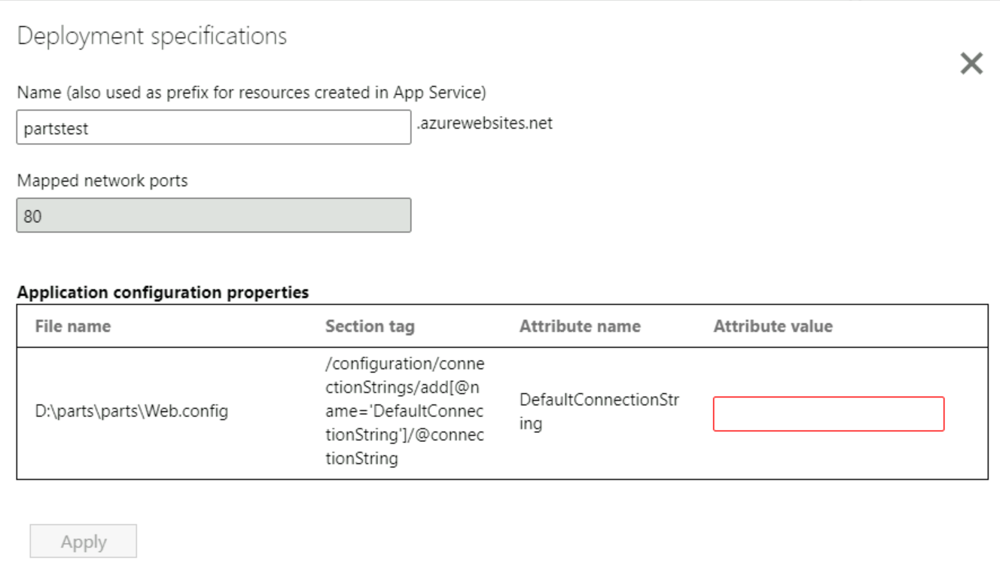

Once the container image is built, the next step is to deploy the application as a container on Azure App Service.

Azure App Service is an HTTP-based service on Azure that you can use to host web applications and REST APIs. This service provides benefits such as:

- Autoscaling. This feature helps your app scale to meet demand based on the parameters you specify, and then automatically reduces the scale when demand decreases.
- High availability. Azure makes use of zones, regions, and availability sets to help ensure that your application remains available if there are server or datacenter failures or downtime.
- Support on the Windows and Linux platforms.
- Integration with automated deployment models using Azure DevOps or GitHub repos.

## **Create new App Service plan**

The tool provides an option to select an existing App Service plan but for this exercise we create a new App Service plan.

1. Select **Create new App Service plan**.  
1. Select the Azure subscription you want to work with.
1. Select the **LearnAppContainerization** resource group.
1. Specify the AKS cluster name as **LearnAppContainerizationAppServiceplan**.
1. Select any available location and SKU for the App Service plan to be created.  
1. Once you select **Create**, the tool triggers the App Service plan creation.

## **Specify secret store**

In a previous exercise, you opted to parameterize application configurations. Specifically, the database connection string. Because of that choice, you can now select Azure Key Vault or Kubernetes secrets for managing your application secrets.

1. Select the option to **create new Azure Key Vault** and specify the name as **learnappcontainerizationkeyvault**. The tool automatically assigns the necessary permissions for managing secrets through the Key Vault.

## **Specify Azure file share** 

If you chose to add more folders and selected the Persistent Volume option, then specify the Azure file share that you want the Azure Migrate: App Containerization tool to use during the deployment process. The tool creates new directories in this Azure file share to copy over the application folders that are configured for Persistent Volume storage. During deployment, these directories are mounted to the application container.

Since this application didn't have any file system dependencies that we chose to externalize, select **continue** to proceed.

## **Application deployment configuration**

Once the previous steps are complete, you need to specify the deployment configuration for the application. Select **Configure** to customize the deployment for the application. In this step, you can provide the following customizations:

1. **Name**: Specify a unique app name for the application. This name is used to generate the application URL and used as a prefix for other resources being created as part of this deployment.
1. **Application Configuration**: For any application configurations that were parameterized, use the following value for the current deployment.
   - **URL**: To create the URL to be specified, navigate to *LearnAppContainerization* resource group and copy the name of the SQL server.
      - The SQL server name is in the format: "appcontainerization-lab0000".
      - Replace the SQL Server name in the following connection string and paste it in the App Containerization tool:

       ```json
       Server=tcp:{SQLSERVERNAME}.database.windows.net,1433;Initial Catalog=partsunlimiteddb;Persist Security Info=False;User ID=adminuser;Password=Password@123;MultipleActiveResultSets=False;Encrypt=True;TrustServerCertificate=False;Connection Timeout=30;
      ```

1. Select **Apply** to save the deployment configuration.
1. Select **Continue** to deploy the application.

    

## **Deploy the application** 

Once the deployment configuration for the application is saved, the tool generates the Kubernetes deployment YAML file for the application. The file is created based on the inputs specified in the deployment specification steps. 

1. Select **Review** to review the deployment specifications for the application.
1. Select the application to deploy.
1. Select **Deploy** to start deployments for the selected applications.
1. Once the application is deployed, you can select the **Deployment status** column to track the resources that were deployed for the application.

## **Browse the deployed application**

Now that your application container is deployed, you can browse the migrated application as follows:

1. Copy the URL displayed in the **Deployment status** column.
1. Paste the URL in a new browser tab.

You should be able to access your application.