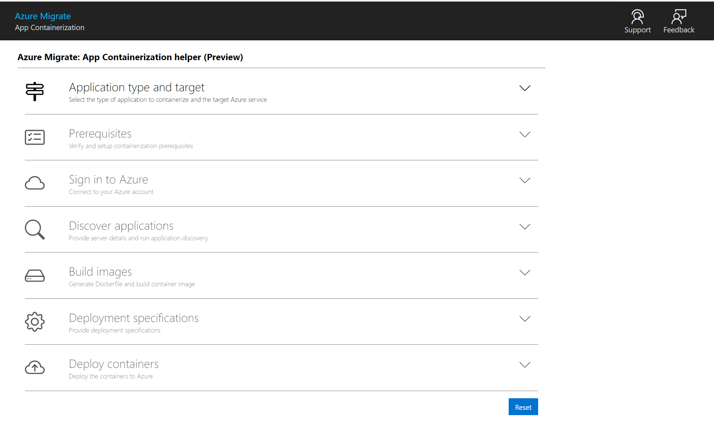
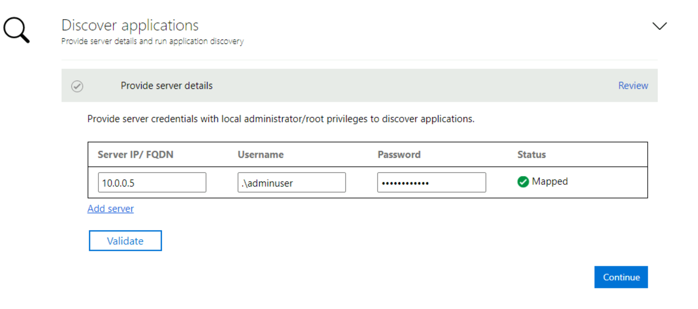
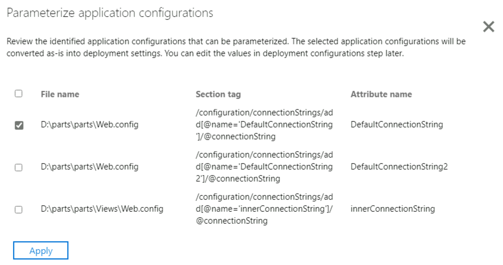

In this exercise, we'll use the Azure Migrate: App Containerization tool to discover the Parts Unlimited application that needs to be containerized and migrated. 

## Complete tool pre-requisites

1. Select **ASP.NET web apps** as the type of application you want to containerize.
2. To specify the target Azure service, select **Containers on Azure Kubernetes Service**.

    

3. Accept the license terms and read the third-party information.
4. The tool will automatically check for internet connectivity and install the latest version of the Azure Migrate: App Containerization tool.
5. Select **Verify** validate the installation of Microsoft Web Deploy tool. The Microsoft Web Deploy has already been installed as part of the setup.
6. The tool will inform you to enable PowerShell remoting which was done as part of the setup. Select **Continue**.

## Sign in to Azure

Select **Sign in** to log in to your Azure account.

1. You'll need a device code to authenticate with Azure. Selecting **Sign in** will open a modal with the device code.
2. Select **Copy code & sign in** to copy the device code and open an Azure sign-in prompt in a new browser tab. If it doesn't appear, make sure you've disabled the pop-up blocker your the browser.
3. On the new tab, paste the device code and complete sign in using your Azure account credentials. You can close the browser tab after sign in is complete to return to the App Containerization tool's web interface.
4. Select the **Azure tenant** that you want to use.
5. Specify the **Azure subscription** that you want to use.

## Discover ASP.NET applications

The App Containerization helper tool connects remotely to the application servers using the provided credentials and attempts to discover ASP.NET applications hosted on the application servers.

1. To discover the Parts Unlimited application, use the following values:
    - **Server IP/FQDN**: In your **LearnAppContainerization** resource group, navigate to *vm-aspserver*, copy the private IP address, and specify this value in the App Containerization tool.
    - **Credentials**: Specify **.\adminuser** as the username and **Password@123** as the password.

2. Select **Validate** to verify that the application server is reachable from the machine running the tool and that the credentials are valid. Upon successful validation, the status column will show the status as **Mapped**.  

    

3. Select **Continue** to start application discovery on the selected application servers.

4. Upon successful completion of application discovery, you can select the list of applications to containerize.

    

5. Use the checkbox to select the **PartsUnlimited** application to containerize.
6. **Specify container name**: Specify a name for the target container for each selected application. The container name should be specified as <*name:tag*>, where the tag is used for the container image. For example, you can specify the target container name as *partsunlimitedtest:v1*.

### Parameterize application configurations

Parameterizing the configuration makes it available as a deployment time parameter. This allows you to configure this setting while deploying the application as opposed to having it hard-coded to a specific value in the container image. For example, this option is useful for parameters like database connection strings.

1. Select **App configurations** to review the detected configurations.
2. Select the checkbox to parameterize the configuration with the attribute name **DefaultConnectionString**.
3. Select **Apply** after selecting the configurations to parameterize.

   

### Externalize file system dependencies

 You can add other folders that your application uses. Specify if they should be part of the container image or are to be externalized through persistent volumes on Azure file share. Using persistent volumes works great for stateful applications that store state outside the container or have other static content stored on the file system.

1. This application does not have any file system dependencies that need to be externalized. Select **Continue** to proceed to the container image build phase.
