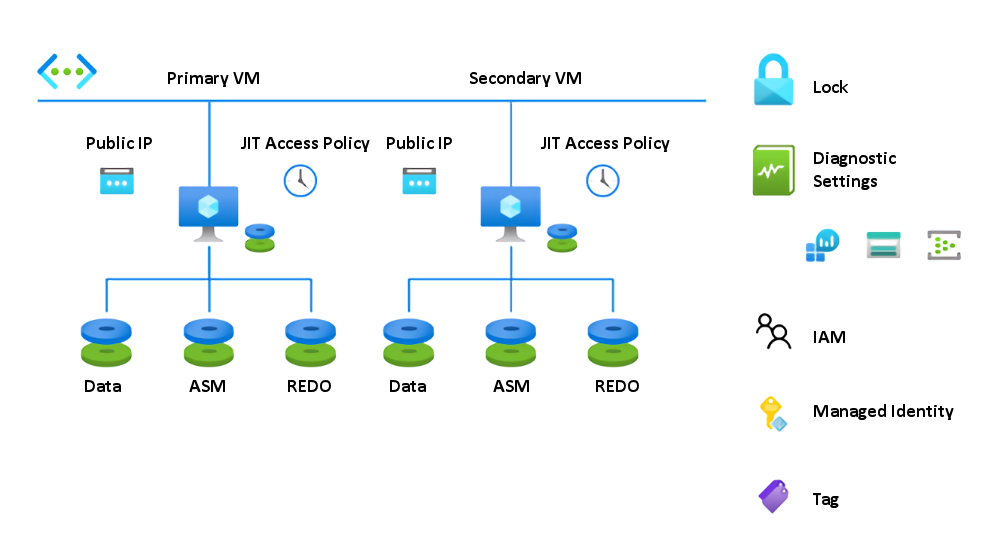

You've gathered the recommended sizing for your VMs and storage usage, and you've established a recommended architecture based on the reference landing zone architecture. In this section, you'll learn what's required to create the infrastructure and architecture elements to host your Oracle databases on VMs. Note that you'll deploy your application VMs in a later step.

## Automate your Oracle landing zone deployment

You learn that it's best to avoid manually deploying resources. Automation can help you reduce the errors, increase productivity, and optimize deployment time. The[Oracle on Azure Virtual Machines landing zone accelerator](/azure/cloud-adoption-framework/scenarios/oracle-iaas/introduction-oracle-landing-zone) offers guidance on how to improve productivity and avoid potential errors or confusion when setting up your target environment. Based on this guidance, you decide to integrate [modern DevOps processes](/devops/what-is-devops) and pursue an [infrastructure as code (IaC)](/devops/deliver/what-is-infrastructure-as-code) approach to automating your Oracle on Azure IaaS landing zone deployment.

To support this process, Microsoft offers a set of [example automation scripts](https://github.com/Azure/lza-oracle) that allows you to seamlessly define and deploy a configuration and architecture for your Oracle-to-Azure migration. These scripts help you create the networking and VM assets to host your database servers. They provide a baseline configuration that you modify to fit your landing zone requirements. You configure these elements as needed:

- The [resource group](/azure/azure-resource-manager/management/manage-resource-groups-portal) where you assign new resources. Azure resource groups are containers for storing and organizing resources.

- The [Azure region](https://azure.microsoft.com/explore/global-infrastructure/geographies/#overview) you want to host your resources. An Azure region is a set of datacenters located in a specific geographic area, connected with dedicated low-latency networking.

- Your [virtual networking configuration](/azure/virtual-machines/workloads/oracle/deploy-application-oracle-database-azure#network-and-security). This includes any subnets, network security groups, or other virtual network devices.

- Your virtual machines and their dedicated storage resources. This includes selecting which [Oracle Linux images](/azure/virtual-machines/workloads/oracle/oracle-overview#oracle-databases-on-azure-infrastructure) you want to use as a base for the VMs.

- Management features, such as [Azure tags](/azure/azure-resource-manager/management/tag-resources).

For resource deployment, the example scripts offer versions using either [Terraform](/azure/developer/terraform/overview) or [Bicep](/azure/azure-resource-manager/bicep/overview?tabs=bicep) automation format. Both tools support resource deployment to Azure, but your team may have a preference based on key [differences](/azure/developer/terraform/comparing-terraform-and-bicep?tabs=comparing-bicep-terraform-integration-features). In your case, your wider IT team has decided to use Bicep for deployment automation to Azure, so you use those versions of the automation scripts.

To configure the machines after deployment, the scripts make use of [Ansible](/azure/developer/ansible/overview). You modify the sample Ansible configuration files to automate the any post-deployment VM setup, including configuring the Oracle database software and creating your databases.

Use the example [Data Guard-based automated deployment](https://github.com/Azure/lza-oracle/blob/main/docs/wiki/Deploy-DG-with-Bicep-GitHub-Actions.md) as your starting point, and modify the configuration to match the requirements you gathered during your assessment process. This creates two database servers synced for redundancy using [Oracle Data Guard](https://www.oracle.com/database/data-guard/). To integrate this process with your existing IT workflows, you manage the [deployment using GitHub Actions](/training/paths/bicep-github-actions/).

When successfully deployed, your database infrastructure architecture should resemble the following example diagram.

After several test runs, you use the scripts to deploy your resources to their production locations. With your landing zone deployed, you're ready to create your application servers and to start migrating your data.