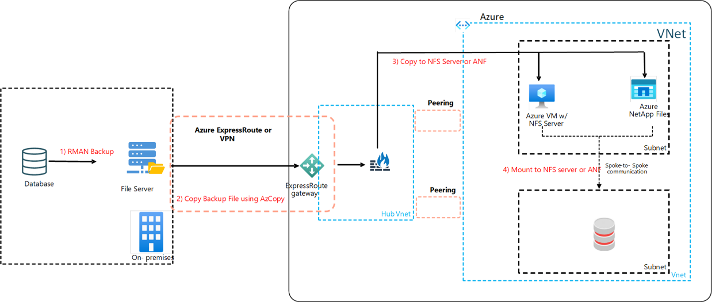

Now that you've deployed your landing zone and configured your Oracle database server VMs, you're ready to deploy your application to Azure.

## Use Azure Migrate to replicate the application VMs

There are many ways to deploy application VMs to Azure. You could use [Bicep](/azure/azure-resource-manager/bicep/overview?tabs=bicep) template files to deploy your VMs. This approach, however, requires significant IT effort. You prefer to minimize the effort to migrate the application layer.

You previously used Azure Migrate to analyze your existing hosting environment. The tool can also help automate your [application server migration to Azure VMs](/azure/migrate/tutorial-migrate-physical-virtual-machines). Azure Migrate creates the appropriate Azure VMs and copies the OS and applications running on the on-premises servers you're migrating, minimizing any manual configuration your team needs to perform.

Note that Azure Migrate requires the deployment of virtual appliances to your local datacenter and the installation of migration agent software on your servers, and it may not be supported on certain application servers. Although it may not be a good fit for all migrations, you believe it will be a useful component in your scenario.

To complete this process:

1. [Install the Azure Migrate replication appliance on your on-premises network.](/azure/migrate/tutorial-migrate-physical-virtual-machines#set-up-the-replication-appliance) The replication appliance coordinates the required tasks between Azure and the local machines being migrated.

1. [Install Azure Migrate Mobility service agent on servers migrating to Azure.](/azure/migrate/tutorial-migrate-physical-virtual-machines#install-the-mobility-service-agent) This agent allows the replication appliance to manage the local servers and to copy necessary data to the newly deployed Azure VMs.

1. [Configure replication settings.](/azure/migrate/tutorial-migrate-physical-virtual-machines#replicate-machines) This allows you to select which machines are being migrated, the target Azure resource group and virtual network to use, and the target VM and storage settings. Because you used Azure Migrate to assess the application, the tool should automatically populate many of these settings.

1. [Test migration.](/azure/migrate/tutorial-migrate-physical-virtual-machines#run-a-test-migration) After configuring your replication settings, perform a test migration. By deploying a test version of your replicated machine, you validate that your settings are correct. After validation, you delete the test VMs.

1. [Execute migration.](/azure/migrate/tutorial-migrate-physical-virtual-machines#migrate-vms) This process creates the target VMs and then copies the OS and application from your existing servers to the new Azure VMs.

1. [Perform post-migration VM configuration.](/azure/migrate/tutorial-migrate-physical-virtual-machines#post-migration-best-practices) When the new VMs are up and running, you need to update settings, such as host names, networking and firewall configuration, and database connection settings. The updates help ensure that the applications are accessible to users and can communicate with your new Oracle database server VMs.

After completing this process, confirm that your applications are communicating with your databases. Also confirm that your networking and security configuration is working as expected.

## Migrate your Oracle database data

At this point, your new database and application VMs are set up and talking to each other. You're ready for the final migration process: getting your data from your old database to your new Azure-hosted database servers.

Oracle workloads tend to involve very large amounts of data, and the storage and bandwidth requirements during migration can be intense. Based on your workload and uptime requirements, you'll need to determine which of the two data migration scenarios will work for you:

- **Offline migration.** In this scenario, you freeze the live database, create a snapshot of it, and then transfer it to the new environment. Offline migrations generally increase potential downtime related to the migration but are simpler to implement.

- **Online migration.** In this scenario, you transfer an initial snapshot of the live database and then continuously replicate changes to your new environment until you're ready for the final cutover. Online migration minimizes downtime but introduces additional complexity due to the need to keep the old and new databases in sync.

Azure offers several options for moving data from your existing datacenter into your Azure-hosted Oracle databases, and both Oracle and Azure provide technology to support your data migration needs.

Azure offers the following common tools to migrate data from on-premises Oracle databases:

- [Azure Storage](/azure/storage/common/storage-introduction)
- [AzCopy](/azure/storage/common/storage-ref-azcopy)
- [NFS file shares in Azure Files](/azure/storage/files/files-nfs-protocol)
- [Azure VPN Gateway](/azure/vpn-gateway/vpn-gateway-about-vpngateways)
- [Azure ExpressRoute](/azure/expressroute/expressroute-introduction)

Standard Oracle tools support exporting data from your on-premises databases and importing data to your Azure VM-hosted Oracle database. These include:

- [Oracle Recovery Manager (RMAN)](https://www.oracle.com/database/technologies/high-availability/rman.html)
- [Oracle Data Guard](https://www.oracle.com/database/data-guard/)
- [Oracle GoldenGate](https://www.oracle.com/integration/goldengate/)
- [Oracle Data Pump](https://docs.oracle.com/en/database/oracle/oracle-database/19/sutil/oracle-data-pump-overview.html)
- [Oracle Zero Downtime Migration](https://www.oracle.com/database/zero-downtime-migration/)

In scenarios where large amounts of data take an unreasonably long time to make a direct copy, you can move the bulk of your data physically with a service like [Azure Data Box](https://azure.microsoft.com/products/databox/data/). This service lets you perform an on-premises copy of up to 1 petabyte of your data by using a high-capacity physical device. As part of the service, the data is transferred directly to your target Azure datacenter. After it's there, the data can be quickly loaded onto Azure Storage, where you can efficiently import it to your database VMs.

To handle your migration, you decide to perform a simple RMAN backup to export your existing data. You then will use the AzCopy utility to copy it to the Azure VMs, where it can be mounted for use by your new Oracle servers. The following diagram illustrates a similar scenario.

## Final sync and cutover

After you've confirmed that your data has been imported successfully into the new VM-hosted database, you're ready to cut over production from on-premises to your Azure environment.

Be sure to schedule a final migration downtime for your application so that you can freeze the on-premises version and make any final syncs between environments. Then promote the Azure version to production. Your migration is complete!
