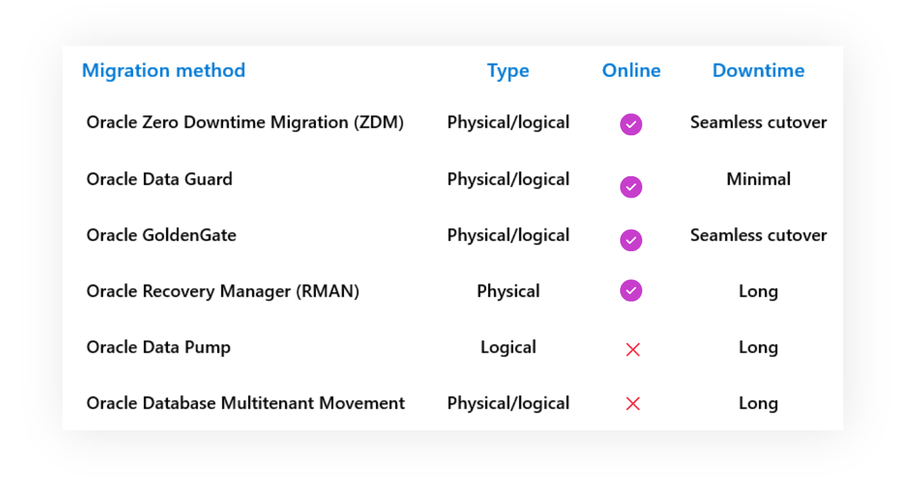

After your Exadata Infrastructure is created, you can start provisioning the virtual machine clusters to host your databases. Like your on-premises Exadata systems, these clusters provide a bridge for managing resource use and communication between the compute and storage assets on the underlying Exadata infrastructure and the databases that you create. The cluster is also where you configure networking connectivity between the databases and the rest of your Azure environment, such as your application VMs.

## Provision your virtual machine cluster

Although you can distribute the available resources among multiple virtual machine clusters to support different workloads, in your migration, you're focusing on creating a single cluster.

As you did when creating the infrastructure, use the Azure portal to access the Oracle Database@Azure service blade, where you start the [provisioning process](/azure/oracle/oracle-db/provision-oracle-database#provision-an-exadata-virtual-machine-cluster).

Supply the following details about your new cluster:

- The subscription and resource group you created the Exadata infrastructure instance on (in the previous section).

- The [Azure region](/azure/oracle/oracle-db/database-overview#available-regions) and [availability zone](/azure/reliability/availability-zones-overview) where you want the instance to reside. Again, make sure these settings match your VMs, virtual network, and the newly created infrastructure.

- A unique name for your cluster.

- The Exadata infrastructure instance to deploy on. Use the instance you created in the previous section.

- License and Oracle Grid Infrastructure settings.

- SSH security settings.

Next, define how you want your cluster configured, including:

- The total number of VMs to create.

- The database system shape, which depends on the Exadata infrastructure model you chose when creating the infrastructure.

- The number of OCPUs to use for each VM.

- The amount of memory allocated to each VM.

- The amount of local storage each VM is assigned.

Note that these settings may be limited, based on the configuration of the Exadata infrastructure you created.

After you complete the resource allocation step, configure the networking settings. This includes choosing the virtual network to connect to the rest of your virtual resources, such as your application VMs, and then specifying the [subnet you configured to connect with your cluster](/azure/oracle/oracle-db/oracle-database-network-plan).

The remaining steps include configuring diagnostics collection, accepting the Oracle Terms of Use and Privacy Policy, and applying any administrative or management [Azure tags](/azure/azure-resource-manager/management/tag-resources) to the cluster. Then you can proceed to create the cluster.

## Migrate your data

Now that you've configured your Oracle Exadata infrastructure and virtual machine cluster, you're ready to migrate your workload's databases. Manage this process through the [Oracle Cloud Infrastructure](https://docs.oracle.com/iaas/Content/home.htm) portal, using the [OCI Database Migration service (DMS)](https://www.oracle.com/cloud/database-migration/#overview) tool.

OCI DMS enables you to orchestrate your migration workflow to execute secure, fault-tolerant, and incremental migrations. You can choose from several Oracle services, including [Zero Downtime Migration (ZDM)](https://www.oracle.com/database/zero-downtime-migration/), [Data Guard](https://www.oracle.com/database/data-guard/), [Oracle Data Pump](https://docs.oracle.com/en/database/oracle/oracle-database/19/sutil/oracle-data-pump-overview.html), and [Oracle GoldenGate](https://www.oracle.com/integration/goldengate/).

You perform an initial data migration using DMS and then set up incremental updates to keep your data in sync until you're ready to cut over production to your infrastructure.
