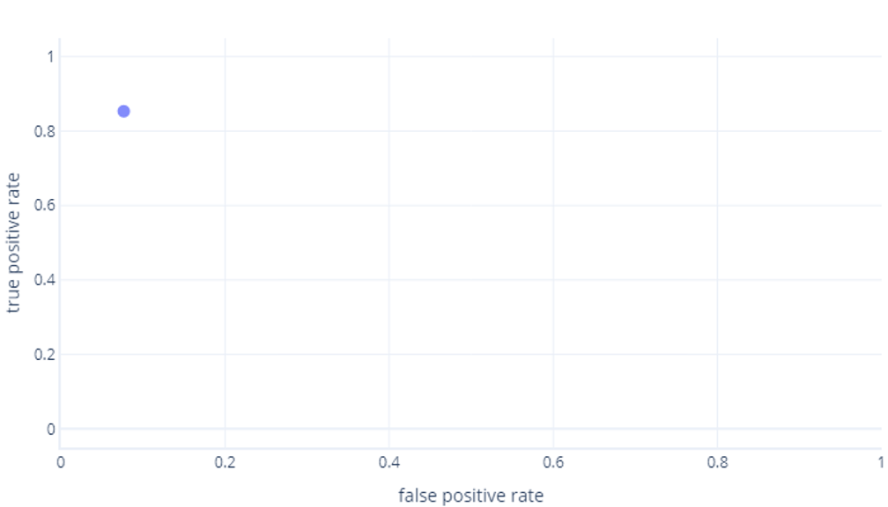
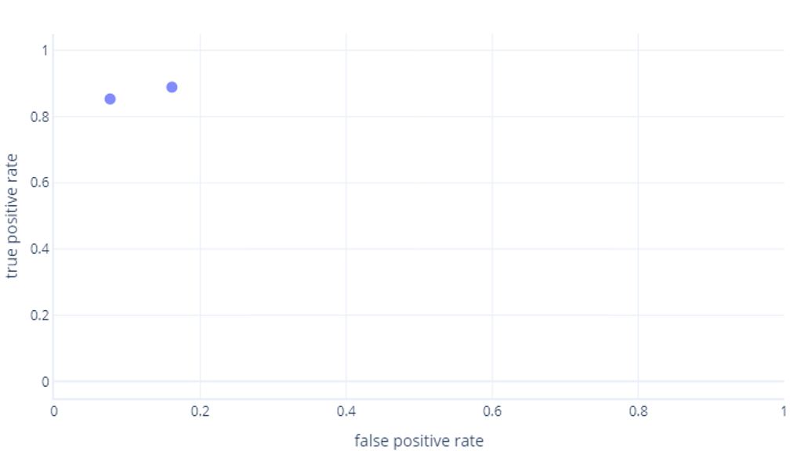
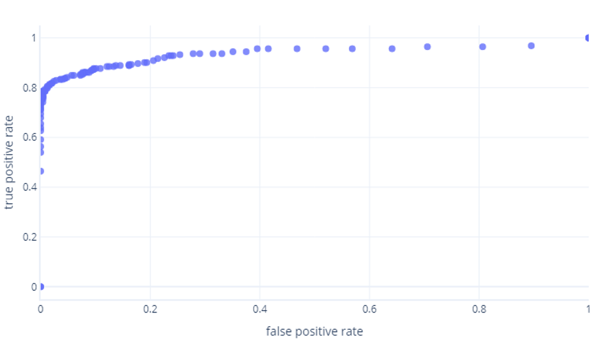
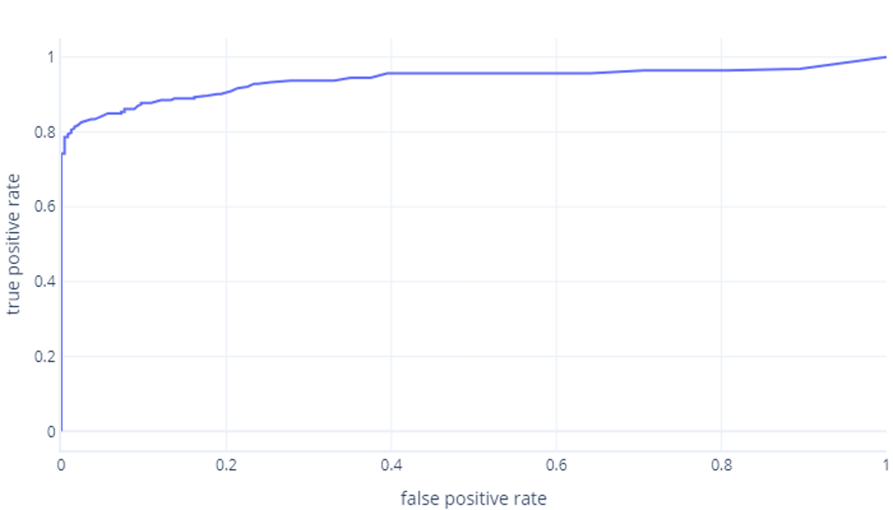
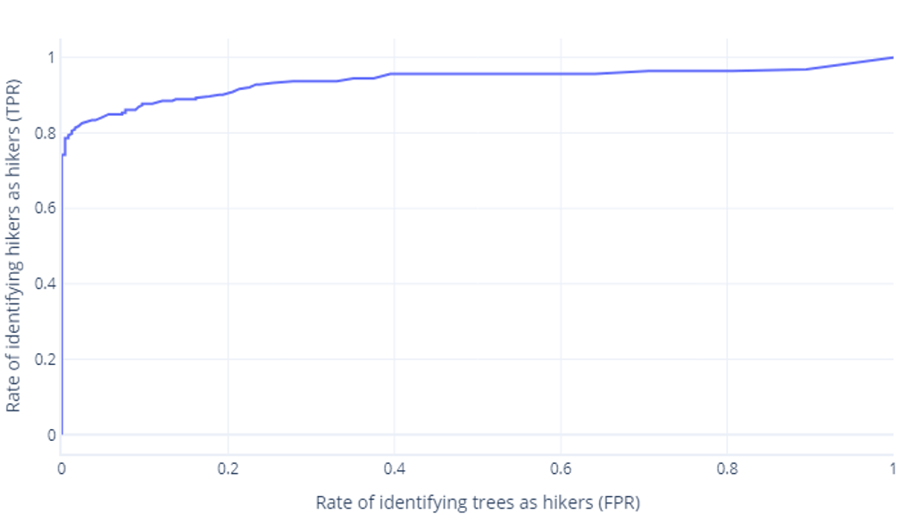

Classification models must assign a sample to a category. For example, it must use features such as size, color, and motion to determine whether an object is a hiker or a tree.

We can improve classification models many ways. For example, we can ensure our data are balanced, clean, and scaled. We can also alter our model architecture, and use hyperparameters to squeeze as much performance as we possibly can out of our data and architecture. Eventually, we find no better way to improve performance on our test (or hold-out) set and declare our model ready.

Model tuning to this point can be complex, but a final simple step can be used to further improve how well our model works. To understand this, though, we need to go back to basics.

## Probabilities and categories

Many models have multiple decision-making stages, and the final one often is simply a binarization step. During binarization, probabilities are converted into a hard label. For example, let’s say that the model is provided with features and calculates that there's a 75% chance that it was shown a hiker, and 25% chance it was shown a tree. An object cannot be 75% hiker and 25% tree – it's one or the other! As such, the model applies a threshold, which is normally 50%. As the hiker class is larger than 50%, the object is declared to be a hiker.

The 50% threshold is logical – it means that the most likely label according to the model is always chosen. If the model is biased, however, this 50% threshold might not be appropriate. For example, if the model has a slight tendency to pick trees more than hikers – picking trees 10% more frequently than it should – we could adjust our decision threshold to account for this.

## Refresher on decision matrices

Decision matrices are a great way to assess the kinds of mistakes a model is making. This gives us the rates of True Positives (TP), True Negatives (TN), False Positives (FP), and False Negatives (FN)

!(Screenshot showing a confusion matrix of true positives, true negatives, false positives, and false negatives.)(../media/2-decision-matrices.png)

We can calculate some handy characteristics from the confusion matrix. Two popular characteristics are:

* True Positive Rate (sensitivity): how often ‘True’ labels are correctly identified as ‘True’. For example, how often the model predicts ‘hiker’ when the sample it's shown is in fact a hiker.
* False Positive Rate (false alarm rate): how often ‘False’ labels are incorrectly identified as ‘True’. For example, how often the model predicts ‘Hiker’ when it's shown a tree.

Looking at true positive and false positive rates can help us understand a model’s performance.

Consider our hiker example. Ideally, the true positive rate is very high, and the false positive rate is very low, because this means that the model identifies hikers well, and doesn’t identify trees as hikers very often. Yet, if the true positive rate is very high, but the false positive rate is also very high, then the model is biased: it's identifying almost everything it encounters as hiker. Similarly, we don’t want a model with a low true positive rate, because then when the model encounters a hiker, it'll label them as a tree.

## ROC curves

Receiver Operator Characteristic (ROC) curves are a graph where we plot true positive rate versus false positive rate.

ROC curves can be confusing for beginners for two main reasons. The first reason is that, beginners know that a model only has one value for true positive and true negative rates. So an ROC plot must look like this:

If you’re also thinking this, you’re right. A trained model only produces one point. However, remember that our models have a threshold—normally 50%—that is used to decide whether the true (hiker) or false (tree) label should be used. If we change this threshold to 30% and recalculate true positive and false positive rates, we get another point:

If we do this for thresholds between 0% - 100%, we might get a graph like this:

Which we usually display as a line, instead:

The second reason these graphs can be confusing is the jargon involved. Remember that we want a high true positive rate (identifying hikers as such) and a low false positive rate (not identifying trees as hikers).

## Good ROC, bad ROC

Understanding good and bad ROC curves is something best done in an interactive environment. When you’re ready, jump into the next exercise to explore this topic.
