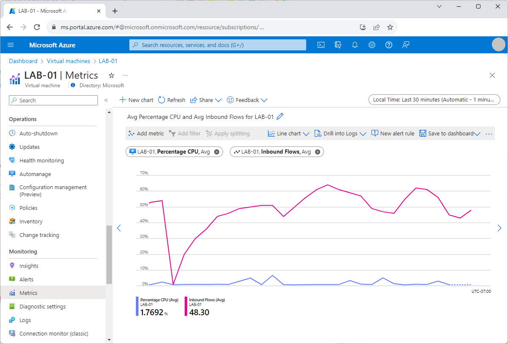

You can use Azure Monitor to view metrics on all of your Azure resources. 

Your band is going on tour next month, so you need to identify which metrics you want to use to monitor the health of your virtual machines (VMs).

In this unit, you'll look at how to use Azure metrics to monitor the health of a VM. You'll explore the metrics available in Azure.

## Basic metrics for Azure VMs

Metrics are numerical values that help you understand the health, operation, and performance of your VMs. You can choose a specific metric and see a graph of that metric in the Azure portal.

By default, you can get data like:

- CPU usage
- Network traffic
- OS disk usage
- Boot success

Azure collects these metrics by default for hosted VMs without requiring you to install additional software. To capture the boot diagnostics, you need to create and associate a storage account. You associate the storage account at the time you create your VM. Or, for an existing VM, you associate one later.

## View metrics

You can choose multiple metrics and plot them on a graph to see how much traffic hits your web server, and how the server performs. The Azure portal offers a flexible time range for graphs from the last 30 minutes, the last four hours, or the last 30 days. Azure also lets you pin these graphs to your dashboard so you can quickly view server health.

By using Virtual Machine host metrics, you can:

- Know when your VMs are reaching their disk and CPU limits.
- Detect trends.
- Control your operational costs by sizing according to usage and demand.

## Get more metrics

To collect Guest OS metrics, you need to install the Azure Monitor Agent and select the metrics to be collected by using Data Collection Rules. The Azure Monitor Agent  is available for Windows and Linux.

After you've installed the Azure Monitor Agent, you can:

- Collect guest OS metrics
- Create and access near real-time metric alerts
- Collect and archive logs in Azure Monitor logs for further analysis.

You can install the Azure Monitor Agent by using the Azure portal, or programmatically with the Azure CLI, or PowerShell.

## Get boot diagnostics

In addition to the metrics discussed above, you can also enable boot diagnostics to troubleshoot VMs in Azure. This helps you identify issues with your VMs during the boot process. The boot diagnostics feature needs a storage account to save the data that it collects.

Once boot diagnostics is enabled, you can:

- View the output of the console Log for Linux Machines.
- See screenshots of the VM from the hypervisor for both Windows and Linux machines.