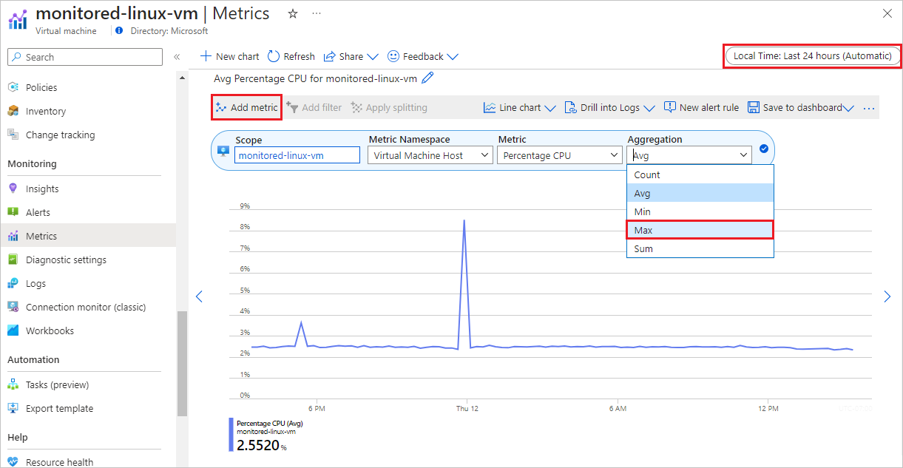

With your VM running on Azure, you can view host-level metrics without installing any additional software. You can quickly create a virtual machines (VM) by using Azure CLI commands. If you create a storage account at the same time, you can connect boot diagnostics when you create the VM.

You'd like to move to a new version of Ubuntu so you deploy a new VM. You only need to monitor host-level metrics, so you're only going to create a VM and a storage account.

In this exercise, you'll deploy a Linux virtual machine and enable boot diagnostics. After the VM is created, you'll quickly set up a graph to view the host CPU usages and inbound traffic. You'll also check that the boot diagnostics are working correctly.

## Create a storage account and VM

1. Use the Cloud Shell on the right, create a virtual network for your VM.

    ```azurecli
    USERNAME=learn-admin
    PASSWORD=$(openssl rand -base64 32)
    echo $PASSWORD > password-vault

    az network vnet create  \
    --name band-vnet \
    --address-prefix 10.10.0.0/16 \
    --subnet-name frontend \
    --subnet-prefix 10.10.1.0/24 \
    --location eastus2 \
    --resource-group <rgn>[sandbox resource group name]</rgn>
    ```

1. Create a storage account to store boot diagnostics.

    ```azurecli
    STORAGE=metricsstorage$RANDOM
    
    az storage account create \
        --name $STORAGE \
        --sku Standard_LRS \
        --location eastus2 \
        --resource-group <rgn>[sandbox resource group name]</rgn>
    ```

1. Create your VM with boot diagnostics enabled.

    ```azurecli
    az vm create \
        --name monitored-linux-vm \
        --image UbuntuLTS \
        --size Standard_B1s \
        --location eastus2 \
        --vnet-name band-vnet \
        --authentication-type password \
        --admin-password $PASSWORD \
        --admin-username $USERNAME \
        --boot-diagnostics-storage $STORAGE \
        --resource-group <rgn>[sandbox resource group name]</rgn>
    ```

## View host-level metrics

1. Go to the [Azure portal](https://portal.azure.com/) and sign in with the account you used to enable the sandbox. 
1. In the navigation on the left, select **All resources**.
1. Select the **monitored-linux-vm** virtual machine you created.

    

1. Scroll down, and under **Monitoring**, select **Metrics**.
1. Select the following values:

   |Field     |Value |
   |---------|---------|
   |METRIC NAMESPACE    |   Virtual Machine Host     |
   |METRIC     |   Percentage CPU  |
   |AGGREGATION    |    Max     |  

1. Select **Add metric**.
1. Select the following values:

   |Field     |Value |
   |---------|---------|
   |METRIC NAMESPACE    |   Virtual Machine Host     |
   |METRIC     |   Inbound Flows  |
   |AGGREGATION    |    Avg     |  

1. Select the **Finish editing** check mark.
1. You should now have the following graph.

    

Azure collects this data without the need to install anything extra on Ubuntu or Windows VMs.

## View boot diagnostics

1. Below the **Monitoring** section on the left, select **Support + troubleshooting**.
1. Select **Boot diagnostics**.
1. Review the screenshot to verify that your virtual machine booted correctly.

    

You can also select **Serial log** to view log messages created when the VM booted.