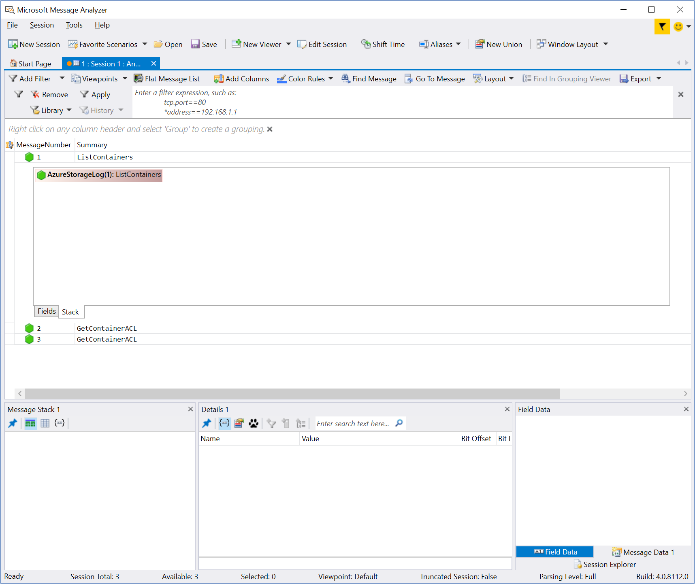

Diagnosing and troubleshooting issues for an application hosted in a cloud environment can be more complicated than in traditional environments. To support these types of applications successfully, you should monitor them and understand how to diagnose and troubleshoot any aspects of them and their dependent technologies. A combination of tools and logging can be used to identify issues. 

The new Automobile Distribution customer portal uses Azure Storage to store uploaded files. As there are some concerns about the performance of storing files in the portal, the first step to diagnosing any issues is knowing which troubleshooting tools you can use.

In this unit, you'll learn about some of the different tools you can use to analyze issues with Azure Storage.

## Tools available for troubleshooting Azure Storage

There are several tools you can use to monitoring Azure Storage. You can use the information generated by these tools to help pinpoint issues. You would typically use a combination of these tools to give you a richer view of what's happening. Additional tools are available from third-party sources, but we won't discuss them here.

### Azure portal

The Azure portal gives you a graphical way to view and monitor storage performance in near real time. There can be a delay of a few minutes between capturing data and it appearing on the Azure portal. In the Azure portal, you can:

- Configure metrics and logging.
- View graphs and charts, and select which metrics to visualize.
- Assess how your applications are doing over time.
- Configure alerts to notify you of any behavior that is out of the ordinary.

You can monitor the performance of a storage account using the **Overview** tab on the storage account page. Scroll down to the monitoring section and choose what to show data for. The image below shows an example the ingress, egress, average latency, and request breakdown for blob storage in a storage account:


### AzCopy

You can download the storage account logs to your local computer by using the [AzCopy](https://aka.ms/AzCopy) utility, or the desktop version of [Azure Storage Explorer](https://azure.microsoft.com/features/storage-explorer/). You can then analyze this data by using analysis tools on your desktop.

The following command shows an example that retrieves the diagnostic logs for a storage account named *mystorageaccount*. The log files are saved to a folder named *C:\logs* on the local computer. Replace **\<storage account key\>** with the one of the keys that you can find on the **Access keys** page for the storage account in the Azure portal:

```bash
azcopy /source:"https://mystorageaccount.blob.core.windows.net/$logs" /dest:C:logs /sourceType:blob /SourceKey:<storage account key> /S
```

> [!NOTE]
> The **\$logs** container is hidden from many Azure tools. For example, you won't see it appear in the online version of Storage Explorer used by the Azure portal, or Cloud Explorer in Visual Studio. AzCopy and the desktop version of Azure Storage Explorer are exceptions.

You can't use AzCopy to download data from storage tables, so you can't use this tool to retrieve the data from the **\$Metrics** tables.

### Azure Storage Explorer (desktop version)

The desktop version of [Azure Storage Explorer](https://azure.microsoft.com/features/storage-explorer/) gives you another way to view the logs and metrics gathered by Azure Storage Analytics. The **\$Metrics** tables and the **$logs** container are all accessible in Storage Explorer, and you can export the data, including the metrics in the **\$Metrics** tables, to a folder on your desktop computer.

### Microsoft Message Analyzer

Microsoft Message Analyzer is a protocol analyzer for capturing, displaying, and analyzing messaging traffic, events, and other system or application messages. Message Analyzer also enables you to load, aggregate, and analyze data from logs and saved trace files.

You can use Message Analyzer to examine many types of log files, including:

- Server logs, created when you enable logging in Azure. These logs include those generated by Azure Storage Analyzer.
- .NET client logs, created when client-side logging is enabled for a .NET Core application.
- HTTP network trace log, created by a web server.

Use Message Analyzer for reading log files. It displays log data in visual format. It allows searching, grouping, and filtering, enabling you to easily examine errors and locate the source of performance issues.

The image below shows Message Analyzer displaying diagnostic log information for a storage account. The log information was downloaded from Azure storage using the AzCopy command shown previously:



You can download Message Analyzer from the [Message Analyzer page](https://www.microsoft.com/download/details.aspx?id=44226) on the Microsoft website.

Unit 7 describes using Message Analyzer in more detail.
