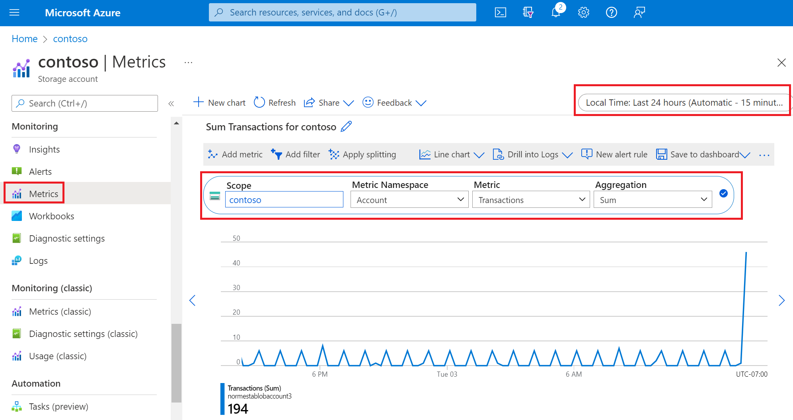
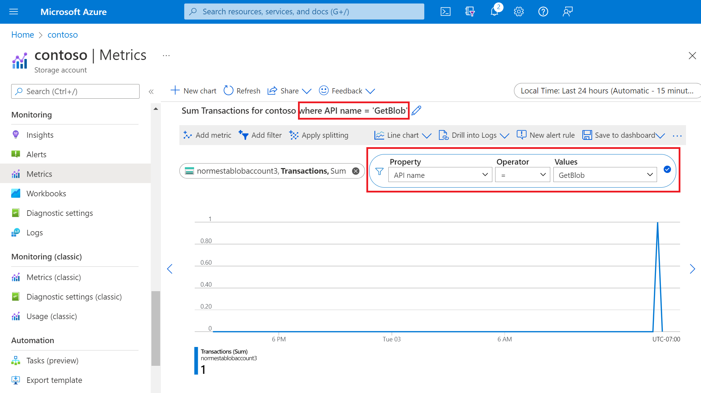

It's important to understand storage metrics so you know which metrics to examine and what these metrics indicate about the state of a storage account. Using Azure Storage metrics, you can analyze usage trends by your applications and diagnose possible issues with your storage account.

In this unit, you'll learn about metrics in Azure Monitor, what information it reports on, and how you can use the metrics it provides to identify problems with how your applications are using Azure Storage.

## Understand metrics

Storage metrics are captured automatically. Therefore, you don't have to enable any sort of setting to begin collecting them. Azure Storage generates these metrics and they are stored in an Azure Monitor data platform. Azure Monitor collects *capacity* metrics and *transaction* metrics at both the storage account level and the storage service level (For example: Blob Storage or File Storage).

### Capacity metrics

Capacity metrics describe the storage of data (For example: bytes stored, bytes still available for storage). Capacity metrics values are refreshed daily (up to 24 Hours). The time grain defines the time interval for which metrics values are presented. The supported time grain for all capacity metrics is one hour (PT1H).

### Transaction metrics

Transaction metrics describe account activity (For example: number of transactions or number of bytes read). Transaction metrics are emitted on every request to a storage account from Azure Storage to Azure Monitor. In the case of no activity on your storage account, there will be no data on transaction metrics in the period. The time grain defines the time interval that metric values are presented. The supported time grains for all transaction metrics are PT1H and PT1M.

## The anatomy of a metric value

Get metric values by providing a time range, time interval, metric namespace, metric name and the type of aggregation. Here's a description of each element:

| Element | Description |
|---|---|
| Time range | The period of time that you want to capture (For example: yesterday, or the last month). |
| Time interval | The granularity of time reflected by a metric value. (For example: a value that reflects 1 hour or 1 day). |
| Metric namespace | The namespace of the metric. This specifies whether to get a metric at the storage account level, or at the level of a specific storage service (For example: File Storage). |
| Metric name | The metric you are interested in (For example: egress). |
| Aggregation | How you want that value calculated. In most cases, you'll choose either a sum or an average. |

For metrics that support dimensions, you can filter the metric with the desired dimension value. Dimensions are name/value pairs that carry additional data to describe the metric value. For example, authentication type is a dimension for transactions. If you are interested in seeing only transactions that were authorized by using an account key, you can use the authentication dimension and filter on account key.

The **ResponseType** dimension reveals the success and failure rate, and the reasons for failure, such as timeouts, throttling, network errors, authorization failure, and so on. This information can give you a good insight as to why the performance of your applications may be suffering. For example, frequent throttling and timeout errors can indicate a high level of contention occurring for limited resources, and you might need to re-architect your system to the use the **Premium** rather than the **Standard** tier for your storage accounts. You might also need to spread the load across multiple storage accounts or select a different organization for any blob containers and tables that your application is using.

## View and analyze metrics

You can get metric values by using the Azure portal, PowerShell, Azure CLI, or by using code that targets Azure client libraries.

### Azure portal

The previous unit presented different ways to view metrics in the Azure portal. You can define the elements that appear in those views by using [Metrics Explorer](/azure/azure-monitor/essentials/metrics-getting-started). In Metrics Explorer, you can specify the time range, time interval, metric namespace, metric, and aggregation for each value you want to analyze. You can also filter by dimensions. You can create charts based on these metrics and then pin them to dashboards for easy access in future.

The following image shows a metric configuration that gets the total number of transactions in the past 24 hours. Each data point reflects 15 minutes of data.

> [!div class="mx-imgBorder"]
> 

The following image shows the API dimension being used to get only read transactions.

> [!div class="mx-imgBorder"]
> 

### Command line and scripts

You get metrics by running commands at the command line or by arranging commands in a script that you can run later as part of a scheduled task (PowerShell) or job (Azure CLI).

#### PowerShell

You can get metric values by using the [Get-AzMetric](/powershell/module/Az.Monitor/Get-AzMetric) cmdlet. This example gets the total number of read transactions for a storage account.

```powershell
$resourceId = "<resource-ID>"
$dimFilter = [String](New-AzMetricFilter -Dimension ApiName -Operator eq -Value "GetBlob" 3> $null)
Get-AzMetric -ResourceId $resourceId -MetricName Transactions -TimeGrain 01:00:00 -MetricFilter $dimFilter -AggregationType "Total"
```

#### Azure CLI

You can get metric values by using the [az monitor metrics list](/cli/azure/monitor/metrics#az-monitor-metrics-list) command. This example gets the total number of read transactions for a storage account.

```azurecli
az monitor metrics list --resource <resource-ID> --metric "Transactions" --interval PT1H --filter "ApiName eq 'GetBlob' " --aggregation "Total" 
```

### Application code

You can get metric values by writing code that uses any of the Azure SDKs. The following example uses the [Azure SDK for .NET](/dotnet/azure/sdk/azure-sdk-for-dotnet) to get the average amount of Blob storage used in a storage account over a specified time period.

```csharp
public static async Task ReadStorageMetricValueTest()
{
    // Resource ID for blob storage
    var resourceId = "/subscriptions/{subscriptionId}/resourceGroups/{resourceGroupName}/providers/Microsoft.Storage/storageAccounts/{storageAccountName}/blobServices/default";

    var subscriptionId = "<subscription-ID}";
    var tenantId = "<tenant-ID>";
    var applicationId = "<application-ID>";
    var accessKey = "<accessKey>";

    MonitorManagementClient readOnlyClient = AuthenticateWithReadOnlyClient(tenantId, applicationId, accessKey, subscriptionId).Result;

    Microsoft.Azure.Management.Monitor.Models.Response Response;

    string startDate = DateTime.Now.AddHours(-3).ToUniversalTime().ToString("o");
    string endDate = DateTime.Now.ToUniversalTime().ToString("o");
    string timeSpan = startDate + "/" + endDate;

    ODataQuery<MetadataValue> odataFilterMetrics = new ODataQuery<MetadataValue>(
        string.Format("BlobType eq '{0}'", "BlockBlob"));

    Response = readOnlyClient.Metrics.List(
                    resourceUri: resourceId,
                    timespan: timeSpan,
                    interval: System.TimeSpan.FromHours(1),
                    metricnames: "BlobCapacity",
                    odataQuery: odataFilterMetrics,
                    aggregation: "Average",
                    resultType: ResultType.Data);

    foreach (var metric in Response.Value)
    {
       // process value here.
    }
}
```
